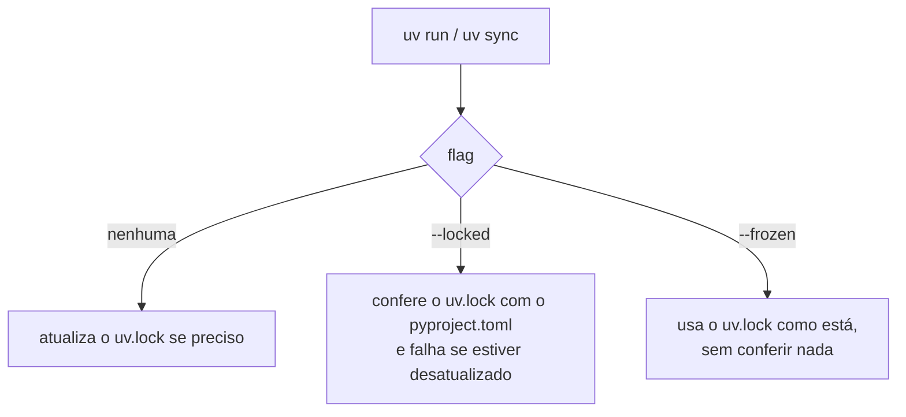

# 01-1. Ambiente reproduzível e pacote

## Objetivos desta aula

Ao final desta aula você vai entender:

- por que um projeto precisa de um **lockfile** e o que `--locked` e `--frozen` mudam;
- o que são **grupos de dependências** e por que testes e notebooks não entram na produção;
- por que o código mora em `src/` e como o comando `mqtt-ids` nasce do `pyproject.toml`.

E vai ter construído: um checkout que se sincroniza sozinho a partir do `uv.lock` e um pacote `mqtt_ids` que você importa de qualquer pasta.

**Ganho tangível:** `uv run --locked mqtt-ids --help` imprime a ajuda do comando, vindo de um ambiente criado só a partir do lockfile.

## Onde estamos

Esta é a primeira aula; veja o [mapa do curso](index.md). Ela cobre o começo da [issue 01](issues/01-project-runner.md): "um checkout limpo sincroniza o ambiente a partir do lockfile" e "o pacote é importável fora da raiz do projeto". As próximas aulas (01-2 e 01-3) constroem em cima do pacote que você conhece aqui.

## Antes de começar

Você precisa de um terminal, do `git` e do repositório clonado. O Python em si não precisa estar instalado: o `uv` baixa a versão certa.

!!! info "Caso nunca tenha usado o uv"

    --8<-- "course/includes/instalar-uv.md"

## Conceitos

### Ambiente reproduzível: `pyproject.toml`, `uv.lock` e `.venv`

Um **ambiente de projeto** é a "caixa" com o Python e as bibliotecas de um único projeto. Três arquivos/pastas o definem, cada um com um papel:

- `pyproject.toml` diz **o que o projeto pede**: bibliotecas com versões mínimas (`pandas>=3.0.5`);
- `uv.lock` diz **exatamente o que foi instalado**: cada pacote, em versão exata, para todas as plataformas;
- `.venv` é a **caixa pronta** nesta máquina. Ela nasce do lockfile e pode ser apagada e recriada a qualquer momento.

Analogia: o `pyproject.toml` é a lista de compras ("farinha, ovos"); o `uv.lock` é a nota fiscal ("farinha tipo 1, marca X, lote 123"); o `.venv` é a cozinha montada com aqueles itens.

O problema que isso resolve: sem lockfile, "funciona na minha máquina" vira regra, porque duas instalações feitas em dias diferentes resolvem versões diferentes. Em pesquisa isso é grave: um resultado que muda com a versão do `scikit-learn` não é reproduzível.

O `uv` oferece três modos de tratar o lockfile ao rodar um comando:



Neste projeto usamos sempre `--locked` ([ADR-018](DECISIONS.md#adr-018-bootstrap-automatico-e-ambiente-unico-para-scripts-e-notebooks)): ele nunca resolve versões novas e avisa se alguém mudou o `pyproject.toml` sem atualizar o lockfile. O `--frozen` é mais permissivo: nem confere.

Fonte: [uv — sincronização e bloqueio](https://docs.astral.sh/uv/concepts/projects/sync/) e [layout de projetos do uv](https://docs.astral.sh/uv/concepts/projects/layout/) (o lockfile deve ir para o Git; o `.venv` não).

### Grupos de dependências

Nem toda biblioteca é necessária para **executar** o produto. Testes (`pytest`), lint (`ruff`) e notebooks (`jupyterlab`) só servem a quem desenvolve. O `pyproject.toml` separa esses pacotes em **grupos de dependências**, numa tabela `[dependency-groups]`: eles ficam só no ambiente local e não entram nos requisitos publicados do projeto.

O grupo `dev` é especial: o `uv` o sincroniza por padrão. Outros grupos (aqui, `notebook`) só entram quando você pede, com `--group notebook`; `--all-groups` traz todos e `--no-dev` tira o `dev`.

Sem grupos, ou você instala tudo sempre (ambiente pesado) ou esquece a ferramenta de teste e descobre só quando o CI falha.

Fonte: [grupos de dependências no uv](https://docs.astral.sh/uv/concepts/projects/dependencies/).

### Layout `src` e ponto de entrada

No **layout `src`** o código importável (`mqtt_ids`) mora em `src/mqtt_ids/`, e não na raiz. A razão: o Python põe a pasta atual no começo do caminho de importação; num layout "plano" você acaba importando a cópia da pasta, não o pacote instalado, e erros de empacotamento passam despercebidos. Com `src/`, o pacote só é importável depois de **instalado** no ambiente.

Quem instala é o `uv`, graças à seção `[build-system]` (aqui, `hatchling`). Como o projeto é instalado de forma editável, o `uv` coloca `src/` no caminho de importação do `.venv`, e por isso `import mqtt_ids` funciona de qualquer pasta.

A mesma seção habilita **pontos de entrada**: em `[project.scripts]`, a linha `mqtt-ids = "mqtt_ids.cli:main"` cria o comando `mqtt-ids`, que chama a função `main` do módulo `mqtt_ids.cli`. Assim a biblioteca (`src/mqtt_ids/`) fica separada do comando, que é só uma casca fina.

Fontes: [src layout vs flat layout (PyPA)](https://packaging.python.org/en/latest/discussions/src-layout-vs-flat-layout/), [aplicações e bibliotecas empacotadas no uv](https://docs.astral.sh/uv/concepts/projects/init/) e [configuração de projeto no uv](https://docs.astral.sh/uv/concepts/projects/config/) (pontos de entrada exigem um build system).

## Ponte teoria → projeto

A [issue 01](issues/01-project-runner.md) exige reprodutibilidade desde o primeiro comando, e a [ADR-018](DECISIONS.md#adr-018-bootstrap-automatico-e-ambiente-unico-para-scripts-e-notebooks) escolheu `uv run --locked` como porta de entrada de todo código executável: scripts, testes e notebooks usam o mesmo ambiente. O layout `src` e o comando `mqtt-ids` separam biblioteca e entrypoint, como a issue pede. Para a sua missão (um projeto de pesquisa que vira portfólio), isso é o que permite a quem avalia rodar o seu trabalho e obter os mesmos números.

## Mão na massa

### Passo 1 — Sincronizar o ambiente a partir do lockfile

Vamos criar o `.venv` a partir do `uv.lock`, sem resolver nada. Em um checkout limpo (sem `.venv`), um único comando faz tudo.

```bash title="$ Execução no terminal (na pasta do projeto)"
uv sync --locked
```

```text title="Saída esperada"
Using CPython 3.13.15
Creating virtual environment at: .venv
Resolved 143 packages in 0.96ms
   Building mqtt-investigation @ file:///.../fresh
      Built mqtt-investigation @ file:///.../fresh
Prepared 1 package in 200ms
...
```

**O que aconteceu:** o `uv` escolheu um Python compatível com `requires-python`, criou o `.venv`, **construiu o próprio projeto** (`Building mqtt-investigation`) e instalou os pacotes do lockfile. "Resolved 143 packages" é a leitura do `uv.lock`, não uma busca na internet. A versão do Python, os caminhos e os tempos variam na sua máquina; os avisos de *hardlink* só aparecem quando o cache fica em outro sistema de arquivos.

??? question "Pare e pense: o que aparece se você rodar o mesmo comando de novo?"

    Quase nada de novo: `Resolved 143 packages` e `Checked 76 packages`. O ambiente já bate com o lockfile, então não há o que instalar.

### Passo 2 — Ler o `pyproject.toml`

Abra o `pyproject.toml`. As partes que mais importam nesta aula são o `[project.scripts]` e os grupos.

```toml title="pyproject.toml" linenums="1" hl_lines="1-3 21-23 25-31"
[build-system]  # (1)!
requires = ["hatchling>=1.27"]
build-backend = "hatchling.build"

[project]
name = "mqtt-investigation"
version = "0.1.0"
description = "Experimentos reproduzíveis de detecção de intrusão MQTT"
readme = "README.md"
requires-python = ">=3.12"  # (2)!
dependencies = [  # (3)!
    "imblearn>=0.0",
    "kaggle>=2.2.4",
    "kagglehub>=1.0.2",
    "matplotlib>=3.11.1",
    "pandas>=3.0.5",
    "python-dotenv>=1.2.3",
    "PyYAML>=6.0.3",
    "scikit-learn>=1.9.0",
    "seaborn>=0.13.2",
]

[project.scripts]  # (4)!
mqtt-ids = "mqtt_ids.cli:main"
mqtt-kaggle-assets = "mqtt_ids.kaggle_assets_cli:main"

[dependency-groups]  # (5)!
dev = [
    "mkdocs>=1.6.1",
    "mkdocs-material>=9.7.7",
    "pytest>=9.0.2",
    "ruff>=0.14.14",
]
notebook = ["ipykernel>=7.2.0", "jupyterlab>=4.5.4"]
```

1.  Sem `[build-system]` o projeto não seria instalável e o `[project.scripts]` seria ignorado. O `hatchling` é a ferramenta que empacota o projeto.
2.  O `uv` escolhe, ou baixa, um Python que respeite este limite. Por isso você não precisa instalar Python à mão.
3.  Dependências **de execução**, com versão mínima. As versões exatas ficam no `uv.lock`, não aqui.
4.  Cada linha cria um comando no ambiente: `mqtt-ids` chama `main` do módulo `mqtt_ids.cli`. O formato é `módulo:função`.
5.  Grupos só de desenvolvimento. `dev` é sincronizado por padrão; `notebook`, só com `--group notebook`. (As duas linhas do `mkdocs` entraram quando o curso foi montado.)

O arquivo continua com `[tool.pytest.ini_options]`, `[tool.ruff]` e `[tool.hatch.build.targets.wheel]` (que aponta o pacote para `src/mqtt_ids`); eles aparecem no código completo no fim da aula.

### Passo 3 — Importar o pacote de qualquer pasta

Agora a prova do layout `src` mais a instalação: importar `mqtt_ids` na raiz e **fora** dela.

```python title="src/mqtt_ids/__init__.py" linenums="1"
"""Ferramentas para experimentos reproduzíveis de detecção MQTT."""

__version__ = "0.1.0"  # (1)!
```

1.  É o único conteúdo do `__init__.py`: marca a pasta como pacote e expõe a versão.

```bash title="$ Execução no terminal (na pasta do projeto)"
uv run --locked python -c "import mqtt_ids; print(mqtt_ids.__version__)"
```

```text title="Saída esperada"
0.1.0
```

Agora de outra pasta, apontando o projeto com `--project`:

```bash title="$ Execução no terminal (de qualquer outra pasta, como /tmp)"
cd /tmp
uv run --locked --project /caminho/do/projeto python -c "import mqtt_ids; print(mqtt_ids.__version__)"
```

```text title="Saída esperada"
0.1.0
```

**O que aconteceu:** o `--project` diz ao `uv` qual ambiente usar, e o Python importou o pacote mesmo estando fora da raiz. Isso só funciona porque o projeto está **instalado** no `.venv`. O caminho de importação desse ambiente contém `.../src` (um arquivo `.pth` o adiciona na instalação editável), então edições em `src/` valem na hora, sem reinstalar.

??? question "Pare e pense: e se você tentasse `python3 -c \"import mqtt_ids\"` de `/tmp`, com o Python do sistema?"

    Falha com `ModuleNotFoundError: No module named 'mqtt_ids'`: o Python do sistema não enxerga o `.venv`. É por isso que usamos `uv run`: ele entra no ambiente certo antes de executar.

### Passo 4 — Chamar o comando `mqtt-ids`

O ponto de entrada do `[project.scripts]` virou um comando. Peça a ajuda dele:

```bash title="$ Execução no terminal (na pasta do projeto)"
uv run --locked mqtt-ids --help
```

```text title="Saída esperada"
usage: mqtt-ids [-h] --scenario SCENARIO [--stage {diagnostics,acquire}]
                [--resume] [--output-dir OUTPUT_DIR]

Executa um cenário MQTT IDS.

options:
  -h, --help            show this help message and exit
  --scenario SCENARIO
  --stage {diagnostics,acquire}
  --resume
  --output-dir OUTPUT_DIR
```

**O que aconteceu:** o `uv run` achou o script `mqtt-ids` no ambiente e executou `mqtt_ids.cli:main`. As opções são o contrato do runner, que a aula 01-3 constrói. A ajuda mostra `--scenario` sem colchetes: ele é obrigatório.

### Passo 5 — Ver os grupos em ação

Retire o grupo `dev` e veja o `pytest` sumir; depois traga tudo de volta.

```bash title="$ Execução no terminal (na pasta do projeto)"
uv sync --locked --no-dev
uv run --locked --no-sync python -c "import pytest"
```

```text title="Saída esperada"
...
    import pytest
ModuleNotFoundError: No module named 'pytest'
```

Para voltar ao ambiente completo de desenvolvimento:

```bash title="$ Execução no terminal (na pasta do projeto)"
uv sync --locked --all-groups
```

**O que aconteceu:** `--no-dev` removeu os pacotes do grupo `dev`. O `--no-sync` no segundo comando impede o `uv run` de reinstalá-los antes de executar, e por isso o `import` falha. Com `--all-groups` o ambiente inclui também o grupo `notebook`.

## Testando

Esta aula não escreve testes novos: a prova de que o ambiente funciona é a suíte existir e passar. Rode-a:

--8<-- "course/includes/rodar-testes.md"

```text title="Saída esperada"
============================= test session starts ==============================
platform linux -- Python 3.13.15, pytest-9.1.1, pluggy-1.6.0
rootdir: ...
configfile: pyproject.toml
testpaths: tests
plugins: anyio-4.14.2
collected 22 items

tests/test_config.py .......                                             [ 31%]
tests/test_kaggle_assets.py .........                                    [ 72%]
tests/test_runner.py ......                                              [100%]

============================== 22 passed in 0.24s ==============================
```

**Como ler a saída do pytest:** o cabeçalho (`platform`, versões, `rootdir`) varia por máquina. `testpaths: tests` vem do `pyproject.toml`. Cada arquivo de teste ganha uma linha, e cada ponto (`.`) é um teste que passou; um `F` seria uma falha. No fim, `22 passed` resume tudo. O catálogo de cenários testados está em [Catálogo de testes](testing/scenarios.md).

## Erros comuns

**1. `The lockfile at uv.lock needs to be updated, but --locked was provided.`** Você (ou alguém) mudou as dependências no `pyproject.toml` e não atualizou o lockfile. Reproduzimos adicionando uma biblioteca na mão:

```text title="Saída"
Resolved 144 packages in 154ms
error: The lockfile at `uv.lock` needs to be updated, but `--locked` was provided.

hint: To update the lockfile, run `uv lock`.
```

Causa: o `--locked` conferiu e viu a divergência, que é exatamente o seu papel. Correção: use `uv add <pacote>` (que atualiza os dois arquivos juntos) ou rode `uv lock` e **commite** o `uv.lock`.

**2. `ModuleNotFoundError: No module named 'mqtt_ids'`.** Você chamou `python3` direto, fora do ambiente do projeto. Correção: troque por `uv run --locked python ...`.

**3. `error: Failed to spawn: mqtt-ids` / `No such file or directory`.** Você rodou `uv run mqtt-ids` numa pasta que não é o projeto, então o `uv` não achou o ambiente. Correção: entre na pasta do projeto ou use `--project`.

## Código completo desta aula

??? example "Arquivo completo: pyproject.toml"

    ```toml
    --8<-- "pyproject.toml"
    ```

??? example "Arquivo completo: src/mqtt_ids/__init__.py"

    ```python
    --8<-- "src/mqtt_ids/__init__.py"
    ```

## Exercícios

Os exercícios criam um módulo de prática, `src/mqtt_ids/exercicios.py`, que é seu e não faz parte do contrato da issue. Cada um vem com o teste que o confere.

1. Escreva `package_version()`, que devolve a versão do pacote **instalado** (via `importlib.metadata`), e `dependency_groups()`, que lê o `pyproject.toml` com `tomllib` e devolve os nomes dos grupos de dependências em ordem alfabética. O exercício está pronto quando este teste passar:

    ```python title="tests/test_exercicio_01_1.py"
    import mqtt_ids
    from mqtt_ids.exercicios import dependency_groups, package_version


    def test_package_version_matches_the_installed_metadata():
        assert package_version() == mqtt_ids.__version__


    def test_dependency_groups_lists_the_groups_of_pyproject():
        assert dependency_groups() == ["dev", "notebook"]
    ```

    ```bash title="$ Execução no terminal (na pasta do projeto)"
    uv run --locked pytest tests/test_exercicio_01_1.py
    ```

    Antes de escrever a solução, o teste falha na importação:

    ```text title="Saída esperada (antes da solução)"
    E   ModuleNotFoundError: No module named 'mqtt_ids.exercicios'
    =========================== short test summary info ============================
    ERROR tests/test_exercicio_01_1.py
    ```

??? tip "Solução"

    ```python title="src/mqtt_ids/exercicios.py"
    import tomllib
    from importlib.metadata import version
    from pathlib import Path


    def package_version() -> str:
        return version("mqtt-investigation")


    def dependency_groups(pyproject: Path = Path("pyproject.toml")) -> list[str]:
        data = tomllib.loads(pyproject.read_text(encoding="utf-8"))
        return sorted(data["dependency-groups"])
    ```

    Depois da solução: `2 passed`. O nome em `version("mqtt-investigation")` é o `name` do `pyproject.toml`, não o nome do módulo (`mqtt_ids`). A função `dependency_groups` assume que você roda os testes na raiz do projeto, onde o caminho relativo `pyproject.toml` existe.

## Quiz de fixação

??? question "1. Com suas palavras: qual a diferença entre `pyproject.toml` e `uv.lock`?"

    O `pyproject.toml` declara o que o projeto pede (versões mínimas, grupos, comandos); o `uv.lock` registra as versões exatas que foram resolvidas e instaladas. O primeiro é a intenção, o segundo é a prova reproduzível.

??? question "2. O que acontece com `uv run --locked` se o `pyproject.toml` mudou e o `uv.lock` não?"

    Falha com "The lockfile needs to be updated, but --locked was provided": o `--locked` confere o lockfile contra o `pyproject.toml`. Com `--frozen` nada seria conferido e o comando usaria o lockfile antigo.

**3. Por que o código fica em `src/mqtt_ids/` e não na raiz?**

- a) Para o pacote só ser importável depois de instalado, evitando importar a cópia da pasta atual
- b) Para o Python carregar os arquivos mais rápido a cada execução
- c) Para o Git ignorar os arquivos de código-fonte do projeto

??? question "Resposta da 3"

    **a)**. O layout `src` impede que a pasta atual (primeiro item do caminho de importação) esconda erros de empacotamento. O b) está errado porque o layout não muda a velocidade; o c) porque o Git versiona `src/` normalmente.

??? question "4. Em que grupo está o `pytest` e como ele some do ambiente?"

    No grupo `dev`, sincronizado por padrão. `uv sync --locked --no-dev` o remove do ambiente.

## Commit

Um **commit** é um ponto de controle do histórico do Git, com uma mensagem que explica a mudança. Fazemos um por aula para que cada passo do curso fique auditável e fácil de reverter. Esta aula adicionou documentação e (se você fez os exercícios) seus arquivos de prática:

```bash title="$ Execução no terminal (na pasta do projeto)"
git add docs/01-1-ambiente-e-pacote.md course/ mkdocs.yml
git commit -m "docs: aula 01-1 sobre ambiente reproduzível e pacote"
```

## Resumo

- `pyproject.toml` pede, `uv.lock` fixa, `.venv` executa; `--locked` confere o lockfile e `--frozen` o ignora.
- Grupos de dependências separam produção, desenvolvimento e notebooks.
- Layout `src` + `[build-system]` tornam `mqtt_ids` instalável e importável; `[project.scripts]` cria o comando `mqtt-ids`.

## Fonte principal

[uv — sincronização e bloqueio de projetos](https://docs.astral.sh/uv/concepts/projects/sync/): leia a parte sobre `--locked` e `--frozen`.

## Para saber mais

- [Layout de projetos do uv](https://docs.astral.sh/uv/concepts/projects/layout/)
- [Grupos de dependências no uv](https://docs.astral.sh/uv/concepts/projects/dependencies/)
- [src layout vs flat layout](https://packaging.python.org/en/latest/discussions/src-layout-vs-flat-layout/)
- [Pacotes empacotados no uv](https://docs.astral.sh/uv/concepts/projects/init/) e [configuração e pontos de entrada](https://docs.astral.sh/uv/concepts/projects/config/)

!!! question "Ficou com dúvida?"

    O agente é o seu professor: pergunte o que não ficou claro, colando a mensagem de erro exata e o que você tentou. Para conversar com pessoas, veja as comunidades em [Recursos](recursos.md#comunidades).

**Próxima aula:** [01-2. Cenário YAML](01-2-cenario-yaml.md).
