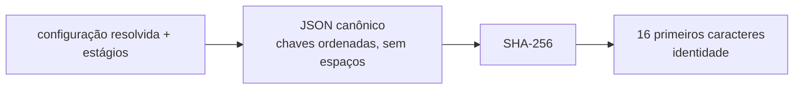

# 01-3. Runner, identidade e manifesto

## Objetivos desta aula

Ao final desta aula você vai entender:

- como uma **identidade determinística** nasce de um hash do cenário em formato canônico;
- por que toda execução, boa ou ruim, grava um **manifesto** autocontido;
- como a linha de comando seleciona **estágios** e **retoma** uma execução concluída.

E vai ter construído: o runner mínimo (`run_experiment`) e o comando `mqtt-ids`, com os testes que verificam o comportamento externo.

**Ganho tangível:** `mqtt-ids --scenario configs/diagnostics.yaml` imprime o caminho de um `manifest.json` cuja pasta tem um nome estável, derivado do cenário.

## Onde estamos

Na [aula 01-2](01-2-cenario-yaml.md) você construiu o `Scenario`, validado e imutável. Agora o runner o consome e produz o resultado que fecha a [issue 01](issues/01-project-runner.md): um estágio de diagnóstico verificável e um manifesto com identidade, configuração resolvida, versões, seed e status. É a última aula da issue 01; depois dela o curso passa à aquisição de dados (02-1).

### Relembrando

??? question "1. Por que `seed: true` não pode passar na validação do cenário?"

    Porque o YAML lê `true` como booleano e, em Python, `bool` é subclasse de `int`; sem checar `bool` explicitamente a seed viraria o inteiro 1.

??? question "2. O que `safe_load` faz de diferente de `load`?"

    Só constrói tipos básicos do YAML e recusa tags que criam objetos Python ou executam funções.

??? question "3. O que `Scenario.as_dict()` devolve e por que o `Scenario` é imutável?"

    A configuração resolvida como dicionário simples (`{"run": {"name": ..., "seed": ...}}`). A imutabilidade garante que o cenário que gerou a identidade não muda no meio da execução.

## Antes de começar

As aulas 01-1 e 01-2 concluídas, com a suíte verde:

--8<-- "course/includes/rodar-testes.md"

Nenhuma ferramenta nova: usamos só a biblioteca padrão (`hashlib`, `json`, `argparse`, `importlib.metadata`).

## Conceitos

### Identidade determinística

Cada execução precisa de um nome que não dependa do relógio nem de sorte: duas execuções do **mesmo** cenário e dos **mesmos** estágios devem ter o mesmo nome; qualquer mudança (outra seed, outro estágio) deve gerar outro. Esse nome é a **identidade**.

A receita tem três passos: (1) transformar a configuração resolvida em um texto **canônico**, isto é, sempre idêntico para o mesmo conteúdo (`json.dumps` com `sort_keys=True` e `separators=(",", ":")`: chaves ordenadas e nenhum espaço opcional); (2) calcular o SHA-256 desse texto; (3) guardar os 16 primeiros caracteres hexadecimais.



Analogia: é como o número de série calculado a partir das especificações do produto: mesmas especificações, mesmo número.

Sem ordenar as chaves, `{"a":1,"b":2}` e `{"b":2,"a":1}` seriam textos diferentes e gerariam hashes diferentes para a mesma configuração. Fontes: [json](https://docs.python.org/3/library/json.html) (`sort_keys`, `separators`) e [hashlib](https://docs.python.org/3/library/hashlib.html).

### Manifesto autocontido

O **manifesto** é um `manifest.json` gravado na pasta da identidade. Ele diz tudo sobre a execução sem consultar mais nada: a configuração resolvida, os estágios, a seed, o início e o fim, o status (`completed` ou `failed`), o erro quando houver e o ambiente (plataforma, Python e versões de pacotes lidas com `importlib.metadata`).

O ponto central: o manifesto é gravado **sempre**, inclusive quando algo falha. O bloco `try / except / finally` do Python garante isso: o `finally` roda de qualquer jeito. Uma execução que falhou e não deixou rastro seria impossível de auditar.

Fonte: [importlib.metadata](https://docs.python.org/3/library/importlib.metadata.html) (`version` e `PackageNotFoundError`).

### Interface de linha de comando com estágios e retomada

A função `main` usa o `argparse` para ler os argumentos: `--scenario` (obrigatório, um `Path`), `--stage` (repetível, restrito a uma lista), `--resume` (um interruptor) e `--output-dir`. Se a validação falhar, `parser.error` imprime o uso e a mensagem e sai com o código 2.

**Retomar** significa: se já existe um manifesto `completed` para essa identidade, não refaça nada e devolva o mesmo caminho. É isso que impede repetir trabalho caro quando o pipeline crescer.

Fonte: [argparse](https://docs.python.org/3/library/argparse.html).

## Ponte teoria → projeto

A [issue 01](issues/01-project-runner.md) pede "identidade determinística", "manifesto autocontido", "seleção de estágios e retomada". A [ADR-016](DECISIONS.md#adr-016-configuracao-registries-e-manifests) define a identidade como parte do manifesto em arquivos e a [ADR-018](DECISIONS.md#adr-018-bootstrap-automatico-e-ambiente-unico-para-scripts-e-notebooks) descreve o runner mínimo. Para a sua missão: cada resultado que você citar no portfólio poderá ser ligado a uma pasta com configuração, seed e ambiente registrados.

## Mão na massa

### Passo 1 — O ponto de entrada: `run_experiment`

Abra `src/mqtt_ids/runner.py`. A função começa conferindo as entradas e calculando a identidade:

```python title="src/mqtt_ids/runner.py" linenums="20"
def run_experiment(
    scenario: Scenario, stages: Iterable[str], output_dir: Path, resume: bool = False
) -> Path:
    """Executa os estágios solicitados e grava sempre o manifesto da execução."""
    selected_stages = tuple(stages)  # (1)!
    unknown_stages = sorted(set(selected_stages).difference(SUPPORTED_STAGES))
    if unknown_stages:
        raise ValueError(f"Estágios desconhecidos: {', '.join(unknown_stages)}")  # (2)!
    if not selected_stages:
        raise ValueError("Selecione pelo menos um estágio.")
    resolved = scenario.as_dict()  # (3)!
    identity = _identity(resolved, selected_stages)
    manifest_path = output_dir / identity / "manifest.json"  # (4)!
    if resume and manifest_path.is_file():
        previous = json.loads(manifest_path.read_text(encoding="utf-8"))
        if previous.get("status") == "completed":  # (5)!
            return manifest_path
```

1.  `tuple(stages)` congela a sequência (e aceita qualquer iterável, como a lista da CLI).
2.  Estágio desconhecido ou lista vazia falham **antes** de criar qualquer pasta.
3.  A configuração resolvida da aula 01-2.
4.  A pasta da execução se chama como a identidade: o caminho já diz de que execução se trata.
5.  Retomada: só um manifesto **concluído** é reaproveitado. Uma execução que falhou é refeita.

A constante usada na linha 25 é `SUPPORTED_STAGES = ("diagnostics", "acquire")`, na linha 17: o estágio `acquire` será tema da aula 02-2.

### Passo 2 — A identidade determinística

```python title="src/mqtt_ids/runner.py" linenums="76"
def _identity(config: dict[str, Any], stages: tuple[str, ...]) -> str:
    canonical = json.dumps(
        {"config": config, "stages": stages}, sort_keys=True, separators=(",", ":")  # (1)!
    )
    return hashlib.sha256(canonical.encode("utf-8")).hexdigest()[:16]  # (2)!
```

1.  JSON canônico: chaves ordenadas e separadores compactos. A identidade inclui os **estágios**, então rodar só `diagnostics` e rodar `acquire` gera pastas diferentes.
2.  SHA-256 do texto em UTF-8, em hexadecimal, cortado em 16 caracteres: curto para nomear pastas e ainda improvável de colidir neste projeto.

Calcule a identidade do cenário de diagnóstico:

```bash title="$ Execução no terminal (na pasta do projeto)"
uv run --locked python -c "
from mqtt_ids.config import load_scenario
from mqtt_ids.runner import _identity
from pathlib import Path
print(_identity(load_scenario(Path('configs/diagnostics.yaml')).as_dict(), ('diagnostics',)))
"
```

```text title="Saída esperada"
e42180fc7c9644a4
```

**O que aconteceu:** como a identidade só depende da configuração e dos estágios, **este mesmo valor** aparece na sua máquina e em qualquer outra.

??? question "Pare e pense: se você mudar `seed: 20260822` para `seed: 1`, a identidade muda?"

    Sim: a seed faz parte da configuração resolvida, e qualquer mudança no texto canônico muda o SHA-256. Com a seed igual a 1 a pasta passa a se chamar `73867696991a505a`.

### Passo 3 — O manifesto, gravado sempre

Montamos o dicionário do manifesto e executamos os estágios dentro de `try`:

```python title="src/mqtt_ids/runner.py" linenums="37"
    manifest: dict[str, Any] = {
        "identity": identity,
        "config": resolved,
        "stages": list(selected_stages),
        "seed": scenario.seed,
        "started_at": datetime.now(UTC).isoformat(),  # (1)!
        "status": "running",
        "environment": _environment(),
    }
    try:
        for stage in selected_stages:
            if stage == "diagnostics":
                manifest["diagnostics"] = _diagnostics()  # (2)!
            elif stage == "acquire":
                if scenario.dataset is None:
                    raise ValueError("O estágio acquire exige a seção 'dataset'.")
                manifest["dataset"] = acquire_dataset(
                    scenario.dataset.handle,
                    scenario.dataset.data_dir,
                    DatasetMetadata(
                        doi=scenario.dataset.doi,
                        license=scenario.dataset.license,
                        authors=scenario.dataset.authors,
                    ),
                )
        manifest["status"] = "completed"  # (3)!
```

1.  Em UTC e no formato ISO 8601, sem ambiguidade de fuso. O horário **não** entra na identidade; só descreve a execução.
2.  O diagnóstico é o estágio mais simples: devolve que o runner está disponível e quais estágios existem.
3.  Só chega aqui se todos os estágios terminaram sem exceção.

Agora o tratamento de falha e a gravação, que acontece **sempre**:

```python title="src/mqtt_ids/runner.py" linenums="63"
    except Exception as error:
        manifest["status"] = "failed"
        manifest["error"] = {"type": type(error).__name__, "message": str(error)}  # (1)!
        raise  # (2)!
    finally:
        manifest["finished_at"] = datetime.now(UTC).isoformat()
        manifest_path.parent.mkdir(parents=True, exist_ok=True)  # (3)!
        manifest_path.write_text(
            json.dumps(manifest, indent=2, sort_keys=True) + "\n", encoding="utf-8"  # (4)!
        )
    return manifest_path
```

1.  Guardamos o tipo e a mensagem do erro: o manifesto explica por que falhou.
2.  `raise` sem argumentos **relança** a mesma exceção. O manifesto registra a falha, mas ela não é engolida.
3.  A pasta só é criada aqui: se a validação inicial falhou, nada chega até esta linha.
4.  `indent=2` e `sort_keys=True` deixam o arquivo legível e estável para comparar. A quebra de linha final é convenção de arquivo de texto.

Falta o registro do ambiente, que usa `importlib.metadata`:

```python title="src/mqtt_ids/runner.py" linenums="83"
def _environment() -> dict[str, Any]:
    packages: dict[str, str | None] = {}
    for package in ("mqtt-investigation", "PyYAML", "pytest", "ruff", "ipykernel"):
        try:
            packages[package] = version(package)  # (1)!
        except PackageNotFoundError:
            packages[package] = None  # (2)!
    return {
        "platform": platform.platform(),
        "python": sys.version,
        "packages": packages,
    }
```

1.  `version("nome-da-distribuição")` devolve a versão **instalada** como texto.
2.  Se o pacote não está no ambiente (por exemplo, sem o grupo `notebook`), registramos `None` em vez de falhar.

### Passo 4 — A linha de comando

```python title="src/mqtt_ids/cli.py" linenums="12"
def main() -> None:
    """Processa argumentos e imprime o caminho do manifesto produzido."""
    parser = argparse.ArgumentParser(description="Executa um cenário MQTT IDS.")
    parser.add_argument("--scenario", required=True, type=Path)  # (1)!
    parser.add_argument("--stage", action="append", choices=SUPPORTED_STAGES)  # (2)!
    parser.add_argument("--resume", action="store_true")  # (3)!
    parser.add_argument("--output-dir", type=Path, default=Path("artifacts/runs"))
    arguments = parser.parse_args()
    try:
        scenario = load_scenario(arguments.scenario)
        manifest = run_experiment(
            scenario,
            arguments.stage or ["diagnostics"],  # (4)!
            arguments.output_dir,
            arguments.resume,
        )
    except (ScenarioError, ValueError) as error:
        parser.error(str(error))  # (5)!
    print(manifest)
```

1.  Obrigatório, e já convertido em `Path`.
2.  `append` permite repetir `--stage`; `choices` recusa nomes fora de `SUPPORTED_STAGES`.
3.  `store_true`: sem a opção vale `False`, com ela vale `True`.
4.  Sem nenhum `--stage`, o padrão é o diagnóstico.
5.  Erros de configuração viram uma mensagem de uso e saída com código 2, sem traceback.

Rode o runner:

```bash title="$ Execução no terminal (na pasta do projeto)"
uv run --locked mqtt-ids --scenario configs/diagnostics.yaml --output-dir /tmp/runs
cat /tmp/runs/*/manifest.json
```

```text title="Saída esperada"
/tmp/runs/e42180fc7c9644a4/manifest.json
{
  "config": {
    "run": {
      "name": "diagnostics",
      "seed": 20260822
    }
  },
  "diagnostics": {
    "runner": "available",
    "supported_stages": [
      "diagnostics",
      "acquire"
    ]
  },
  "environment": {
    "packages": {
      "PyYAML": "6.0.3",
      "ipykernel": "7.3.0",
      "mqtt-investigation": "0.1.0",
      "pytest": "9.1.1",
      "ruff": "0.16.4"
    },
    "platform": "Linux-7.2.8-1-cachyos-x86_64-with-glibc2.44",
    "python": "3.13.15 (main, Sep  1 2026, 14:18:08) [Clang 22.1.3 ]"
  },
  "finished_at": "2026-10-01T20:08:26.066120+00:00",
  "identity": "e42180fc7c9644a4",
  "seed": 20260822,
  "stages": [
    "diagnostics"
  ],
  "started_at": "2026-10-01T20:08:26.057577+00:00",
  "status": "completed"
}
```

**O que aconteceu:** o comando imprimiu o caminho do manifesto e o arquivo traz tudo sobre a execução. `platform`, `python`, as versões e os horários **variam** na sua máquina; `identity`, `config`, `seed`, `stages` e `status` são os mesmos.

### Passo 5 — Retomar, falhar e mudar de identidade

Rode de novo o mesmo comando e depois com `--resume`:

```bash title="$ Execução no terminal (na pasta do projeto)"
uv run --locked mqtt-ids --scenario configs/diagnostics.yaml --output-dir /tmp/runs
grep started_at /tmp/runs/*/manifest.json
uv run --locked mqtt-ids --scenario configs/diagnostics.yaml --output-dir /tmp/runs --resume
grep started_at /tmp/runs/*/manifest.json
```

```text title="Saída esperada"
/tmp/runs/e42180fc7c9644a4/manifest.json
  "started_at": "2026-10-01T20:08:26.133975+00:00",
/tmp/runs/e42180fc7c9644a4/manifest.json
  "started_at": "2026-10-01T20:08:26.133975+00:00",
```

**O que aconteceu:** a pasta é a mesma (identidade igual). Sem `--resume` o manifesto foi reescrito, então o `started_at` do primeiro comando foi substituído; com `--resume` o runner viu o manifesto `completed` e **não** tocou nele: o `started_at` não mudou entre as duas execuções finais. (Os horários variam.)

Agora um estágio que exige uma seção ausente do cenário:

```bash title="$ Execução no terminal (na pasta do projeto)"
uv run --locked mqtt-ids --scenario configs/diagnostics.yaml --stage acquire --output-dir /tmp/runs
```

```text title="Saída esperada"
usage: mqtt-ids [-h] --scenario SCENARIO [--stage {diagnostics,acquire}]
                [--resume] [--output-dir OUTPUT_DIR]
mqtt-ids: error: O estágio acquire exige a seção 'dataset'.
```

**O que aconteceu:** o runner levantou `ValueError`, a CLI o transformou em mensagem de uso, mas antes o `finally` gravou um manifesto `failed` na pasta do estágio `acquire`, com `{"type": "ValueError", "message": "O estágio acquire exige a seção 'dataset'."}`.

??? question "Pare e pense: `--stage diagnostics` explícito gera a mesma identidade que o padrão?"

    Sim. Sem `--stage`, a CLI usa `["diagnostics"]`, e a identidade depende só dos estágios selecionados: `e42180fc7c9644a4` nos dois casos.

Limpe a pasta de rascunho: `rm -rf /tmp/runs`.

## Testando

Os testes do runner existem em `tests/test_runner.py`. Os dois primeiros mostram o estilo: **comportamento externo**, chamando o comando como o usuário chamaria.

```python title="tests/test_runner.py" linenums="14"
def test_runner_creates_a_deterministic_completed_manifest(tmp_path: Path) -> None:
    scenario = tmp_path / "scenario.yaml"
    scenario.write_text("run:\n  name: smoke\n  seed: 7\n", encoding="utf-8")  # (1)!
    output_dir = tmp_path / "runs"
    command = [
        sys.executable,  # (2)!
        "-m",
        "mqtt_ids.cli",
        "--scenario",
        str(scenario),
        "--output-dir",
        str(output_dir),
    ]
    first = subprocess.run(command, check=True, capture_output=True, text=True)  # (3)!
    manifest_path = Path(first.stdout.strip())
    manifest = json.loads(manifest_path.read_text(encoding="utf-8"))
    second = subprocess.run(
        [*command, "--resume"], check=True, capture_output=True, text=True
    )
    assert manifest["status"] == "completed"
    assert manifest["seed"] == 7
    assert manifest["diagnostics"]["runner"] == "available"
    assert second.stdout.strip() == str(manifest_path)  # (4)!
```

1.  O cenário é criado dentro de `tmp_path`: nada de arquivos reais do repositório.
2.  `sys.executable` é o Python do ambiente atual. `-m mqtt_ids.cli` executa o módulo da CLI como um processo separado.
3.  `check=True` falha o teste se o comando sair com erro; `capture_output` guarda o que ele imprimiu.
4.  A retomada devolve exatamente o mesmo caminho.

O quarto teste simula uma falha trocando uma função por outra durante o teste:

```python title="tests/test_runner.py" linenums="79"
def test_failed_stage_writes_a_failed_manifest(
    tmp_path: Path, monkeypatch: pytest.MonkeyPatch
) -> None:
    def fail_diagnostics() -> dict[str, str]:
        raise RuntimeError("diagnóstico interrompido")

    monkeypatch.setattr(runner, "_diagnostics", fail_diagnostics)  # (1)!
    output_dir = tmp_path / "runs"

    with pytest.raises(RuntimeError, match="diagnóstico interrompido"):  # (2)!
        runner.run_experiment(
            scenario=Scenario(name="failure-test", seed=7),
            stages=["diagnostics"],
            output_dir=output_dir,
        )

    manifest_path = next(output_dir.glob("*/manifest.json"))
    manifest = json.loads(manifest_path.read_text(encoding="utf-8"))

    assert manifest["status"] == "failed"  # (3)!
    assert manifest["error"] == {
        "type": "RuntimeError",
        "message": "diagnóstico interrompido",
    }
    assert manifest["seed"] == 7
```

1.  `monkeypatch.setattr` troca `_diagnostics` por uma versão que falha e **desfaz** a troca ao fim do teste. Assim simulamos uma falha sem alterar o código.
2.  O erro precisa continuar subindo: o `raise` do runner não pode engolir a exceção.
3.  E mesmo assim o manifesto foi gravado com o status `failed`.

```bash title="$ Execução no terminal (na pasta do projeto)"
uv run --locked pytest tests/test_runner.py -v
```

```text title="Saída esperada"
tests/test_runner.py::test_runner_creates_a_deterministic_completed_manifest PASSED [ 16%]
tests/test_runner.py::test_invalid_scenario_fails_before_creating_output PASSED [ 33%]
tests/test_runner.py::test_same_scenario_has_identity_in_independent_runs PASSED [ 50%]
tests/test_runner.py::test_failed_stage_writes_a_failed_manifest PASSED  [ 66%]
tests/test_runner.py::test_cli_records_selected_stage PASSED             [ 83%]
tests/test_runner.py::test_acquisition_failure_is_recorded_in_runner_manifest PASSED [100%]

============================== 6 passed in 0.25s ==============================
```

**O que aconteceu:** seis comportamentos verificados. O segundo teste (`test_invalid_scenario_fails_before_creating_output`) afirma que a pasta de saída **não existe** depois de um cenário inválido; o terceiro, que dois diretórios de saída independentes geram a mesma identidade. O último teste (aquisição) volta na aula 02-2. A descrição de cada cenário está em [Catálogo de testes](testing/scenarios.md).

## Erros comuns

**1. Esquecer o `--scenario`.**

```text title="Saída"
mqtt-ids: error: the following arguments are required: --scenario
```

Correção: informe o arquivo YAML.

**2. Caminho do cenário errado.**

```text title="Saída"
mqtt-ids: error: Cenário não encontrado: nao-existe.yaml
```

Correção: confira o caminho (relativo à pasta onde você roda o comando).

**3. Estágio inexistente.**

```text title="Saída"
mqtt-ids: error: argument --stage: invalid choice: 'foo' (choose from 'diagnostics', 'acquire')
```

Correção: use um dos nomes listados.

**4. Achar que `--resume` conserta uma execução falha.** Ele só reaproveita um manifesto `completed`. Se o anterior terminou com `failed`, o runner executa tudo de novo e sobrescreve o manifesto.

## Código completo desta aula

??? example "Arquivo completo: src/mqtt_ids/runner.py"

    ```python
    --8<-- "src/mqtt_ids/runner.py"
    ```

??? example "Arquivo completo: src/mqtt_ids/cli.py"

    ```python
    --8<-- "src/mqtt_ids/cli.py"
    ```

??? example "Arquivo completo: tests/test_runner.py"

    ```python
    --8<-- "tests/test_runner.py"
    ```

## Exercícios

Os dois exercícios continuam em `src/mqtt_ids/exercicios.py`. O segundo usa o `Scenario` (aula 01-2) e a simulação de falha com `monkeypatch`.

1. Escreva `fingerprint(data)`, que devolve os 16 primeiros caracteres do SHA-256 do JSON canônico de um dicionário, e `completed_runs(output_dir)`, que lista (em ordem) os nomes das pastas cujo `manifest.json` tem status `completed`. O exercício está pronto quando este teste passar:

    ```python title="tests/test_exercicio_01_3.py"
    from pathlib import Path

    import pytest

    from mqtt_ids import runner
    from mqtt_ids.config import Scenario
    from mqtt_ids.exercicios import completed_runs, fingerprint


    def test_fingerprint_ignores_key_order_and_changes_with_values() -> None:
        first = fingerprint({"seed": 1, "name": "x"})

        assert first == fingerprint({"name": "x", "seed": 1})
        assert first != fingerprint({"name": "x", "seed": 2})
        assert len(first) == 16


    def test_completed_runs_ignores_failed_manifests(
        tmp_path: Path, monkeypatch: pytest.MonkeyPatch
    ) -> None:
        ok = runner.run_experiment(Scenario(name="ok", seed=1), ["diagnostics"], tmp_path)

        def boom() -> dict[str, str]:
            raise RuntimeError("falha simulada")

        monkeypatch.setattr(runner, "_diagnostics", boom)
        with pytest.raises(RuntimeError):
            runner.run_experiment(Scenario(name="bad", seed=2), ["diagnostics"], tmp_path)

        assert completed_runs(tmp_path) == [ok.parent.name]
    ```

    ```bash title="$ Execução no terminal (na pasta do projeto)"
    uv run --locked pytest tests/test_exercicio_01_3.py
    ```

    Antes da solução:

    ```text title="Saída esperada (antes da solução)"
    E   ImportError: cannot import name 'completed_runs' from 'mqtt_ids.exercicios' (...)
    ERROR tests/test_exercicio_01_3.py
    ```

??? tip "Solução"

    ```python title="src/mqtt_ids/exercicios.py (acrescente ao arquivo)"
    import hashlib  # junto dos outros imports
    import json


    def fingerprint(data: dict) -> str:
        canonical = json.dumps(data, sort_keys=True, separators=(",", ":"))
        return hashlib.sha256(canonical.encode("utf-8")).hexdigest()[:16]


    def completed_runs(output_dir: Path) -> list[str]:
        completed = []
        for path in sorted(output_dir.glob("*/manifest.json")):
            if json.loads(path.read_text(encoding="utf-8"))["status"] == "completed":
                completed.append(path.parent.name)
        return completed
    ```

    Depois da solução: `2 passed`. É a mesma receita do `_identity` do runner, sem os estágios. O `sorted` dá uma ordem estável à lista.

## Quiz de fixação

??? question "1. Com suas palavras: por que a identidade usa JSON com chaves ordenadas?"

    Para que o mesmo conteúdo produza sempre o mesmo texto, e portanto o mesmo hash, independentemente da ordem em que as chaves foram escritas. Sem isso, `{"a":1,"b":2}` e `{"b":2,"a":1}` teriam identidades diferentes.

??? question "2. O que garante que um manifesto exista mesmo quando um estágio falha?"

    O bloco `finally`: ele roda com ou sem exceção e grava o manifesto, com status `failed` e o erro registrado quando houver. O `raise` do `except` relança a exceção depois.

**3. O que `--resume` faz quando já existe um manifesto `failed` para a identidade?**

- a) Executa os estágios de novo e sobrescreve o manifesto
- b) Devolve o caminho do manifesto sem executar nada
- c) Apaga a pasta da execução e encerra com erro

??? question "Resposta da 3"

    **a)**. O runner só devolve o caminho cedo quando o status é `completed`. O b) descreveria o caso `completed`; o c) não existe no código: nada é apagado.

??? question "4. Revisão da aula 01-2: por que o teste de erro de configuração usa `tmp_path`?"

    Para que cada teste escreva seu YAML numa pasta temporária própria, sem tocar o repositório nem depender de arquivos reais ([ADR-019](DECISIONS.md#adr-019-cobertura-comportamental-do-runner-minimo)).

## Commit

```bash title="$ Execução no terminal (na pasta do projeto)"
git add docs/01-3-runner-e-manifesto.md docs/glossario.md docs/referencia.md docs/recursos.md course/ mkdocs.yml docs/issues/01-project-runner.md
git commit -m "docs: aula 01-3 sobre runner, identidade e manifesto"
```

## Resumo

- Identidade = SHA-256 (16 caracteres) do JSON canônico de configuração e estágios.
- O manifesto é gravado sempre, no `finally`, com status e erro.
- A CLI usa `argparse`; `--resume` reaproveita só execuções `completed`.

## Fonte principal

[Módulo json](https://docs.python.org/3/library/json.html): leia `sort_keys` e `separators`, que tornam a serialização canônica.

## Para saber mais

- [hashlib](https://docs.python.org/3/library/hashlib.html), [argparse](https://docs.python.org/3/library/argparse.html) e [importlib.metadata](https://docs.python.org/3/library/importlib.metadata.html)
- [pytest: monkeypatch](https://docs.pytest.org/en/stable/how-to/monkeypatch.html)

!!! question "Ficou com dúvida?"

    O agente é o seu professor: pergunte o que não ficou claro, colando a mensagem de erro exata e o que você tentou. Para conversar com pessoas, veja as comunidades em [Recursos](recursos.md#comunidades).

**Próxima aula:** [02-1. Handles e SHA-256](02-1-handles-e-sha256.md).
