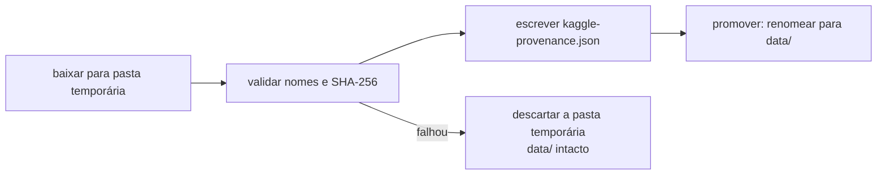

# 02-2. Aquisição atômica e reutilizável

## Objetivos desta aula

Ao final desta aula você vai entender:

- por que baixar para uma pasta **temporária** e só depois **promover** o resultado (aquisição atômica);
- como o manifesto de proveniência permite **reaproveitar** uma cópia sem baixar de novo, e recusar uma cópia adulterada;
- como testar código que depende da rede usando um **dublê** (fake) no lugar do KaggleHub.

E vai ter construído: o estágio `acquire` do runner (`acquire_dataset` e seus ajudantes) com os testes que o protegem.

**Ganho tangível:** uma simulação offline mostra a 1ª chamada baixando, a 2ª reutilizando a cópia e uma cópia adulterada sendo recusada, sem tocar na rede.

## Onde estamos

Na [aula 02-1](02-1-handles-e-sha256.md) você montou os validadores de handle e o `sha256` em streaming. Agora os usamos para o que a [issue 02](issues/02-kaggle-ingestion.md) pede do estágio de aquisição: "baixar os três CSVs, validar nomes e SHA-256 e produzir um manifesto de proveniência", "reutilizar download válido" e deixar status `failed` explicativo em caso de erro. Este estágio é o `acquire` que o runner (aula [01-3](01-3-runner-e-manifesto.md)) já sabia chamar.

### Relembrando

??? question "1. Por que o handle de download precisa de `/versions/N`?"

    Sem a versão o handle aponta para a mais recente, que muda quando alguém publica: o conteúdo deixa de ser reproduzível.

??? question "2. Qual a diferença entre cache e integridade verificada?"

    O cache só garante que existe um arquivo com aquele nome; a integridade verificada compara o SHA-256 calculado com o esperado.

??? question "3. Em um manifesto de execução, quando o status vira `failed` e por que o arquivo é gravado mesmo assim?"

    Quando um estágio levanta uma exceção; o `finally` do runner grava o manifesto sempre, com o erro registrado, para que a falha seja auditável.

## Antes de começar

As aulas 01-1 a 02-1 concluídas, suíte verde:

--8<-- "course/includes/rodar-testes.md"

Não é necessária conta Kaggle: usaremos um dublê no lugar da rede. (Para baixar de verdade você precisaria de credenciais; o roteiro está na [pesquisa sobre armazenamento no Kaggle](research/kaggle-armazenamento-e-recuperacao.md).)

## Conceitos

### Aquisição atômica

Imagine baixar 500 MB direto para `data/` e a conexão cair na metade: `data/` fica com arquivos parciais que parecem válidos. **Atômico** quer dizer "tudo ou nada": o destino final só passa a existir quando a operação inteira terminou e foi verificada.

A receita tem quatro passos: (1) baixar para uma pasta **temporária** criada ao lado do destino (no **mesmo sistema de arquivos**, para que o próximo passo seja só uma troca de nome); (2) validar nomes e SHA-256 ali; (3) escrever o manifesto; (4) **promover**: trocar o nome da pasta temporária pelo do destino. Renomear dentro do mesmo sistema de arquivos é uma operação atômica no Unix: ou aconteceu, ou não.



Se qualquer passo falhar, o `with tempfile.TemporaryDirectory(...)` apaga a pasta temporária e o destino original continua como estava. O `Path.replace` renomeia o alvo e substitui incondicionalmente um arquivo ou diretório vazio já existente.

Fontes: [tempfile](https://docs.python.org/3/library/tempfile.html) (`TemporaryDirectory`: limpeza ao sair do contexto, mesmo com erro), [pathlib](https://docs.python.org/3/library/pathlib.html) (`Path.replace`) e [shutil](https://docs.python.org/3/library/shutil.html) (`rmtree`).

### Reuso por proveniência verificada

Baixar de novo o que já temos é desperdício; reaproveitar sem conferir é arriscado. A solução é guardar, junto aos dados, um arquivo `kaggle-provenance.json` com o handle versionado, DOI, licença, autores e, para cada CSV, nome, tamanho e SHA-256. Para reutilizar, o código **recalcula** o que o manifesto deveria dizer a partir dos bytes que estão no disco e compara com o arquivo. Se forem iguais, a cópia é válida (`reused: true`); se alguém mexeu num byte, não é, e a aquisição se recusa a seguir.

Isso é o oposto de confiar no cache: o manifesto é uma **afirmação**, e a verificação a confirma ([ADR-022](DECISIONS.md#adr-022-aquisicao-kaggle-versionada-validada-e-promovida-atomicamente)).

### Dublê de teste para a rede

Testes não devem depender da internet, de credenciais ou do estado do Kaggle. Um **dublê** (fake) é um objeto que imita a parte externa com o comportamento mínimo necessário. No código, a função `_kagglehub()` devolve o módulo `kagglehub`; é a **costura** onde a rede entra. O teste usa `monkeypatch.setattr` para trocá-la por uma função que devolve uma classe `FakeKaggleHub`, com o método `dataset_download` escrevendo arquivos locais. O fluxo de aquisição roda inteiro, só a rede é falsa.

Fonte: [pytest: monkeypatch](https://docs.pytest.org/en/stable/how-to/monkeypatch.html).

## Ponte teoria → projeto

A [ADR-022](DECISIONS.md#adr-022-aquisicao-kaggle-versionada-validada-e-promovida-atomicamente) define o estágio `acquire`: download em diretório temporário no mesmo filesystem, validação de nomes e SHA-256, promoção atômica sobre árvore vazia ou de placeholders, reuso só se manifesto e bytes continuam válidos, e destino com dados não reconhecidos nunca sobrescrito. Cada critério da issue vira uma linha do código desta aula. Para a sua missão: o portfólio pode afirmar que os dados usados são exatamente os da versão citada, com prova.

## Mão na massa

### Passo 1 — A seção `dataset` do cenário

O estágio precisa saber o que baixar e como atribuir a fonte. Isso vem do cenário, na seção opcional `dataset` que deixamos para esta aula (aula 01-2). A parte de configuração é uma `dataclass` imutável:

```python title="src/mqtt_ids/config.py" linenums="16"
@dataclass(frozen=True)
class DatasetConfig:
    """Fonte Kaggle versionada e sua atribuição verificável."""

    handle: str
    data_dir: Path
    doi: str
    license: str
    authors: tuple[str, ...]  # (1)!

    def as_dict(self) -> dict[str, Any]:
        return {
            "handle": self.handle,
            "data_dir": str(self.data_dir),
            "doi": self.doi,
            "license": self.license,
            "authors": list(self.authors),  # (2)!
        }
```

1.  Tupla, e não lista: uma dataclass imutável não deve conter coleção mutável.
2.  Na versão serializável voltamos a lista, que é o que o JSON e o YAML entendem.

A função `_load_dataset` (linhas 78–104 do mesmo arquivo) valida esta seção com o mesmo estilo de `load_scenario`: chaves **exatas**, textos não vazios e lista de autores não vazia. Veja o exemplo do projeto:

```yaml title="configs/kaggle-acquisition.example.yaml" linenums="1"
run:
  name: kaggle-acquisition
  seed: 20260831
dataset:
  handle: OWNER/SLUG/versions/N  # (1)!
  data_dir: data
  doi: 10.6084/m9.figshare.24420958
  license: CC-BY-4.0
  authors:
    - Héctor Alaiz-Moretón
    - Jose Antonio Aveleira-Mata
    - Saúl Díez Fernández
    - Ángel Luis Muñoz Castañeda
    - Isaías García-Rodríguez
    - Carmen Benavides
    - José Alberto Benítez-Andrades
```

1.  É um **modelo**: você troca `OWNER/SLUG/versions/N` pela versão publicada na sua conta.

Rode o estágio com o modelo sem editar. Ele deve **falhar antes de qualquer download**:

```bash title="$ Execução no terminal (na pasta do projeto)"
cp configs/kaggle-acquisition.example.yaml /tmp/acq.yaml
uv run --locked mqtt-ids --scenario /tmp/acq.yaml --stage acquire --output-dir /tmp/runs
```

```text title="Saída esperada"
                [--resume] [--output-dir OUTPUT_DIR]
mqtt-ids: error: Handle de download de Dataset deve ser 'owner/slug/versions/N'.
```

**O que aconteceu:** o `N` literal não é um número; o validador da aula 02-1 recusou o handle antes da rede. A primeira linha é o final da mensagem de uso do `argparse`. Como o runner grava o manifesto sempre, existe um `manifest.json` com `status: failed` e o erro de `KaggleAssetError`. Limpe com `rm -rf /tmp/runs /tmp/acq.yaml`.

### Passo 2 — Validar o que foi baixado

Antes de promover qualquer coisa, conferimos que os três arquivos existem **exatamente uma vez** e que os hashes batem:

```python title="src/mqtt_ids/kaggle_assets.py" linenums="265"
def _find_raw_files(raw_dir: Path) -> dict[str, Path]:
    found: dict[str, Path] = {}
    for name in RAW_HASHES:
        matches = list(raw_dir.rglob(name)) if raw_dir.is_dir() else []  # (1)!
        if len(matches) != 1:
            raise KaggleAssetError(
                f"{name} deve existir exatamente uma vez dentro de {raw_dir}."  # (2)!
            )
        found[name] = matches[0]
    return found


def _validate_downloaded_raw(raw_dir: Path) -> None:
    raw_files = _find_raw_files(raw_dir)
    for name, expected_hash in RAW_HASHES.items():
        path = raw_files[name]
        if sha256(path) != expected_hash:  # (3)!
            raise KaggleAssetError(f"SHA-256 divergente após download: {path}.")
```

1.  `rglob` procura o nome em todas as subpastas, sem renomear nada. Se a pasta `raw` nem existe, a lista fica vazia.
2.  Zero ocorrências (arquivo ausente) e mais de uma (ambíguo) falham do mesmo jeito: **sem renomeação silenciosa**.
3.  A conferência é do conteúdo, com o `sha256` da aula 02-1.

### Passo 3 — O estágio `acquire_dataset`

Primeiro, as decisões antes de baixar:

```python title="src/mqtt_ids/kaggle_assets.py" linenums="129"
def acquire_dataset(
    handle: str, data_dir: Path, metadata: DatasetMetadata
) -> dict[str, Any]:
    """Baixa, valida e promove uma versão, ou reutiliza uma cópia válida."""
    validate_dataset_download_handle(handle)  # (1)!
    existing = _read_valid_provenance(data_dir, handle, metadata)
    if existing is not None:
        return {**existing, "reused": True}  # (2)!
    if data_dir.exists() and not _contains_only_placeholders(data_dir):
        raise KaggleAssetError(
            f"Destino não está vazio e não é uma aquisição válida: {data_dir}"  # (3)!
        )
```

1.  O primeiro passo é sempre o validador de handle (falhar cedo).
2.  Cópia válida: devolve o manifesto existente, marcando `reused: True`, sem rede.
3.  Se o destino tem dados que **não** são uma aquisição válida (por exemplo, um CSV adulterado), o código **se recusa a sobrescrever**: você decide o que fazer com eles.

Agora o download em área de preparação e a promoção:

```python title="src/mqtt_ids/kaggle_assets.py" linenums="141"
    data_dir.parent.mkdir(parents=True, exist_ok=True)
    with tempfile.TemporaryDirectory(
        prefix=f".{data_dir.name}-download-", dir=data_dir.parent  # (1)!
    ) as temporary:
        staged = Path(temporary) / "data"
        _kagglehub().dataset_download(handle, output_dir=str(staged))  # (2)!
        _validate_downloaded_raw(staged / "raw")
        provenance = _dataset_provenance(handle, staged, metadata)
        (staged / PROVENANCE_FILE).write_text(
            json.dumps(provenance, indent=2, sort_keys=True) + "\n", encoding="utf-8"
        )
        _promote_download(staged, data_dir)  # (3)!
    return {**provenance, "reused": False}
```

1.  A pasta temporária nasce **ao lado** do destino (`dir=data_dir.parent`), no mesmo sistema de arquivos. É isso que permite a promoção por troca de nome.
2.  A rede só entra aqui, pela costura `_kagglehub()`. O `KaggleHub` recebe uma pasta que não existe ainda.
3.  Só depois de validar e escrever o manifesto o resultado vira o destino.

A promoção e o teste de "destino só tem placeholders":

```python title="src/mqtt_ids/kaggle_assets.py" linenums="324"
def _contains_only_placeholders(path: Path) -> bool:
    return all(item.is_dir() or item.name == ".gitkeep" for item in path.rglob("*"))  # (1)!


def _promote_download(staged: Path, destination: Path) -> None:
    backup = destination.with_name(f".{destination.name}-placeholder-backup")
    if backup.exists():
        raise KaggleAssetError(f"Backup temporário inesperado: {backup}")
    if destination.exists():
        destination.replace(backup)  # (2)!
    try:
        staged.replace(destination)  # (3)!
    except Exception:
        if backup.exists() and not destination.exists():
            backup.replace(destination)  # (4)!
        raise
    if backup.exists():
        shutil.rmtree(backup)  # (5)!
```

1.  Uma árvore de "placeholders" tem só pastas e arquivos `.gitkeep` (o que o Git precisa para versionar pastas vazias).
2.  O destino existente (só placeholders) vira um backup por troca de nome.
3.  A pasta validada ocupa o lugar do destino.
4.  Se a promoção falhar, o backup **volta** ao lugar e a exceção sobe: o destino original sobrevive.
5.  Só com tudo certo o backup é apagado.

### Passo 4 — O manifesto de proveniência e o reuso

A proveniência é calculada **a partir dos bytes** da pasta, não copiada de outro lugar:

```python title="src/mqtt_ids/kaggle_assets.py" linenums="285"
def _dataset_provenance(
    handle: str, data_dir: Path, metadata: DatasetMetadata
) -> dict[str, Any]:
    owner, slug, _, version = handle.split("/")  # (1)!
    raw_files = _find_raw_files(data_dir / "raw")
    return {
        "owner": owner,
        "slug": slug,
        "version": int(version),
        "version_handle": handle,
        "doi": metadata.doi,
        "license": metadata.license,
        "authors": list(metadata.authors),
        "files": [
            {
                "name": name,
                "path": str(raw_files[name].relative_to(data_dir)),
                "size_bytes": raw_files[name].stat().st_size,
                "sha256": sha256(raw_files[name]),  # (2)!
            }
            for name in sorted(raw_files)  # (3)!
        ],
    }
```

1.  Como o handle já foi validado, o `split` é seguro: sempre há quatro trechos.
2.  O hash é recalculado agora, sobre os bytes presentes.
3.  Ordem alfabética: o manifesto é estável e comparável.

E o reuso compara o arquivo gravado com o que deveria estar lá:

```python title="src/mqtt_ids/kaggle_assets.py" linenums="310"
def _read_valid_provenance(
    data_dir: Path, handle: str, metadata: DatasetMetadata
) -> dict[str, Any] | None:
    path = data_dir / PROVENANCE_FILE
    if not path.is_file():
        return None  # (1)!
    try:
        observed = json.loads(path.read_text(encoding="utf-8"))
        expected = _dataset_provenance(handle, data_dir, metadata)  # (2)!
    except (OSError, ValueError, json.JSONDecodeError, KaggleAssetError):
        return None  # (3)!
    return observed if observed == expected else None  # (4)!
```

1.  Sem manifesto, não há o que reutilizar.
2.  O esperado é recalculado dos arquivos atuais e do handle pedido.
3.  Qualquer problema (JSON quebrado, arquivo faltando) significa "não é uma cópia válida", sem estourar uma exceção.
4.  Só se manifesto e bytes concordam a cópia é reaproveitada. Um handle de **outra versão** também gera uma diferença e, portanto, não reutiliza.

### Passo 5 — Simular a aquisição, sem rede

Crie o rascunho `/tmp/simular_aquisicao.py`. Ele troca a costura por um dublê e exercita os três caminhos:

```python title="/tmp/simular_aquisicao.py" linenums="1"
import hashlib
import json
import tempfile
from pathlib import Path

from mqtt_ids import kaggle_assets
from mqtt_ids.kaggle_assets import DatasetMetadata, KaggleAssetError, acquire_dataset

PAYLOADS = {"Intrusion.csv": b"intrusion", "DoS.csv": b"dos", "MitM.csv": b"mitm"}
kaggle_assets.RAW_HASHES = {  # (1)!
    name: hashlib.sha256(content).hexdigest() for name, content in PAYLOADS.items()
}


class FakeKaggleHub:  # (2)!
    def dataset_download(self, handle, **kwargs):
        print("  [rede simulada] baixando", handle)
        destination = Path(kwargs["output_dir"])
        for category in ("raw", "interim", "processed"):
            (destination / category).mkdir(parents=True)
        for name, content in PAYLOADS.items():
            (destination / "raw" / name).write_bytes(content)
        return str(destination)


kaggle_assets._kagglehub = lambda: FakeKaggleHub()  # (3)!
metadata = DatasetMetadata("10.6084/m9.figshare.24420958", "CC-BY-4.0", ("Autora Exemplo",))
base = Path(tempfile.mkdtemp())
data = base / "data"

print("1ª chamada")
first = acquire_dataset("owner/data/versions/3", data, metadata)
print("  reused =", first["reused"])
print("2ª chamada")
second = acquire_dataset("owner/data/versions/3", data, metadata)
print("  reused =", second["reused"])
print(json.dumps({k: second[k] for k in ("owner", "slug", "version", "doi", "license")}))
print(sorted(path.name for path in data.iterdir()))

print("Com um arquivo adulterado")
(data / "raw" / "DoS.csv").write_bytes(b"adulterado")
try:
    acquire_dataset("owner/data/versions/3", data, metadata)
except KaggleAssetError as error:
    print("  ERRO:", error.args[0].replace(str(data), "<data>"))
print(sorted(path.name for path in base.iterdir()))
```

1.  Os hashes reais são dos CSVs verdadeiros (centenas de MB). Para a simulação trocamos os esperados pelos hashes dos nossos três conteúdos minúsculos.
2.  O dublê tem só o método de que o código precisa: cria as três pastas e os três arquivos na pasta pedida.
3.  Trocamos a costura: de agora em diante `_kagglehub()` devolve o nosso dublê.

```bash title="$ Execução no terminal (na pasta do projeto)"
uv run --locked python /tmp/simular_aquisicao.py
```

```text title="Saída esperada"
1ª chamada
  [rede simulada] baixando owner/data/versions/3
  reused = False
2ª chamada
  reused = True
{"owner": "owner", "slug": "data", "version": 3, "doi": "10.6084/m9.figshare.24420958", "license": "CC-BY-4.0"}
['interim', 'kaggle-provenance.json', 'processed', 'raw']
Com um arquivo adulterado
  ERRO: Destino não está vazio e não é uma aquisição válida: <data>
['data']
```

**O que aconteceu:** a 1ª chamada "baixou" (uma linha de rede simulada) e criou o manifesto; a 2ª reutilizou sem rede (`reused = True`, nenhuma linha de rede). Depois de adulterar `DoS.csv`, o manifesto deixou de bater com os bytes, a cópia deixou de ser válida e a aquisição **recusou sobrescrever** o destino. A última linha mostra que não restou nenhuma pasta temporária ao lado de `data`. (O diretório base é aleatório; o resto da saída é estável.)

??? question "Pare e pense: e se o download falhar no meio, com `data/` contendo só os `.gitkeep` do projeto?"

    O destino **não é tocado**: a pasta temporária é descartada e os placeholders continuam lá. É exatamente o que o teste `test_failed_acquisition_preserves_placeholder_destination` verifica (veja a seção Testando).

## Testando

Três testes cobrem o estágio. O primeiro faz o que o rascunho fez, com asserções:

```python title="tests/test_kaggle_assets.py" linenums="16"
def test_acquisition_downloads_atomically_and_reuses_valid_data(
    tmp_path: Path, monkeypatch: pytest.MonkeyPatch
) -> None:
    payloads = {
        "Intrusion.csv": b"intrusion",
        "DoS.csv": b"dos",
        "MitM.csv": b"mitm",
    }
    monkeypatch.setattr(  # (1)!
        kaggle_assets,
        "RAW_HASHES",
        {
            name: __import__("hashlib").sha256(value).hexdigest()
            for name, value in payloads.items()
        },
    )
    calls: list[str] = []
```

1.  Troca os hashes esperados só durante o teste; o `monkeypatch` desfaz no fim, e o valor real de `RAW_HASHES` volta intacto.

```python title="tests/test_kaggle_assets.py" linenums="34"
    class FakeKaggleHub:
        def dataset_download(self, handle: str, **kwargs: object) -> str:
            calls.append(handle)  # (1)!
            destination = Path(str(kwargs["output_dir"]))
            for category in ("raw", "interim", "processed"):
                (destination / category).mkdir(parents=True)
            for name, value in payloads.items():
                (destination / "raw" / name).write_bytes(value)
            return str(destination)

    monkeypatch.setattr(kaggle_assets, "_kagglehub", lambda: FakeKaggleHub())  # (2)!
    destination = tmp_path / "data"
    metadata = DatasetMetadata(
        doi="10.6084/m9.figshare.24420958",
        license="CC-BY-4.0",
        authors=("Example Author",),
    )

    first = acquire_dataset("owner/data/versions/3", destination, metadata)
    second = acquire_dataset("owner/data/versions/3", destination, metadata)
```

1.  O dublê **registra** cada chamada: assim o teste pode afirmar quantas vezes a "rede" foi usada.
2.  A costura trocada. Tudo o mais é código de produção.

```python title="tests/test_kaggle_assets.py" linenums="55"
    assert calls == ["owner/data/versions/3"]  # (1)!
    assert first["reused"] is False
    assert second["reused"] is True
    assert second["owner"] == "owner"
    assert second["slug"] == "data"
    assert second["version"] == 3
    assert second["doi"] == metadata.doi
    assert second["license"] == metadata.license
    assert second["authors"] == ["Example Author"]
    assert {item["name"] for item in second["files"]} == set(payloads)
```

1.  A rede foi chamada **uma única vez**, apesar de duas aquisições: é a prova do reuso.

O segundo teste cobre a falha:

```python title="tests/test_kaggle_assets.py" linenums="67"
def test_failed_acquisition_preserves_placeholder_destination(
    tmp_path: Path, monkeypatch: pytest.MonkeyPatch
) -> None:
    destination = tmp_path / "data"
    for category in ("raw", "interim", "processed"):
        (destination / category).mkdir(parents=True)
        (destination / category / ".gitkeep").touch()  # (1)!

    class FakeKaggleHub:
        def dataset_download(self, handle: str, **kwargs: object) -> str:
            staged = Path(str(kwargs["output_dir"])) / "raw"
            staged.mkdir(parents=True)
            (staged / "Intrusion.csv").write_bytes(b"corrupted")  # (2)!
            return str(staged.parent)

    monkeypatch.setattr(kaggle_assets, "_kagglehub", lambda: FakeKaggleHub())

    with pytest.raises(KaggleAssetError, match="deve existir exatamente uma vez"):
        acquire_dataset(
            "owner/data/versions/1",
            destination,
            DatasetMetadata("doi", "CC-BY-4.0", ("Author",)),
        )

    assert (destination / "raw" / ".gitkeep").is_file()  # (3)!
    assert not (destination / "raw" / "Intrusion.csv").exists()
```

1.  O destino começa como o repositório limpo: só `.gitkeep`.
2.  O dublê entrega um download **incompleto**: só um dos três CSVs, e com conteúdo errado.
3.  Depois do erro, o destino é exatamente o que era antes: nada foi promovido.

```bash title="$ Execução no terminal (na pasta do projeto)"
uv run --locked pytest tests/test_kaggle_assets.py tests/test_runner.py -v -k "acquisition"
```

```text title="Saída esperada"
collecting ... collected 15 items / 12 deselected / 3 selected

tests/test_kaggle_assets.py::test_acquisition_downloads_atomically_and_reuses_valid_data PASSED [ 33%]
tests/test_kaggle_assets.py::test_failed_acquisition_preserves_placeholder_destination PASSED [ 66%]
tests/test_runner.py::test_acquisition_failure_is_recorded_in_runner_manifest PASSED [100%]

======================= 3 passed, 12 deselected in 0.03s =======================
```

**O que aconteceu:** o terceiro teste está em `tests/test_runner.py` (aula 01-3 mostra o arquivo) e confere a outra metade do critério: uma falha na aquisição vira manifesto `failed` com a mensagem do erro. Veja a descrição no [Catálogo de testes](testing/scenarios.md).

## Erros comuns

**1. Esquecer de substituir `OWNER/SLUG/versions/N`.** Mensagem: `Handle de download de Dataset deve ser 'owner/slug/versions/N'.` Correção: use o handle com a versão publicada.

**2. Seção `dataset` incompleta** (faltou `license`, por exemplo):

```text title="Saída"
mqtt-ids: error: 'dataset' deve conter exatamente handle, data_dir, doi, license e authors.
```

Correção: informe os cinco campos; a atribuição da fonte é obrigatória.

**3. `Destino não está vazio e não é uma aquisição válida`.** `data/` já tem arquivos que não correspondem ao manifesto (ou não há manifesto). O código protege seus dados em vez de apagá-los. Correção: mova os arquivos para outro lugar ou confira o que mudou antes de decidir.

**4. Esperar que o estágio baixe sem credenciais.** O download real exige autenticação no Kaggle (variável `KAGGLE_API_TOKEN` ou arquivo de token, que nunca vai para o Git). Sem isso o KaggleHub levanta um erro de autenticação; o manifesto da execução registra a falha.

## Código completo desta aula

??? example "Arquivo completo: src/mqtt_ids/kaggle_assets.py"

    ```python
    --8<-- "src/mqtt_ids/kaggle_assets.py"
    ```

??? example "Arquivo completo: src/mqtt_ids/config.py"

    ```python
    --8<-- "src/mqtt_ids/config.py"
    ```

??? example "Arquivo completo: configs/kaggle-acquisition.example.yaml"

    ```yaml
    --8<-- "configs/kaggle-acquisition.example.yaml"
    ```

??? example "Arquivo completo: tests/test_kaggle_assets.py"

    ```python
    --8<-- "tests/test_kaggle_assets.py"
    ```

## Exercícios

Os exercícios continuam em `src/mqtt_ids/exercicios.py`. Eles praticam as duas ideias centrais da aula: gravar sem deixar o arquivo pela metade e comparar um manifesto com o esperado.

1. Escreva `atomic_write_text(path, text)`, que grava o texto em um arquivo temporário vizinho (`<nome>.tmp`) e só então o move sobre o destino com `Path.replace`. E escreva `provenance_matches(data_dir, expected)`, que devolve `True` só se existir `kaggle-provenance.json` em `data_dir`, com JSON válido **igual** a `expected`; sem arquivo ou com JSON quebrado, devolve `False` (sem levantar exceção). O exercício está pronto quando este teste passar:

    ```python title="tests/test_exercicio_02_2.py"
    import json
    from pathlib import Path

    from mqtt_ids.exercicios import atomic_write_text, provenance_matches


    def test_atomic_write_text_replaces_content_and_leaves_no_temporary(
        tmp_path: Path,
    ) -> None:
        target = tmp_path / "manifest.json"
        target.write_text("old", encoding="utf-8")

        atomic_write_text(target, "new")

        assert target.read_text(encoding="utf-8") == "new"
        assert [path.name for path in tmp_path.iterdir()] == ["manifest.json"]


    def test_provenance_matches_only_for_identical_valid_json(tmp_path: Path) -> None:
        expected = {"version": 3, "owner": "owner"}

        assert provenance_matches(tmp_path, expected) is False

        (tmp_path / "kaggle-provenance.json").write_text("{quebrado", encoding="utf-8")
        assert provenance_matches(tmp_path, expected) is False

        (tmp_path / "kaggle-provenance.json").write_text(
            json.dumps({"owner": "owner", "version": 3}), encoding="utf-8"
        )
        assert provenance_matches(tmp_path, expected) is True
    ```

    ```bash title="$ Execução no terminal (na pasta do projeto)"
    uv run --locked pytest tests/test_exercicio_02_2.py
    ```

    Antes da solução:

    ```text title="Saída esperada (antes da solução)"
    E   ImportError: cannot import name 'atomic_write_text' from 'mqtt_ids.exercicios' (...)
    ERROR tests/test_exercicio_02_2.py
    ```

??? tip "Solução"

    ```python title="src/mqtt_ids/exercicios.py (acrescente ao arquivo)"
    def atomic_write_text(path: Path, text: str) -> None:
        temporary = path.with_suffix(path.suffix + ".tmp")
        temporary.write_text(text, encoding="utf-8")
        temporary.replace(path)


    def provenance_matches(data_dir: Path, expected: dict) -> bool:
        path = data_dir / "kaggle-provenance.json"
        if not path.is_file():
            return False
        try:
            return json.loads(path.read_text(encoding="utf-8")) == expected
        except json.JSONDecodeError:
            return False
    ```

    Depois da solução: `2 passed`. O `atomic_write_text` é a mesma ideia de `_promote_download` em pequeno: escrever fora do lugar e trocar o nome. Comparar dicionários com `==` ignora a ordem das chaves, então o `provenance_matches` não depende de como o JSON foi formatado.

## Quiz de fixação

??? question "1. Com suas palavras: por que baixar para uma pasta temporária e só depois promover?"

    Para que o destino final nunca contenha um download parcial ou inválido: a validação acontece fora do lugar, e só o resultado completo e verificado ocupa `data/`, por uma troca de nome. Se algo falhar, a pasta temporária é descartada e o destino fica como estava.

??? question "2. Por que a pasta temporária é criada no mesmo diretório que o destino (`dir=data_dir.parent`)?"

    Para estar no mesmo sistema de arquivos: assim a promoção é uma troca de nome, que é atômica, e não uma cópia (que poderia ser interrompida no meio).

**3. O que acontece se um CSV de `data/` for alterado depois da aquisição e você pedir a mesma versão de novo?**

- a) A aquisição recusa sobrescrever o destino e mostra um erro
- b) A aquisição reutiliza a cópia e marca `reused: true`
- c) A aquisição apaga `data/` e baixa tudo de novo

??? question "Resposta da 3"

    **a)**. O manifesto deixa de bater com os bytes, então a cópia não é "válida" para reuso; como `data/` tem dados não reconhecidos, o código se recusa a sobrescrever. O b) descreveria uma cópia íntegra; o c) o código nunca apaga dados que não reconhece.

??? question "4. Revisão da aula 01-3: por que o manifesto da execução é gravado mesmo quando a aquisição falha?"

    Porque o `finally` do runner roda de qualquer jeito: o manifesto registra `status: failed` e o erro, para que a falha seja auditável.

## Commit

```bash title="$ Execução no terminal (na pasta do projeto)"
git add docs/02-2-aquisicao-atomica.md docs/glossario.md docs/referencia.md docs/recursos.md course/ mkdocs.yml
git commit -m "docs: aula 02-2 sobre aquisição atômica e reuso por proveniência"
```

## Resumo

- Baixe para uma pasta temporária vizinha, valide, escreva o manifesto e **promova** por troca de nome.
- Reuse uma cópia só se o manifesto bate com os bytes; nunca sobrescreva dados não reconhecidos.
- Teste a rede com um dublê injetado na costura `_kagglehub()`.

## Fonte principal

[Módulo tempfile](https://docs.python.org/3/library/tempfile.html): leia `TemporaryDirectory`, que garante a limpeza da pasta temporária mesmo com erro.

## Para saber mais

- [pathlib](https://docs.python.org/3/library/pathlib.html) (`Path.replace`, `rglob`) e [shutil](https://docs.python.org/3/library/shutil.html)
- [pytest: monkeypatch](https://docs.pytest.org/en/stable/how-to/monkeypatch.html)
- [Pesquisa sobre armazenamento e recuperação no Kaggle](research/kaggle-armazenamento-e-recuperacao.md)

!!! question "Ficou com dúvida?"

    O agente é o seu professor: pergunte o que não ficou claro, colando a mensagem de erro exata e o que você tentou. Para conversar com pessoas, veja as comunidades em [Recursos](recursos.md#comunidades).

**Próxima aula:** [02-3. Publicar e recuperar](02-3-publicar-e-recuperar.md).
