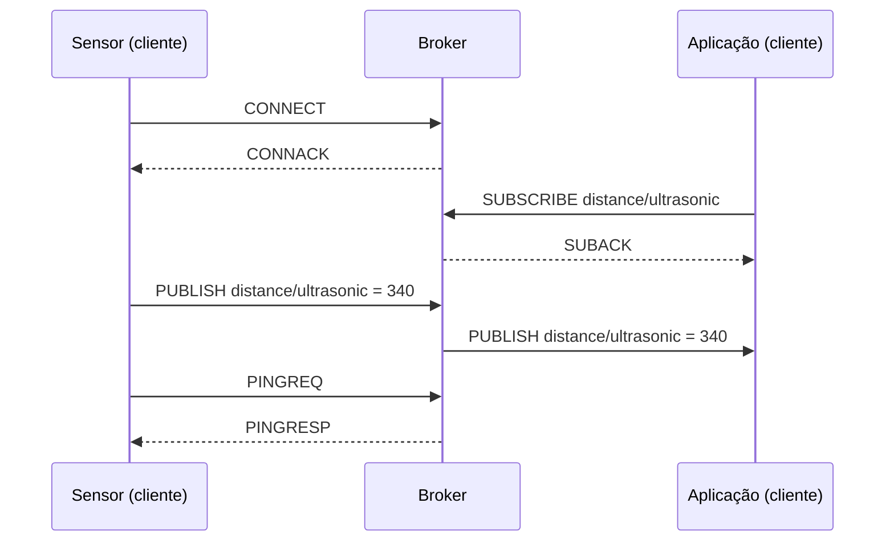
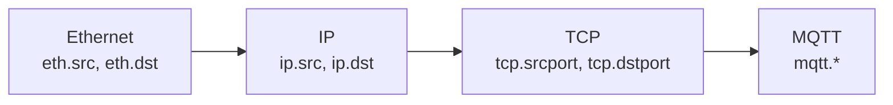

# 03-1. O MQTT e os três ambientes de ataque

## Objetivos desta aula

Ao final desta aula você vai entender:

- como funciona o MQTT (publicar, assinar, tipos de pacote, QoS) o suficiente para **ler um frame**;
- por que a maior parte das colunas `mqtt.*` está vazia em muitos frames e por que isso **não é erro**;
- o que cada CSV representa: um mesmo laboratório MQTT sob um ataque diferente (DoS, MitM ou Intrusion).

E vai ter construído: o início do módulo `src/mqtt_ids/audit.py`, com a tabela `tipo de pacote × classe` dos três ambientes.

**Ganho tangível:** uma tabela por ambiente mostrando que tipo de pacote MQTT cada ataque produz, e a primeira pista de que os três ataques não se parecem em nada.

## Onde estamos

Nas aulas 01 e 02 você montou o runner e trouxe os três CSVs com proveniência verificada. A [issue 03](issues/03-data-audit.md) pede a **auditoria exploratória** e o dicionário de dados. O dicionário já existe ([Dicionário de dados](data_dictionary.md)); o que falta é entender o que os dados **dizem**. Esta é a primeira de nove aulas da issue 03, e ela não escreve nada no repositório além do que você digitar: o curso mostra o código, você o escreve.

### Relembrando

??? question "1. Por que o handle de download de um Dataset precisa de `/versions/N`?"

    Sem a versão o handle aponta para a mais recente, que muda quando alguém publica; com ela o conteúdo é sempre o mesmo e a pesquisa é reproduzível.

??? question "2. Qual a diferença entre cache e integridade verificada?"

    O cache só garante que existe um arquivo com aquele nome; a integridade verificada compara o SHA-256 calculado dos bytes com o valor esperado.

??? question "3. Em `uv run --locked`, o que o `--locked` garante?"

    Que o ambiente segue o `uv.lock` sem resolver versões novas, falhando se o lockfile estiver desatualizado.

## Antes de começar

Você precisa dos três CSVs em `data/raw/` (aula 02-2 ou cópia local). Esta aula não grava nada nessa pasta: **só lê**. As bibliotecas (pandas, Matplotlib, Seaborn) já estão nas dependências do projeto.

## Conceitos

### MQTT: publicar, assinar e pacotes de controle

O **MQTT** é um protocolo de mensagens para dispositivos pequenos. Em vez de dois aparelhos conversarem direto, há um intermediário, o **broker**. Um **cliente** pode **publicar** uma mensagem num **tópico** (um nome como `distance/ultrasonic`) e outros clientes **assinam** tópicos para receber o que for publicado neles. Analogia: um quadro de avisos com seções: quem publica fixa um aviso na seção; quem assinou a seção recebe uma cópia.



Cada passo é um **pacote de controle** MQTT, e o tipo do pacote vai num número (a coluna `mqtt.msgtype`): 1 CONNECT, 2 CONNACK, 3 PUBLISH, 4 PUBACK, 5 PUBREC, 6 PUBREL, 7 PUBCOMP, 8 SUBSCRIBE, 9 SUBACK, 10 UNSUBSCRIBE, 11 UNSUBACK, 12 PINGREQ, 13 PINGRESP, 14 DISCONNECT. O **QoS** é a garantia de entrega do PUBLISH: 0 (no máximo uma vez), 1 (pelo menos uma vez) ou 2 (exatamente uma vez); os pacotes 4 a 7 existem para essas confirmações. O curinga `#` numa assinatura casa com vários níveis de tópico: quem assina `#` recebe, em princípio, tudo o que circula.

Fontes: [especificação MQTT 3.1.1 (OASIS)](https://docs.oasis-open.org/mqtt/mqtt/v3.1.1/os/mqtt-v3.1.1-os.html) (tabela de pacotes, QoS, papéis de cliente e broker, curinga `#`) e [campos MQTT do Wireshark](https://www.wireshark.org/docs/dfref/m/mqtt.html) (`mqtt.msgtype`, `mqtt.topic`, `mqtt.qos`...).

### Camadas e missingness estrutural

O MQTT viaja dentro do TCP, que viaja dentro do IP, que viaja dentro do Ethernet. Cada **linha** do CSV é um **frame**, isto é, um pacote capturado na rede; a captura foi feita no roteador e registra **todo** o tráfego, não só o MQTT.



Um frame que é só um "recebi" do TCP, ou uma página HTTPS de outro computador, não tem camada MQTT: todas as colunas `mqtt.*` ficam **vazias**. Isso é uma **ausência estrutural**: o campo não existe naquele frame, e não é uma falha de coleta. Do mesmo modo, mesmo dentro do MQTT, um PINGREQ não tem tópico. O dicionário de dados já avisa disso ("a ausência geralmente significa não aplicável ao tipo de pacote"); aqui você vai **ver** isso nos números. Imputar esses vazios como se fossem dados perdidos destruiria informação do protocolo.

Fonte: [artigo MQTT_UAD](https://doi.org/10.1016/j.dib.2025.112167) (os frames não-MQTT foram mantidos de propósito para que os modelos aprendam padrões gerais de rede).

### Três arquivos, três ambientes, três ataques

O laboratório do artigo tem um roteador OpenWRT que captura o tráfego, um broker (Aedes, em JavaScript), um sensor de distância (NodeMCU, que publica em `distance/ultrasonic`), um atuador (relé de lâmpada, em `light/relay`) e uma aplicação web. Sobre esse cenário foram realizados **três ataques**, cada um num arquivo:

| Arquivo | Rótulo positivo | Ataque (segundo o artigo) | Pergunta que ele levanta |
|---|---|---|---|
| `DoS.csv` | `DoS` | Negação de serviço: a ferramenta mqtt-malaria simula 1000 clientes publicando 1000 mensagens a cada 100 ms contra o broker | O ataque é volume: o que muda quando há inundação? |
| `MitM.csv` | `mitm` | Homem no meio: ARP spoofing coloca o atacante entre sensor e broker, e um filtro altera o valor lido pelo sensor | O ataque quase não aparece no nível MQTT: como se vê? |
| `Intrusion.csv` | `intrusion` | Cliente desconhecido conecta, assina `#` e injeta mensagens falsas | O ataque é uma sequência de pacotes: um frame basta? |

Todo arquivo tem a mesma coluna `type` com `normal` e o rótulo do seu ataque. **Cada arquivo é um problema de classificação binária separado**, em um ambiente de rede diferente: um modelo treinado no `DoS.csv` aprendeu o que é "DoS" *naquele* laboratório.

Fontes: [artigo MQTT_UAD (Data in Brief)](https://doi.org/10.1016/j.dib.2025.112167), [mqtt-malaria](https://github.com/etactica/mqtt-malaria) (ferramenta de teste de carga de brokers), [MITRE ATT&CK: ARP Cache Poisoning](https://attack.mitre.org/techniques/T1557/002/) e o [manual do mosquitto_sub](https://mosquitto.org/man/mosquitto_sub-1.html) (cliente MQTT usado na intrusão).

## Ponte teoria → projeto

As histórias 16 a 18 do [PRD](PRD.md) pedem confirmar linhas, classes e duplicatas, quantificar missingness e ter um dicionário. Para fazê-lo com sentido, você precisa **ler** um frame: saber se a ausência é estrutural (o que a [ADR-023](DECISIONS.md#adr-023-fonte-semantica-e-contrato-observado-do-dicionario-mqtt_uad) já afirma) e saber o que cada ambiente simula. Para a sua missão (um projeto de pesquisa que também é portfólio), isso é o que transforma "rodei um modelo" em "entendo por que ele acerta".

## Mão na massa

### Passo 1 — Conferir que os dados estão aqui e íntegros

Antes de explorar, usamos o `sha256` e o `RAW_HASHES` da aula 02-1. Crie o rascunho `/tmp/p0301.py`:

```python title="/tmp/p0301.py" linenums="1"
from pathlib import Path

from mqtt_ids.kaggle_assets import RAW_HASHES, sha256

for name, expected in RAW_HASHES.items():
    ok = sha256(Path("data/raw") / name) == expected  # (1)!
    print(f"{name:14s} {'ok' if ok else 'DIVERGENTE'}")
```

1.  Mesma verificação da aula 02-1: o hash calculado dos bytes contra o esperado. Explorar dados sem saber qual versão se tem não é pesquisa reproduzível.

```bash title="$ Execução no terminal (na pasta do projeto)"
uv run --locked python /tmp/p0301.py
```

```text title="Saída esperada"
Intrusion.csv  ok
DoS.csv        ok
MitM.csv       ok
```

**O que aconteceu:** os três arquivos conferem. A ordem das linhas segue a do dicionário `RAW_HASHES`.

### Passo 2 — Abrir um CSV sem enganar o pandas

```bash title="$ Execução no terminal (na pasta do projeto)"
uv run --locked python -c "
import pandas as pd
df = pd.read_csv('data/raw/DoS.csv')
print(df.shape)
"
```

```text title="Saída esperada"
<string>:3: DtypeWarning: Columns (0: mqtt.clientid, 1: mqtt.conack.flags, 2: mqtt.conflags, 3: mqtt.msg, 4: mqtt.protoname) have mixed types. Specify dtype option on import or set low_memory=False.
(94625, 67)
```

**O que aconteceu:** por padrão o pandas lê o arquivo em pedaços e infere o tipo de cada coluna **por pedaço**; como `mqtt.msg` é texto num trecho e vazio em outros, pedaços diferentes inferem tipos diferentes e a coluna fica com tipos **misturados**. É a mensagem que você viu no notebook `01_eda.ipynb`. O aviso se resolve com `low_memory=False` (ler tudo de uma vez, tipo único por coluna) ou com o parâmetro `dtype`. Nesta aula usamos o primeiro; a aula 03-2 formaliza a leitura.

```bash title="$ Execução no terminal (na pasta do projeto)"
uv run --locked python -c "
import pandas as pd
df = pd.read_csv('data/raw/DoS.csv', low_memory=False)
print(df.shape)
print(df['type'].value_counts())
"
```

```text title="Saída esperada"
(94625, 67)
type
normal    49111
DoS       45514
Name: count, dtype: int64
```

**O que aconteceu:** sem o aviso, as 94.625 linhas e 67 colunas. A coluna `type` tem duas classes, `normal` e `DoS`. Repare que as contagens são as do dicionário (49.111 e 45.514), e **não** as do artigo (49.112 e 45.513): essa divergência é tema da aula 03-2.

### Passo 3 — Nomear os tipos de pacote

Crie `src/mqtt_ids/audit.py`. Primeiro, quais são os três ambientes e o nome dos pacotes:

```python title="src/mqtt_ids/audit.py" linenums="1"
"""Auditoria exploratória dos três ambientes MQTT_UAD."""

from __future__ import annotations

import pandas as pd

DATASETS = {  # (1)!
    "dos": ("DoS.csv", "DoS"),
    "mitm": ("MitM.csv", "mitm"),
    "intrusion": ("Intrusion.csv", "intrusion"),
}

MSGTYPE_NAMES = {  # (2)!
    1: "CONNECT",
    2: "CONNACK",
    3: "PUBLISH",
    4: "PUBACK",
    5: "PUBREC",
    6: "PUBREL",
    7: "PUBCOMP",
    8: "SUBSCRIBE",
    9: "SUBACK",
    10: "UNSUBSCRIBE",
    11: "UNSUBACK",
    12: "PINGREQ",
    13: "PINGRESP",
    14: "DISCONNECT",
}
```

1.  Nome curto do ambiente → (arquivo, rótulo positivo). Note que o rótulo é `DoS`, `mitm` e `intrusion`: a capitalização observada nos arquivos (o artigo escreve `MitM`; o dicionário já registrou a divergência).
2.  A tabela da especificação MQTT, de 1 a 14. É uma constante do protocolo, não uma escolha do projeto.

Depois, a função que conta frames por tipo de pacote e por classe:

```python title="src/mqtt_ids/audit.py" linenums="30"
NO_MQTT = "(sem MQTT)"
RESERVED = "(tipo fora da tabela)"


def msgtype_by_class(df: pd.DataFrame) -> pd.DataFrame:
    """Conta frames por tipo de pacote MQTT e por classe."""
    codes = df["mqtt.msgtype"]
    names = codes.map(MSGTYPE_NAMES)  # (1)!
    names = names.mask(codes.notna() & names.isna(), RESERVED).fillna(NO_MQTT)  # (2)!
    table = pd.crosstab(names, df["type"])  # (3)!
    return table.loc[table.sum(axis=1).sort_values(ascending=False).index]  # (4)!
```

1.  `Series.map` com um dicionário troca cada código pelo nome; o que não está no dicionário vira `NaN`. Isso mistura dois casos diferentes, tratados na linha seguinte.
2.  `NaN` pode significar "frame sem MQTT" **ou** "código que não existe na tabela" (como o 0). A segunda linha separa: código presente mas sem nome vira `(tipo fora da tabela)`; o que sobra de `NaN` é `(sem MQTT)`. Sem esse cuidado, frames malformados do ataque se esconderiam entre os frames sem MQTT.
3.  `pd.crosstab` conta as combinações (tipo de pacote × classe).
4.  Ordena as linhas pelo total, do tipo mais frequente ao menos.

E uma segunda visão, a fração de frames com MQTT em cada classe:

```python title="src/mqtt_ids/audit.py" linenums="43"
def mqtt_share_by_class(df: pd.DataFrame) -> pd.Series:
    """Fração de frames com camada MQTT em cada classe."""
    return df["mqtt.msgtype"].notna().groupby(df["type"]).mean()  # (1)!
```

1.  `notna()` vira verdadeiro/falso (tem MQTT?); agrupar por classe e tirar a média de verdadeiros/falsos dá a fração.

??? question "Pare e pense: no DoS, que tipo de pacote você espera que domine os frames de ataque?"

    PUBLISH: o ataque do artigo é uma inundação de mensagens publicadas por milhares de clientes simulados. Confira na tabela abaixo.

### Passo 4 — Ler os três ambientes

Crie o rascunho `/tmp/p0304.py` e rode-o:

```python title="/tmp/p0304.py" linenums="1"
import pandas as pd
from pathlib import Path
from mqtt_ids.audit import DATASETS, msgtype_by_class, mqtt_share_by_class

for key, (filename, positive) in DATASETS.items():
    df = pd.read_csv(Path("data/raw") / filename, low_memory=False)
    print("=====", key)
    print(msgtype_by_class(df))
    print(mqtt_share_by_class(df).round(3).to_dict())
```

```bash title="$ Execução no terminal (na pasta do projeto)"
uv run --locked python /tmp/p0304.py
```

```text title="Saída esperada"
===== dos
type                     DoS  normal
mqtt.msgtype                        
(sem MQTT)              6470   48620
PUBLISH                37626     237
CONNACK                  361      17
PUBREL                   339       0
CONNECT                  313      10
DISCONNECT               175       0
PUBACK                   162       0
PINGRESP                   5     110
PINGREQ                    6     109
PUBCOMP                   35       0
(tipo fora da tabela)     22       0
SUBACK                     0       4
SUBSCRIBE                  0       4
{'DoS': 0.858, 'normal': 0.01}
===== mitm
type          mitm  normal
mqtt.msgtype              
(sem MQTT)    3808  103241
PUBLISH         47    1988
PINGRESP         0     807
PINGREQ          0     766
CONNACK          0       7
CONNECT          0       4
{'mitm': 0.012, 'normal': 0.033}
===== intrusion
type          intrusion  normal
mqtt.msgtype                   
(sem MQTT)         1042   75033
PUBLISH             313    1708
PINGRESP              1    1005
PINGREQ               0     976
CONNACK             198      84
CONNECT             142     139
DISCONNECT          200       1
SUBSCRIBE             2      24
SUBACK                0      25
{'intrusion': 0.451, 'normal': 0.05}
```

**O que aconteceu e como ler (um ambiente de cada vez):**

- **DoS.** Dos 45.514 frames de ataque, 37.626 são PUBLISH: a inundação aparece como foi descrita. Há também CONNECT/CONNACK/DISCONNECT (os clientes simulados se conectam e desconectam), pacotes de confirmação de QoS 1 e 2 (PUBACK, PUBREL, PUBCOMP) que **não existem** no tráfego normal, e 22 frames com um tipo que não está na tabela (`0`): tráfego malformado do ataque. O dado mais forte está na última linha: **só 1% dos frames "normais" têm camada MQTT** (contra 85,8% dos de ataque). O "normal" do DoS é quase todo tráfego de outros computadores da rede, e isso será importante (aula 03-4).
- **MitM.** Quase **nada** no nível MQTT: dos 3.855 frames de ataque, 3.808 não têm camada MQTT, e só 47 são PUBLISH. O ataque não cria pacotes MQTT novos; ele mexe no que já circula. Veremos na aula 03-5 o que dá para observar.
- **Intrusion.** Uma mistura: 313 PUBLISH, 142 CONNECT, 198 CONNACK e 200 DISCONNECT nos frames de ataque. Chama a atenção o **DISCONNECT**: 200 no ataque contra 1 no normal. Isso sugere um cliente que entra sem ser convidado e conecta e desconecta várias vezes. E apenas 2 SUBSCRIBE: a assinatura do `#` é rara; o ataque é uma sequência de pacotes pequena, não um volume (aula 03-6).

O `PINGREQ`/`PINGRESP` é o "ainda estou vivo" entre dispositivo e broker: aparece quase só no tráfego normal.

## Testando

Esta aula não tem testes obrigatórios: ela ainda explora. A aula 03-2 introduz o primeiro teste da issue 03 (o contrato de contagens), e as seguintes testam cada função nova com um CSV minúsculo em `tmp_path`, nunca com os dados reais. Os exercícios abaixo já praticam esse estilo.

## Erros comuns

**1. `FileNotFoundError: ... data/raw/DoS.csv`.** Você rodou o script fora da pasta do projeto ou os CSVs não estão em `data/raw/`. Correção: rode da raiz do projeto e confira `ls data/raw`.

**2. `DtypeWarning: Columns (...) have mixed types`.** Falta `low_memory=False` no `read_csv`. É só um aviso, mas esconde colunas com tipo misto.

**3. `KeyError: 'mqtt.msgtype'`.** Você leu o arquivo errado (ou o separador está errado). Confira que o DataFrame tem 67 colunas com `df.shape`.

**4. Confundir "frame sem MQTT" com "dado perdido".** Preencher esses vazios com a média ou a moda destruiria o sinal (por exemplo, "esse frame nem é MQTT"). Veja a aula 03-3.

## Código completo desta aula

??? example "Arquivo completo: src/mqtt_ids/audit.py"

    ```python
    """Auditoria exploratória dos três ambientes MQTT_UAD."""

    from __future__ import annotations

    import pandas as pd

    DATASETS = {
        "dos": ("DoS.csv", "DoS"),
        "mitm": ("MitM.csv", "mitm"),
        "intrusion": ("Intrusion.csv", "intrusion"),
    }

    MSGTYPE_NAMES = {
        1: "CONNECT",
        2: "CONNACK",
        3: "PUBLISH",
        4: "PUBACK",
        5: "PUBREC",
        6: "PUBREL",
        7: "PUBCOMP",
        8: "SUBSCRIBE",
        9: "SUBACK",
        10: "UNSUBSCRIBE",
        11: "UNSUBACK",
        12: "PINGREQ",
        13: "PINGRESP",
        14: "DISCONNECT",
    }

    NO_MQTT = "(sem MQTT)"
    RESERVED = "(tipo fora da tabela)"


    def msgtype_by_class(df: pd.DataFrame) -> pd.DataFrame:
        """Conta frames por tipo de pacote MQTT e por classe."""
        codes = df["mqtt.msgtype"]
        names = codes.map(MSGTYPE_NAMES)
        names = names.mask(codes.notna() & names.isna(), RESERVED).fillna(NO_MQTT)
        table = pd.crosstab(names, df["type"])
        return table.loc[table.sum(axis=1).sort_values(ascending=False).index]


    def mqtt_share_by_class(df: pd.DataFrame) -> pd.Series:
        """Fração de frames com camada MQTT em cada classe."""
        return df["mqtt.msgtype"].notna().groupby(df["type"]).mean()
    ```

## Exercícios

Os exercícios continuam em `src/mqtt_ids/exercicios.py`. Nada de dados reais: os testes constroem um DataFrame minúsculo.

1. Escreva `top_packet_types(df, positive, n=3)`, que devolve os `n` tipos de pacote **MQTT** mais frequentes numa classe (ignorando os frames sem MQTT), e `reserved_frames(df)`, que conta os frames cujo código de `mqtt.msgtype` existe mas **não** consta em `MSGTYPE_NAMES`. O exercício está pronto quando este teste passar:

    ```python title="tests/test_exercicio_03_1.py"
    import pandas as pd

    from mqtt_ids.exercicios import reserved_frames, top_packet_types


    def make_frames() -> pd.DataFrame:
        return pd.DataFrame(
            {
                "mqtt.msgtype": [3.0, 3.0, 3.0, 8.0, 8.0, None, 0.0, 3.0],
                "type": ["DoS"] * 7 + ["normal"],
            }
        )


    def test_top_packet_types_ignores_frames_without_mqtt() -> None:
        assert top_packet_types(make_frames(), "DoS", n=2) == ["PUBLISH", "SUBSCRIBE"]


    def test_reserved_frames_counts_codes_outside_the_table() -> None:
        assert reserved_frames(make_frames()) == 1
    ```

    ```bash title="$ Execução no terminal (na pasta do projeto)"
    uv run --locked pytest tests/test_exercicio_03_1.py
    ```

    Antes da solução:

    ```text title="Saída esperada (antes da solução)"
    E   ImportError: cannot import name 'reserved_frames' from 'mqtt_ids.exercicios' (...)
    ERROR tests/test_exercicio_03_1.py
    ```

??? tip "Solução"

    ```python title="src/mqtt_ids/exercicios.py (acrescente ao arquivo)"
    import pandas as pd  # junto dos imports
    from mqtt_ids.audit import MSGTYPE_NAMES, NO_MQTT, msgtype_by_class


    def top_packet_types(df: pd.DataFrame, positive: str, n: int = 3) -> list[str]:
        counts = msgtype_by_class(df)[positive].drop(NO_MQTT, errors="ignore")
        return counts.nlargest(n).index.tolist()


    def reserved_frames(df: pd.DataFrame) -> int:
        codes = df["mqtt.msgtype"].dropna()
        return int((~codes.isin(MSGTYPE_NAMES)).sum())
    ```

    Depois da solução: `2 passed`. O primeiro **reaproveita** `msgtype_by_class` e só remove a linha `(sem MQTT)`; o segundo usa `isin` sobre as chaves do dicionário. O `errors="ignore"` evita falhar se o DataFrame não tiver frames sem MQTT.

## Quiz de fixação

??? question "1. Com suas palavras: por que as colunas `mqtt.*` estão vazias na maioria dos frames (de 58% a 97% por arquivo, segundo o dicionário), e isso não é um defeito?"

    Porque a captura registra todo o tráfego da rede, e muitos frames (confirmações do TCP, HTTPS de outros computadores) não têm camada MQTT; e, dentro do MQTT, cada tipo de pacote só tem alguns campos (um PINGREQ não tem tópico). A ausência é **estrutural**: o campo não existe naquele frame.

??? question "2. No DoS, o que diferencia o tráfego de ataque do normal no nível MQTT?"

    O volume de PUBLISH (37.626 dos 45.514 frames de ataque), pacotes de confirmação (PUBACK, PUBREL, PUBCOMP) ausentes no normal, frames malformados e, sobretudo, a presença de MQTT: 85,8% dos frames de ataque contra 1% dos normais.

**3. Por que `msgtype_by_class` separa `(tipo fora da tabela)` de `(sem MQTT)`?**

- a) Para não confundir frames malformados do ataque com frames que nem são MQTT
- b) Porque o pandas não consegue contar valores `NaN` em uma tabela cruzada
- c) Para reduzir o número de linhas da tabela final

??? question "Resposta da 3"

    **a)**. Código `0` existe mas não está na tabela de tipos; é sinal de tráfego malformado. O b) está errado porque o `fillna` resolve o `NaN` sem problema; o c) porque a separação até **aumenta** o número de linhas.

??? question "4. Revisão da aula 02-1: por que conferir o SHA-256 antes de explorar os dados?"

    Porque explorar dados de versão desconhecida torna a análise irreprodutível: só o hash prova que os bytes são os da versão citada.

## Commit

```bash title="$ Execução no terminal (na pasta do projeto)"
git add src/mqtt_ids/audit.py
git commit -m "feat(audit): tabela de tipos de pacote MQTT por classe nos três ambientes"
```

Um **commit** é um ponto de controle do histórico do Git. Faça um commit pequeno por aula: cada passo fica auditável e fácil de reverter. (O curso em si, em `docs/`, é versionado à parte, com mensagens `docs:`.)

## Resumo

- MQTT é publicar/assinar via broker; o tipo do pacote está em `mqtt.msgtype` (1 a 14).
- Frames sem camada MQTT têm todas as colunas `mqtt.*` vazias: ausência **estrutural**.
- Cada CSV é um ambiente com um ataque: DoS (volume), MitM (alteração discreta), Intrusion (sequência de pacotes).

## Fonte principal

[Especificação MQTT 3.1.1](https://docs.oasis-open.org/mqtt/mqtt/v3.1.1/os/mqtt-v3.1.1-os.html): leia a tabela de tipos de pacote de controle e a seção de QoS.

## Para saber mais

- [Artigo MQTT_UAD](https://doi.org/10.1016/j.dib.2025.112167), [campos MQTT do Wireshark](https://www.wireshark.org/docs/dfref/m/mqtt.html)
- [pandas.read_csv](https://pandas.pydata.org/docs/reference/api/pandas.read_csv.html), [crosstab](https://pandas.pydata.org/docs/reference/api/pandas.crosstab.html), [Series.map](https://pandas.pydata.org/docs/reference/api/pandas.Series.map.html)
- [mqtt-malaria](https://github.com/etactica/mqtt-malaria), [MITRE: ARP Cache Poisoning](https://attack.mitre.org/techniques/T1557/002/), [mosquitto_sub](https://mosquitto.org/man/mosquitto_sub-1.html)

!!! question "Ficou com dúvida?"

    O agente é o seu professor: pergunte o que não ficou claro, colando a mensagem de erro exata e o que você tentou. Para conversar com pessoas, veja as comunidades em [Recursos](recursos.md#comunidades).

**Próxima aula:** [03-2. Carga segura e contrato de contagens](03-2-carga-segura-e-contrato.md).
