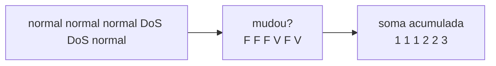
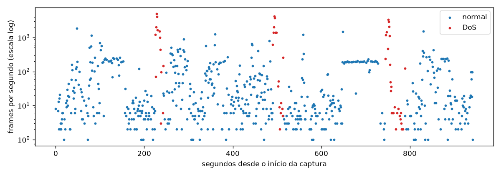

# 03-4. DoS: o ambiente da inundação

## Objetivos desta aula

Ao final desta aula você vai entender:

- como transformar uma coluna de rótulos em **rajadas** (sequências contíguas da mesma classe) e medir quanto tempo e quantos frames cada uma ocupa;
- por que **taxa de frames por segundo** e **volume** separam o DoS do normal só em parte;
- como é a **anatomia** de um ataque de inundação nos dados: pacotes, QoS, tópicos, tamanhos e repetições.

E vai ter construído: `run_ids`, `class_runs`, `frames_per_second`, `rate_by_class`, `class_profile`, uma função de figura e o primeiro notebook de ambiente.

**Ganho tangível:** uma figura da linha do tempo do `DoS.csv` (três janelas de ataque) e uma tabela com a assinatura do ataque.

## Onde estamos

Nas aulas 03-1 a 03-3 você leu um frame, fixou o contrato de contagens e auditou as colunas. A partir daqui cada aula olha **um ambiente**. Começamos pelo DoS, o mais volumoso: 45.514 frames de ataque (48%), o único arquivo em que o ataque não é raro. A [issue 03](issues/03-data-audit.md) pede para entender "classe ao longo do tempo, concentração temporal e dependência entre frames" (história 19 do [PRD](PRD.md)).

### Relembrando

??? question "1. O que é uma flag de presença e por que não é uma coluna constante?"

    Uma coluna com um único valor quando presente e ausente no resto (por exemplo, `mqtt.conflag.cleansess` só no CONNECT). Ela tem **dois** estados (presente/ausente), e esse estado informa o tipo de pacote; uma constante tem um só.

??? question "2. Como se prova que a ausência de `mqtt.topic` é estrutural?"

    Medindo a ausência dentro de cada tipo de pacote: 0% onde o pacote tem tópico (PUBLISH, SUBSCRIBE) e 100% nos outros.

??? question "3. O que `duplicates == repeated_frame_numbers` revelou no DoS?"

    Que cada duplicata exata é o mesmo frame repetido em mais de uma linha: 32.298 linhas (34%), quase todas de ataque.

## Antes de começar

As aulas 03-1 a 03-3 concluídas e a suíte verde. Esta aula acrescenta o módulo `src/mqtt_ids/audit_figures.py` e usa o Matplotlib (já nas dependências).

--8<-- "course/includes/rodar-testes.md"

## Conceitos

### Rajadas: a classe ao longo do tempo

Os CSVs estão em **ordem de captura**: `frame.time_relative` (segundos desde o início da captura) é crescente. Quando os rótulos vêm em blocos (muitos `normal` seguidos, depois muitos `DoS` seguidos), cada bloco é uma **rajada**. Para contá-las, comparamos cada linha com a anterior: se a classe mudou, começou uma rajada nova.



Em pandas, `serie != serie.shift()` marca onde a classe mudou (o primeiro elemento sempre conta como mudança, porque o `shift` põe um ausente na frente) e `.cumsum()` numera as rajadas. Com esse número, `groupby` junta cada rajada e entrega **tamanho, início, fim e duração**.

Por que isso importa: se os ataques são **poucas rajadas longas**, quadros vizinhos são quase cópias uns dos outros. Uma divisão aleatória em treino e teste colocaria frames quase idênticos dos dois lados e inflaria a métrica. É o argumento da ADR-008 (holdout temporal, validação agrupada), agora com número.

Fontes: [Series.shift](https://pandas.pydata.org/docs/reference/api/pandas.Series.shift.html) e [guia de groupby](https://pandas.pydata.org/docs/user_guide/groupby.html) (agrupar por uma série de rótulos; agregação nomeada).

### Taxa de frames: o que a inundação muda

Uma inundação aumenta o **número de frames por segundo**. Medimos agrupando os frames pelo segundo inteiro de `frame.time_relative` e contando. Duas leituras diferentes do mesmo fenômeno: a **taxa** (frames por segundo, ao longo de segundos) e o **intervalo entre frames** (`frame.time_delta`, em milissegundos ou menos). A taxa é mais legível para humanos; o intervalo é o que o modelo veria em cada linha.

Cuidado com a conclusão apressada: "ataque = taxa alta". O normal também pode ter rajadas de tráfego (downloads, vídeo). A pergunta honesta é **quanto** as distribuições se sobrepõem, e a figura abaixo responde.

### Anatomia de um ataque de inundação

O artigo descreve o DoS como mil clientes simulados (mqtt-malaria) publicando mil mensagens a cada 100 ms. Nos dados, isso deixa assinaturas medíveis: tipo de pacote (PUBLISH), QoS (0, o mais barato), **tópicos aleatórios** (a ferramenta cria um tópico por cliente), payloads de tamanho fixo e frames grandes (segmentos TCP cheios). Cada assinatura é, ao mesmo tempo, uma pista para o modelo e uma **armadilha**: um tópico como `mqtt-malaria/beem.loadr-...` identifica a *ferramenta* usada no laboratório, não o comportamento de um DoS qualquer. Por isso a política do projeto manda o tópico cru para a ablação (ADR-006).

Fonte: [mqtt-malaria](https://github.com/etactica/mqtt-malaria) (ferramenta de teste de carga que simula muitos clientes publicando com tamanho e taxa configuráveis) e o [artigo MQTT_UAD](https://doi.org/10.1016/j.dib.2025.112167).

## Ponte teoria → projeto

A história 19 do [PRD](PRD.md) pede visualizar a classe ao longo do tempo para entender concentração temporal e dependência entre frames; a [ADR-008](DECISIONS.md#adr-008-holdout-temporal-e-cv-agrupada) decide holdout temporal e CV agrupada porque "frames próximos são correlacionados". Esta aula traz a **evidência**: os 45.514 frames de ataque do DoS ocupam **três** rajadas de 13 a 17 mil frames cada. Para a sua missão: o texto do portfólio pode afirmar com número por que a validação não pode ser aleatória.

## Mão na massa

### Passo 1 — Numerar as rajadas

Acrescente ao fim de `src/mqtt_ids/audit.py`:

```python title="src/mqtt_ids/audit.py" linenums="149"
def run_ids(df: pd.DataFrame, positive: str) -> pd.Series:
    """Numera as rajadas: cada troca de classe começa uma rajada nova."""
    is_positive = df["type"] == positive  # (1)!
    return (is_positive != is_positive.shift()).cumsum()  # (2)!


def class_runs(df: pd.DataFrame, positive: str) -> pd.DataFrame:
    """Uma linha por rajada contígua de uma mesma classe."""
    runs = df.groupby(run_ids(df, positive)).agg(  # (3)!
        label=("type", "first"),  # (4)!
        frames=("type", "size"),
        start_s=("frame.time_relative", "min"),
        end_s=("frame.time_relative", "max"),
    )
    runs["duration_s"] = runs["end_s"] - runs["start_s"]
    return runs.reset_index(drop=True).round(1)
```

1.  Verdadeiro nos frames de ataque, falso nos normais. Só distinguimos "ataque / não ataque" porque cada arquivo é binário.
2.  Verdadeiro quando a classe **mudou** em relação à linha anterior; `cumsum()` soma os verdadeiros como 1 e numera as rajadas (1, 1, 1, 2, 2, 3...).
3.  `groupby` recebe a **série** com os números de rajada (não uma coluna do DataFrame): cada rajada vira um grupo.
4.  Agregação nomeada `nome=(coluna, função)`: o resultado tem colunas com os nomes que escolhemos. `first` pega o rótulo da rajada; `size` conta frames; `min` e `max` dão o início e o fim.

Rascunho `/tmp/p0304.py` com a tabela de rajadas e quantas das linhas de cada uma são duplicatas:

```python title="/tmp/p0304.py" linenums="1"
import pandas as pd

from mqtt_ids.audit import class_profile, class_runs, load_raw, rate_by_class, run_ids

pd.set_option("display.width", 200)
df = load_raw("dos")
runs = class_runs(df, "DoS")
runs["duplicates"] = df.duplicated().groupby(run_ids(df, "DoS")).sum().to_numpy()  # (1)!
print(runs)
print()
print(rate_by_class(df))
print()
print(class_profile(df).round(6))
```

1.  Reaproveita `duplicated()` da aula 03-2: soma as duplicatas **por rajada** (agrupando pelos mesmos números). `to_numpy()` descarta o índice para encaixar na tabela.

Antes de rodar, escreva as funções dos Passos 2 e 3.

### Passo 2 — Taxa de frames por classe

```python title="src/mqtt_ids/audit.py" linenums="167"
def frames_per_second(df: pd.DataFrame) -> pd.Series:
    """Frames por segundo de captura, só nos segundos em que houve tráfego."""
    seconds = df["frame.time_relative"].astype(int)  # (1)!
    return seconds.groupby(seconds).size()  # (2)!


def rate_by_class(df: pd.DataFrame) -> pd.DataFrame:
    """Segundos ativos, mediana e máximo de frames por segundo, por classe."""
    rows = {}
    for label, part in df.groupby("type"):  # (3)!
        rate = frames_per_second(part)
        rows[label] = {
            "active_seconds": len(rate),
            "median_fps": float(rate.median()),
            "max_fps": int(rate.max()),
        }
    return pd.DataFrame(rows)
```

1.  Descarta a parte fracionária: o segundo inteiro de captura em que cada frame caiu.
2.  Agrupa pelo próprio segundo e conta: o tamanho de cada grupo é "frames naquele segundo". Segundos sem tráfego não aparecem.
3.  `groupby("type")` entrega pares (rótulo, parte do DataFrame). Calcular a taxa **por classe** evita misturar os segundos de uma classe com os da outra.

### Passo 3 — Um perfil comparável das classes

```python title="src/mqtt_ids/audit.py" linenums="186"
def class_profile(df: pd.DataFrame) -> pd.DataFrame:
    """Medidas comparáveis entre as classes de um ambiente."""
    groups = df.groupby("type")
    return pd.DataFrame(
        {
            "frames": groups.size(),
            "share_with_mqtt": groups["mqtt.msgtype"].apply(lambda s: s.notna().mean()),  # (1)!
            "median_frame_len": groups["frame.len"].median(),
            "median_time_delta": groups["frame.time_delta"].median(),
            "unique_topics": groups["mqtt.topic"].nunique(),  # (2)!
        }
    ).T  # (3)!
```

1.  Fração de frames com camada MQTT em cada classe (a mesma ideia de `mqtt_share_by_class`, da aula 03-1).
2.  Tópicos distintos por classe: `nunique` ignora os ausentes e dá a cardinalidade dentro do grupo.
3.  `.T` transpõe: as medidas viram linhas e as classes viram colunas, o que cabe melhor na tela.

```bash title="$ Execução no terminal (na pasta do projeto)"
uv run --locked python /tmp/p0304.py
```

```text title="Saída esperada"
    label  frames  start_s  end_s  duration_s  duplicates
0  normal   12981      0.0  224.6       224.6           3
1     DoS   17142    225.6  243.8        18.2       11909
2  normal   18238    243.9  490.8       246.9          26
3     DoS   15181    490.8  514.9        24.1       10708
4  normal   10184    514.9  743.7       228.9           0
5     DoS   13191    745.9  789.5        43.6        9652
6  normal    7708    789.6  942.1       152.4           0

                   DoS  normal
active_seconds    56.0   608.0
median_fps        83.0    13.5
max_fps         4970.0  1855.0

type                        DoS        normal
frames             45514.000000  49111.000000
share_with_mqtt        0.857846      0.009998
median_frame_len    1514.000000    590.000000
median_time_delta      0.000137      0.000129
unique_topics       5902.000000      3.000000
```

**O que aconteceu e como ler:**

- **Três rajadas de ataque**, de 18, 24 e 44 segundos, com 13 a 17 mil frames cada, **separadas por rajadas normais** de 150 a 250 segundos. Somadas, as três rajadas duram cerca de 86 dos 942 segundos da captura (≈9%) e concentram 48% dos frames.
- **As duplicatas moram nas rajadas de ataque**: 11.909, 10.708 e 9.652 linhas repetidas, contra 29 no tráfego normal. É por isso que a ADR-025 (proposta) é tão relevante para o DoS.
- **Taxa:** mediana de 83 frames por segundo no ataque contra 13,5 no normal, e picos de 4.970 contra 1.855. O normal também tem picos.
- **Intervalo entre frames:** quase idêntico entre as classes (0,137 ms contra 0,129 ms): o `time_delta` mediano **não** separa as classes; o que separa é a **quantidade** de frames no mesmo intervalo.
- **Anatomia no perfil:** 85,8% dos frames de ataque têm MQTT (contra 1% do normal), mediana de 1.514 bytes (contra 590) e 5.902 tópicos distintos (contra 3).

### Passo 4 — A figura da linha do tempo

Crie `src/mqtt_ids/audit_figures.py`:

```python title="src/mqtt_ids/audit_figures.py" linenums="1"
"""Figuras da auditoria exploratória."""

from __future__ import annotations

from pathlib import Path

import matplotlib

matplotlib.use("Agg")  # (1)!

import matplotlib.pyplot as plt  # noqa: E402
import pandas as pd  # noqa: E402

from mqtt_ids.audit import frames_per_second  # noqa: E402


def plot_class_timeline(df: pd.DataFrame, positive: str, path: Path) -> Path:
    """Frames por segundo, por classe, ao longo da captura."""
    fig, ax = plt.subplots(figsize=(10, 3.5))  # (2)!
    for label, color in (("normal", "tab:blue"), (positive, "tab:red")):
        rate = frames_per_second(df[df["type"] == label])
        ax.scatter(rate.index, rate.values, s=6, color=color, label=label)  # (3)!
    ax.set_yscale("log")  # (4)!
    ax.set_xlabel("segundos desde o início da captura")
    ax.set_ylabel("frames por segundo (escala log)")
    ax.legend()
    fig.tight_layout()
    path.parent.mkdir(parents=True, exist_ok=True)  # (5)!
    fig.savefig(path, dpi=120)
    plt.close(fig)  # (6)!
    return path
```

1.  Escolhe o **backend** `Agg`, que só escreve arquivos de imagem, sem abrir janela. É preciso trocá-lo **antes** de criar qualquer figura. Assim a função roda no terminal, no teste e dentro do runner (aula 03-8) sem interface gráfica. Por isso os imports seguintes levam `# noqa: E402` (o Ruff estranha imports depois de código).
2.  Uma figura larga e baixa; `fig` é a figura e `ax` o eixo onde se desenha.
3.  Um ponto por segundo ativo, azul para o normal e vermelho para o ataque.
4.  Escala **logarítmica** no eixo vertical: os valores vão de 1 a quase 5.000 frames por segundo; na escala linear os pontos baixos ficariam colados no fundo.
5.  Cria a pasta de destino se ela não existir (as figuras ficam em `results/figures/`, ignorada pelo Git).
6.  Libera a figura da memória. Sem isso, um laço que gera muitas figuras acumularia memória.

Rascunho `/tmp/p0304b.py` que gera a figura:

```python title="/tmp/p0304b.py" linenums="1"
from pathlib import Path

from mqtt_ids.audit import load_raw
from mqtt_ids.audit_figures import plot_class_timeline

path = plot_class_timeline(load_raw("dos"), "DoS", Path("/tmp/dos_timeline.png"))
print(path, path.stat().st_size > 10_000)
```

```bash title="$ Execução no terminal (na pasta do projeto)"
uv run --locked python /tmp/p0304b.py
```

```text title="Saída esperada"
/tmp/dos_timeline.png True
```

Abra o arquivo `/tmp/dos_timeline.png` no seu visualizador. A figura gerada neste replay:



**O que aconteceu e como ler a figura:** os pontos **vermelhos** formam três grupos curtos, perto dos segundos 225, 490 e 750, com picos de até quase 5.000 frames por segundo. Os **azuis** (normal) cobrem toda a captura, e mostram que o tráfego normal **também** chega a centenas e a mais de mil frames por segundo (e há um patamar quase constante perto de 200 entre os segundos 650 e 730). Resultado: a taxa sozinha é um sinal **forte, mas não suficiente**: cada ataque ainda tem o resto da assinatura (tipo de pacote, tamanho, tópicos).

??? question "Pare e pense: por que usar escala logarítmica, e o que ela esconde?"

    Os valores vão de 1 a ~5.000, então na escala linear quase todos os pontos ficariam colados embaixo. A escala log mostra todos, mas **esconde** a magnitude: um salto de 1.000 para 4.000 parece pequeno. Em figuras de portfólio, diga sempre qual é a escala (no rótulo do eixo, como fizemos).

### Passo 5 — A anatomia do ataque

Rascunho `/tmp/p0304c.py`:

```python title="/tmp/p0304c.py" linenums="1"
from mqtt_ids.audit import load_raw

df = load_raw("dos")
attack = df[df["type"] == "DoS"]
normal = df[df["type"] == "normal"]

print("destino do ataque:", attack["ip.dst"].value_counts(normalize=True).head(2).round(3).to_dict())
print("porta de destino:", attack["tcp.dstport"].value_counts(normalize=True).head(2).round(3).to_dict())
print("QoS no ataque:", attack["mqtt.qos"].value_counts(dropna=False).to_dict())
print("frames de 1514 bytes no ataque:", round((attack["frame.len"] == 1514).mean(), 3))

topics = attack["mqtt.topic"].dropna()
print("tópicos únicos / frames com tópico:", topics.nunique(), "/", len(topics))
print("exemplo de tópico:", topics.iloc[0])
print("tópicos que não são do mqtt-malaria:", topics[~topics.str.startswith("mqtt-malaria")].value_counts().to_dict())
print("tópicos no normal:", normal["mqtt.topic"].value_counts().to_dict())

payload = attack["mqtt.msg"].dropna().astype(str)
print("tamanho do payload: mediana", int(payload.str.len().median()), "| exemplo:", payload.iloc[0])
```

```bash title="$ Execução no terminal (na pasta do projeto)"
uv run --locked python /tmp/p0304c.py
```

```text title="Saída esperada"
destino do ataque: {'192.168.1.171': 0.897, '192.168.1.196': 0.1}
porta de destino: {1883.0: 0.897, 3000.0: 0.001}
QoS no ataque: {0.0: 37699, nan: 7287, 3.0: 220, 2.0: 170, 1.0: 138}
frames de 1514 bytes no ataque: 0.669
tópicos únicos / frames com tópico: 5902 / 37496
exemplo de tópico: mqtt-malaria/beem.loadr-malaria-VirtualBox-6638-80/data/1/200
tópicos que não são do mqtt-malaria: {'motor': 3}
tópicos no normal: {'light/rele1': 127, 'distance/ultrasonic1': 77, 'motor': 37}
tamanho do payload: mediana 100 | exemplo: 4BC1bAa76E8cae0BAFF27BF524aAffbfD5BbB8ED1B2220AA03BcffC6457F3bcc9fFD2F76BC212649CbaE25D0EbeBEE2F296013
```

**O que aconteceu e como ler:**

- **Um alvo, uma porta:** 89,7% dos frames de ataque vão para `192.168.1.171`, porta **1883** (a porta padrão não criptografada do MQTT). Esse IP recebe **todo** o tráfego da porta 1883 nos três arquivos, e a hipótese natural é que seja o **broker**; os outros 10% do destino são o atacante (`192.168.1.196`), provavelmente as respostas do broker.
- **QoS:** 37.699 PUBLISH em QoS 0 (a inundação mais barata), mas também **220 frames com QoS 3**, valor **reservado** pela especificação (inválido), e QoS 1 e 2 residuais. QoS 3 é tráfego malformado do ataque e não deve ser "corrigido" sem regra (ADR-023).
- **Tópicos:** 5.902 tópicos distintos em 37.496 frames com tópico, todos `mqtt-malaria/...`, salvo 3 `motor`. No normal só há **3** tópicos do laboratório (`light/rele1`, `distance/ultrasonic1`, `motor`). O tópico separa as classes **perfeitamente** e é **inútil fora desse laboratório**: o nome do ataque está escrito nele. (Note que os tópicos reais são `rele1` e `ultrasonic1`; o artigo diz `light/relay` e `distance/ultrasonic`.)
- **Payload:** mediana de 100 caracteres, aleatórios; 67% dos frames de ataque têm exatamente 1.514 bytes (segmento TCP cheio, a rede juntando várias mensagens num frame: **consistente** com a hipótese das repetições da aula 03-2).

!!! warning "Duas leituras do mesmo ataque"

    **Como padrão de rede:** inundação de PUBLISH QoS 0 contra a porta 1883, com muitos clientes, em rajadas de dezenas de segundos. Isso **generaliza** para outros brokers. **Como identidade do laboratório:** o IP do atacante, o prefixo `mqtt-malaria`, os tópicos aleatórios. Isso **não** generaliza. A política de features (aula 03-9) separa uma coisa da outra.

## Testando

```python title="tests/test_audit_runs.py" linenums="1"
import pandas as pd

from mqtt_ids.audit import class_runs, frames_per_second, rate_by_class, run_ids


def make_frames() -> pd.DataFrame:
    return pd.DataFrame(
        {
            "type": ["normal", "normal", "DoS", "DoS", "DoS", "normal"],
            "frame.time_relative": [0.0, 0.5, 1.0, 1.2, 1.4, 3.0],  # (1)!
        }
    )


def test_each_change_of_class_starts_a_new_run() -> None:
    assert run_ids(make_frames(), "DoS").tolist() == [1, 1, 2, 2, 2, 3]  # (2)!


def test_class_runs_reports_size_and_time_span() -> None:
    runs = class_runs(make_frames(), "DoS")

    assert runs["label"].tolist() == ["normal", "DoS", "normal"]
    assert runs["frames"].tolist() == [2, 3, 1]
    assert runs.loc[1, "duration_s"] == 0.4  # (3)!


def test_frames_per_second_counts_only_active_seconds() -> None:
    assert frames_per_second(make_frames()).to_dict() == {0: 2, 1: 3, 3: 1}  # (4)!


def test_rate_by_class_summarises_each_class() -> None:
    rates = rate_by_class(make_frames())

    assert rates.loc["max_fps", "DoS"] == 3
    assert rates.loc["active_seconds", "normal"] == 2
```

1.  Seis frames à mão: duas normais, três de ataque e uma normal no segundo 3.
2.  A classe muda duas vezes (normal→ataque e ataque→normal): três rajadas.
3.  O ataque vai de 1,0 a 1,4 s: duração 0,4 (o `round(1)` da função arredonda o ponto flutuante).
4.  O segundo 2 não aparece: não houve tráfego nele. Só há contagem de segundos **ativos**.

```bash title="$ Execução no terminal (na pasta do projeto)"
uv run --locked pytest tests/test_audit_runs.py -v
```

```text title="Saída esperada"
tests/test_audit_runs.py::test_each_change_of_class_starts_a_new_run PASSED [ 25%]
tests/test_audit_runs.py::test_class_runs_reports_size_and_time_span PASSED [ 50%]
tests/test_audit_runs.py::test_frames_per_second_counts_only_active_seconds PASSED [ 75%]
tests/test_audit_runs.py::test_rate_by_class_summarises_each_class PASSED [100%]

============================== 4 passed in 0.16s ===============================
```

**O que aconteceu:** quatro testes que cobrem a lógica de rajadas e taxa com 6 linhas. A função de figura não tem teste de pixels; o estágio `audit` (aula 03-8) verificará que o arquivo foi criado. Depois de escrever os testes, use `lint tests` para atualizar o catálogo.

## O notebook do DoS

O arquivo `notebooks/01_eda_dos.ipynb` está vazio. Preencha-o como **narrativa que só consome as funções da biblioteca** (a issue 03 exige "nenhuma lógica exclusiva no notebook"). Sugestão de células, em ordem:

1. *Markdown*: o que é o ambiente DoS (mqtt-malaria; 1000 clientes × 1000 msgs/100 ms) e as perguntas desta aula.
2. *Código*: `from mqtt_ids.audit import ...; df = load_raw("dos")` (a leitura verificada).
3. *Código*: `contract_counts(df, "DoS")` e `duplicates_by_class(df)` (aula 03-2).
4. *Código*: `msgtype_by_class(df)` (aula 03-1).
5. *Código*: `class_runs(df, "DoS")` e `rate_by_class(df)`.
6. *Código*: `plot_class_timeline(df, "DoS", Path("../results/figures/dos_timeline.png"))` e exibir a figura.
7. *Markdown*: **o que aprendemos** (rajadas, taxa, assinatura) e **o que ainda não sabemos** (se as repetições são o mesmo frame; se o modelo generaliza fora do laboratório).

Abra-o com `uv run --locked --group notebook jupyter lab` (ADR-018) e use **Restart & Run All** para conferir que executa do início ao fim.

## Erros comuns

**1. A figura não aparece e o terminal avisa sobre `Qt`/`Tk`.** O backend interativo foi escolhido. Confirme o `matplotlib.use("Agg")` **antes** de importar `pyplot`.

**2. `KeyError: 'frame.time_relative'` (ou colunas faltando).** O DataFrame não é o CSV completo; confira `df.shape == (94625, 67)`.

**3. Rajadas demais.** Se o resultado de `class_runs` tem centenas de linhas, o DataFrame não está em ordem de captura (alguém reordenou). As rajadas dependem da **ordem**: não use `sample` nem `sort_values` antes.

**4. `ValueError: cannot convert float NaN to integer` em `frames_per_second`.** Houve um `NaN` em `frame.time_relative` (não há nos CSVs verificados; aparece se você filtrou por uma coluna com ausentes e recombinou).

**5. Ler "taxa alta" como "ataque".** A figura mostra tráfego normal acima de 1.000 frames por segundo: a taxa precisa ser lida junto com o tipo de pacote e o tamanho.

## Código completo desta aula

??? example "Trecho acrescentado a src/mqtt_ids/audit.py (a partir da linha 149)"

    ```python
    def run_ids(df: pd.DataFrame, positive: str) -> pd.Series:
        """Numera as rajadas: cada troca de classe começa uma rajada nova."""
        is_positive = df["type"] == positive
        return (is_positive != is_positive.shift()).cumsum()


    def class_runs(df: pd.DataFrame, positive: str) -> pd.DataFrame:
        """Uma linha por rajada contígua de uma mesma classe."""
        runs = df.groupby(run_ids(df, positive)).agg(
            label=("type", "first"),
            frames=("type", "size"),
            start_s=("frame.time_relative", "min"),
            end_s=("frame.time_relative", "max"),
        )
        runs["duration_s"] = runs["end_s"] - runs["start_s"]
        return runs.reset_index(drop=True).round(1)


    def frames_per_second(df: pd.DataFrame) -> pd.Series:
        """Frames por segundo de captura, só nos segundos em que houve tráfego."""
        seconds = df["frame.time_relative"].astype(int)
        return seconds.groupby(seconds).size()


    def rate_by_class(df: pd.DataFrame) -> pd.DataFrame:
        """Segundos ativos, mediana e máximo de frames por segundo, por classe."""
        rows = {}
        for label, part in df.groupby("type"):
            rate = frames_per_second(part)
            rows[label] = {
                "active_seconds": len(rate),
                "median_fps": float(rate.median()),
                "max_fps": int(rate.max()),
            }
        return pd.DataFrame(rows)


    def class_profile(df: pd.DataFrame) -> pd.DataFrame:
        """Medidas comparáveis entre as classes de um ambiente."""
        groups = df.groupby("type")
        return pd.DataFrame(
            {
                "frames": groups.size(),
                "share_with_mqtt": groups["mqtt.msgtype"].apply(lambda s: s.notna().mean()),
                "median_frame_len": groups["frame.len"].median(),
                "median_time_delta": groups["frame.time_delta"].median(),
                "unique_topics": groups["mqtt.topic"].nunique(),
            }
        ).T
    ```

??? example "Arquivo completo: tests/test_audit_runs.py"

    ```python
    import pandas as pd

    from mqtt_ids.audit import class_runs, frames_per_second, rate_by_class, run_ids


    def make_frames() -> pd.DataFrame:
        return pd.DataFrame(
            {
                "type": ["normal", "normal", "DoS", "DoS", "DoS", "normal"],
                "frame.time_relative": [0.0, 0.5, 1.0, 1.2, 1.4, 3.0],
            }
        )


    def test_each_change_of_class_starts_a_new_run() -> None:
        assert run_ids(make_frames(), "DoS").tolist() == [1, 1, 2, 2, 2, 3]


    def test_class_runs_reports_size_and_time_span() -> None:
        runs = class_runs(make_frames(), "DoS")

        assert runs["label"].tolist() == ["normal", "DoS", "normal"]
        assert runs["frames"].tolist() == [2, 3, 1]
        assert runs.loc[1, "duration_s"] == 0.4


    def test_frames_per_second_counts_only_active_seconds() -> None:
        assert frames_per_second(make_frames()).to_dict() == {0: 2, 1: 3, 3: 1}


    def test_rate_by_class_summarises_each_class() -> None:
        rates = rate_by_class(make_frames())

        assert rates.loc["max_fps", "DoS"] == 3
        assert rates.loc["active_seconds", "normal"] == 2
    ```

## Exercícios

Os exercícios continuam em `src/mqtt_ids/exercicios.py`. Eles **reaproveitam** `class_runs`.

1. Escreva `longest_run(df, positive)`, que devolve a **maior rajada de ataque** como um dicionário `{"frames", "start_s", "end_s"}`, e `attack_time_share(df, positive)`, a fração do tempo de captura ocupada por rajadas de ataque (soma das durações das rajadas de ataque dividida pela duração total da captura). O exercício está pronto quando este teste passar:

    ```python title="tests/test_exercicio_03_4.py"
    import pandas as pd

    from mqtt_ids.exercicios import attack_time_share, longest_run


    def make_frames() -> pd.DataFrame:
        return pd.DataFrame(
            {
                "type": ["normal", "DoS", "DoS", "normal", "DoS", "normal"],
                "frame.time_relative": [0.0, 1.0, 3.0, 4.0, 6.0, 10.0],
            }
        )


    def test_longest_run_returns_the_biggest_attack_burst() -> None:
        assert longest_run(make_frames(), "DoS") == {
            "frames": 2,
            "start_s": 1.0,
            "end_s": 3.0,
        }


    def test_attack_time_share_is_attack_duration_over_capture_duration() -> None:
        assert attack_time_share(make_frames(), "DoS") == 0.2
    ```

    ```bash title="$ Execução no terminal (na pasta do projeto)"
    uv run --locked pytest tests/test_exercicio_03_4.py
    ```

    Antes da solução:

    ```text title="Saída esperada (antes da solução)"
    E   ImportError: cannot import name 'attack_time_share' from 'mqtt_ids.exercicios' (...)
    ERROR tests/test_exercicio_03_4.py
    ```

??? tip "Solução"

    ```python title="src/mqtt_ids/exercicios.py (acrescente ao arquivo)"
    from mqtt_ids.audit import class_runs  # junto dos imports de audit


    def longest_run(df: pd.DataFrame, positive: str) -> dict[str, float]:
        runs = class_runs(df, positive)
        attacks = runs[runs["label"] == positive]
        biggest = attacks.loc[attacks["frames"].idxmax()]
        return {
            "frames": int(biggest["frames"]),
            "start_s": float(biggest["start_s"]),
            "end_s": float(biggest["end_s"]),
        }


    def attack_time_share(df: pd.DataFrame, positive: str) -> float:
        runs = class_runs(df, positive)
        attack_seconds = runs.loc[runs["label"] == positive, "duration_s"].sum()
        capture = df["frame.time_relative"].max() - df["frame.time_relative"].min()
        return float(attack_seconds / capture)
    ```

    Depois da solução: `2 passed`. `idxmax` devolve o rótulo da linha com o maior número de frames. No `DoS.csv` real, `longest_run` dá `{'frames': 17142, 'start_s': 225.6, 'end_s': 243.8}` e `attack_time_share` dá ≈ 0,091, isto é, cerca de 9% da captura (18,2 + 24,1 + 43,6 s sobre 942 s).

## Quiz de fixação

??? question "1. Com suas palavras: por que poucas rajadas longas de ataque tornam a divisão aleatória em treino e teste perigosa?"

    Porque frames vizinhos de uma mesma rajada são quase cópias (mesmo tipo de pacote, tamanho, destino, tópicos aleatórios do mesmo gerador). Uma divisão aleatória põe frames quase idênticos nos dois lados e a métrica de teste mede memória, não generalização. Por isso o projeto usa holdout temporal e validação agrupada (ADR-008).

??? question "2. A taxa de frames por segundo é suficiente para detectar o DoS?"

    Não. O ataque tem taxa mediana maior (83 contra 13,5) e picos maiores, mas o tráfego normal também chega a centenas e a mais de mil frames por segundo. O ataque se identifica pelo conjunto: PUBLISH em QoS 0 para a porta 1883, frames grandes, tópicos aleatórios, volume sustentado.

**3. O que a presença de `mqtt-malaria/...` em 99,99% dos tópicos de ataque indica para a política de features?**

- a) Que o tópico cru identifica a ferramenta do laboratório e deve ficar fora da matriz principal
- b) Que o tópico cru é a melhor feature, pois separa as classes quase perfeitamente
- c) Que os tópicos podem ser ignorados porque são ausentes na maioria dos frames

??? question "Resposta da 3"

    **a)**. O tópico separa as classes porque nomeia o ataque neste laboratório; fora dele não existe. O b) confunde separabilidade com generalização; o c) está errado porque a ausência é estrutural e a feature segue relevante para a ablação.

??? question "4. Revisão da aula 03-2: por que `duplicates` se concentra nas rajadas de ataque do DoS?"

    Porque o tráfego de inundação gera muitos frames repetidos (os mesmos frames exportados em várias linhas): 11.909, 10.708 e 9.652 linhas repetidas nas três rajadas, contra 29 no normal.

## Commit

```bash title="$ Execução no terminal (na pasta do projeto)"
git add src/mqtt_ids/audit.py src/mqtt_ids/audit_figures.py tests/test_audit_runs.py notebooks/01_eda_dos.ipynb
git commit -m "feat(audit): rajadas, taxa de frames e figura da linha do tempo do DoS"
```

## Resumo

- `(classe != classe.shift()).cumsum()` numera rajadas; o DoS tem **3 rajadas de ataque** (18, 24 e 44 s) e cerca de 9% do tempo de captura.
- A taxa sozinha não basta: o normal também tem picos; a assinatura é PUBLISH QoS 0 → porta 1883, frames grandes, 5.902 tópicos `mqtt-malaria/...`, e repetições.
- Tópicos e IPs identificam o **laboratório**, não o ataque: a política de features os separa (aula 03-9).

## Fonte principal

[Guia de groupby do pandas](https://pandas.pydata.org/docs/user_guide/groupby.html): leia agrupar por uma série e a agregação nomeada.

## Para saber mais

- [Series.shift](https://pandas.pydata.org/docs/reference/api/pandas.Series.shift.html)
- [Backends do Matplotlib](https://matplotlib.org/stable/users/explain/figure/backends.html)
- [mqtt-malaria](https://github.com/etactica/mqtt-malaria), [artigo MQTT_UAD](https://doi.org/10.1016/j.dib.2025.112167)

!!! question "Ficou com dúvida?"

    O agente é o seu professor: pergunte o que não ficou claro, colando a mensagem de erro exata e o que você tentou. Para conversar com pessoas, veja as comunidades em [Recursos](recursos.md#comunidades).

**Próxima aula:** [03-5. MitM: o ataque que quase não aparece no MQTT](03-5-mitm-trafego-alterado.md).
