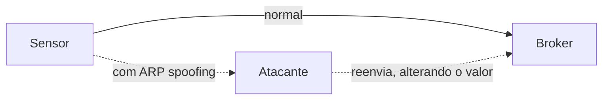

# 03-5. MitM: o ataque que quase não aparece no MQTT

## Objetivos desta aula

Ao final desta aula você vai entender:

- o que é **ARP spoofing** e por que um ataque de homem no meio deixa pouquíssimo rastro nas colunas `mqtt.*`;
- por que o **MAC** (`eth.src`) não identifica o atacante quando há spoofing, mesmo que o dicionário o trate como "identidade";
- como medir um ataque feito de **rajadas curtíssimas** num arquivo 96,5% normal.

E vai ter construído: `layer_shares`, `top_values_by_class`, `bursts_summary` e `numeric_payload_by_class`, mais o notebook do MitM.

**Ganho tangível:** a leitura dos 3.855 frames de ataque do `MitM.csv`: 80% são broadcasts pequenos sem camada IP, e só 47 são PUBLISH de leituras de sensor alteradas.

## Onde estamos

Na [aula 03-4](03-4-dos-inundacao.md) o ataque era volume e aparecia em todas as medidas. O MitM é o oposto: o ataque **modifica** tráfego legítimo, o atacante se faz passar por outro aparelho e quase tudo o que ele gera não tem MQTT. É o ambiente mais difícil de enxergar na [issue 03](issues/03-data-audit.md): 3,5% de frames de ataque (história 16: "confirmar classes e prevalência").

### Relembrando

??? question "1. Como se numeram rajadas de uma classe em pandas?"

    `(is_positive != is_positive.shift()).cumsum()`: compara cada linha com a anterior (a classe mudou?) e soma os verdadeiros acumulados.

??? question "2. Por que a taxa de frames sozinha não separa o DoS do normal?"

    Porque o tráfego normal também tem picos (mais de mil frames por segundo); o ataque se identifica pelo conjunto: PUBLISH QoS 0 para a porta 1883, frames grandes, tópicos aleatórios.

??? question "3. Por que o tópico `mqtt-malaria/...` separa as classes e, ainda assim, é um péssimo atributo?"

    Porque ele nomeia a ferramenta do laboratório: separa os dados deste experimento, mas não existiria em outro ambiente (identidade do cenário, não comportamento).

## Antes de começar

As aulas 03-1 a 03-4 concluídas e a suíte verde:

--8<-- "course/includes/rodar-testes.md"

## Conceitos

### ARP spoofing: o homem no meio na rede local

Numa rede local, um computador que quer falar com o IP `192.168.1.171` precisa descobrir o **endereço físico** (MAC) dele. Para isso usa o **ARP**: transmite a todos ("broadcast", destino `ff:ff:ff:ff:ff:ff`) a pergunta "quem tem este IP?", e o dono responde com o seu MAC. O protocolo guarda as respostas numa tabela e **não exige autenticação**.

O **ARP spoofing** (ou cache poisoning) aproveita isso: o atacante envia respostas ARP **falsas** dizendo "o IP do sensor está no meu MAC" (e o inverso para o broker). Os dois passam a enviar tudo ao atacante, que **retransmite** (é o homem no meio) e pode alterar o conteúdo. No laboratório do artigo, o atacante usa a ferramenta Ettercap para o ARP spoofing e um filtro para **mudar o valor lido pelo sensor** antes de entregar ao broker.



Fontes: [RFC 826 (ARP)](https://www.rfc-editor.org/rfc/rfc826.html), [MITRE ATT&CK T1557.002](https://attack.mitre.org/techniques/T1557/002/) (o protocolo é *stateless* e sem autenticação; o atacante responde com o seu MAC) e o [artigo MQTT_UAD](https://doi.org/10.1016/j.dib.2025.112167).

### Por que quase não há MQTT no ataque

O CSV só tem campos de Ethernet, IP, TCP e MQTT: **não há campos ARP**. Então um frame ARP aparece como um frame **sem IP, sem TCP e sem MQTT**, com `eth.dst` de broadcast e tamanho pequeno. Esse é o retrato do MitM nos dados: a maior parte do "ataque" são os frames ARP da fase de envenenamento. Os poucos frames MQTT são os PUBLISH do sensor **depois** de alterados.

Isso muda o que "ler" o MitM quer dizer. No DoS o ataque era um **comportamento MQTT** (inundação); aqui é um **comportamento de rede local** (ARP) mais uma **alteração de dado** quase invisível. Um modelo que só olhasse campos MQTT estaria cego para 98,8% dos frames de ataque.

### Identidade em duas camadas e MAC compartilhado

Há dois "nomes" de um aparelho: o IP (camada 3) e o MAC (camada 2). No ARP spoofing o atacante **mistura os dois**: usa o próprio MAC para responder em nome de outros IPs. Efeito prático para a ciência de dados: o MAC do atacante aparece **também em tráfego normal** (antes e depois do ataque, e quando ele é um aparelho legítimo da rede), e frames de ataque podem ter o IP do sensor e o MAC de outro aparelho. Por isso a "exclusividade" de `eth.src` é **zero** no MitM (aula 03-7), embora no DoS (aula 03-4) IPs e tópicos fossem quase exclusivos de uma classe.

## Ponte teoria → projeto

A [ADR-006](DECISIONS.md#adr-006-politica-principal-de-features) exclui IP e MAC crus da política principal porque "identificadores e ordem podem codificar o cenário de coleta". O MitM mostra a **outra** razão: sob spoofing, o identificador nem sequer é confiável como identidade. A história 20 do [PRD](PRD.md) pede cruzar identificadores com o alvo. Para a sua missão: no portfólio você poderá dizer, com números, que o MitM é um problema de detecção **de eventos raros**, e não de classificação de pacotes MQTT.

## Mão na massa

### Passo 1 — Quantas camadas cada classe tem

Acrescente ao fim de `src/mqtt_ids/audit.py`:

```python title="src/mqtt_ids/audit.py" linenums="200"
def layer_shares(df: pd.DataFrame) -> pd.DataFrame:
    """Fração de frames de cada classe com camada IP, TCP e MQTT."""
    layers = pd.DataFrame(
        {
            "ip": df["ip.src"].notna(),  # (1)!
            "tcp": df["tcp.srcport"].notna(),
            "mqtt": df["mqtt.msgtype"].notna(),
        }
    )
    return layers.groupby(df["type"]).mean().round(3)  # (2)!
```

1.  Um frame tem camada IP se `ip.src` existe; TCP, se `tcp.srcport` existe; MQTT, se `mqtt.msgtype` existe. É a ideia das camadas da aula 03-1 virando três colunas verdadeiro/falso.
2.  Agrupa por classe e tira a média de verdadeiros/falsos: a fração de frames com cada camada.

```python title="src/mqtt_ids/audit.py" linenums="212"
def top_values_by_class(
    df: pd.DataFrame, column: str, positive: str, n: int = 3
) -> pd.DataFrame:
    """Frames por classe nos n valores mais frequentes do ataque."""
    counts = pd.crosstab(df[column].fillna("(ausente)"), df["type"])  # (1)!
    return counts.loc[counts[positive].nlargest(n).index]  # (2)!
```

1.  Tabela valor × classe, com os ausentes aparecendo como `(ausente)`.
2.  `nlargest(n)` escolhe os n valores com **mais frames de ataque**; o `loc` traz as duas classes para eles. Ver o que o ataque mais usa **e** o quanto o normal também usa.

### Passo 2 — Ler o MitM

Crie o rascunho `/tmp/p0305.py`:

```python title="/tmp/p0305.py" linenums="1"
import pandas as pd

from mqtt_ids.audit import (
    bursts_summary,
    class_profile,
    layer_shares,
    load_raw,
    msgtype_by_class,
)

pd.set_option("display.width", 200)
df = load_raw("mitm")
print(layer_shares(df))
print()
print(class_profile(df).round(6))
print()
print(msgtype_by_class(df).head(3))
print()
print(bursts_summary(df, "mitm"))
```

Falta a função `bursts_summary` (Passo 3). Escreva-a antes de executar:

```python title="src/mqtt_ids/audit.py" linenums="220"
def bursts_summary(df: pd.DataFrame, positive: str) -> dict[str, float]:
    """Resumo das rajadas de ataque de um ambiente."""
    runs = class_runs(df, positive)  # (1)!
    attacks = runs[runs["label"] == positive]
    return {
        "bursts": len(attacks),
        "median_frames": float(attacks["frames"].median()),
        "max_frames": int(attacks["frames"].max()),
        "attack_seconds": round(float(attacks["duration_s"].sum()), 1),
        "capture_seconds": round(float(df["frame.time_relative"].max()), 1),  # (2)!
    }
```

1.  Reaproveita `class_runs` da aula 03-4; só filtra as rajadas de ataque.
2.  Duração aproximada da captura (o tempo relativo do último frame). `round(..., 1)` evita ruído de ponto flutuante (41,80000000004).

```bash title="$ Execução no terminal (na pasta do projeto)"
uv run --locked python /tmp/p0305.py
```

```text title="Saída esperada"
ip    tcp   mqtt
type
mitm    0.099  0.099  0.012
normal  0.955  0.928  0.033

type                      mitm         normal
frames             3855.000000  106813.000000
share_with_mqtt       0.012192       0.033442
median_frame_len     42.000000     191.000000
median_time_delta     0.000207       0.000138
unique_topics         1.000000       3.000000

type          mitm  normal
mqtt.msgtype
(sem MQTT)    3808  103241
PUBLISH         47    1988
PINGRESP         0     807

{'bursts': 159, 'median_frames': 3.0, 'max_frames': 529, 'attack_seconds': 41.8, 'capture_seconds': 4706.6}
```

**O que aconteceu e como ler:**

- **Camadas:** só **9,9%** dos frames de ataque têm IP (e TCP); no normal, 95,5%. Ou seja, **90% do ataque está abaixo da camada IP**: ARP. Só **1,2%** do ataque tem MQTT (47 frames).
- **Tamanho:** mediana de **42 bytes** no ataque, contra 191 no normal. 42 bytes é o tamanho típico de uma mensagem ARP numa rede Ethernet; o CSV não tem campos ARP, então isto é uma **inferência**, mas ela é coerente com o ataque descrito no artigo e com o item seguinte.
- **Rajadas:** **159** rajadas, com **mediana de 3 frames** (a maior tem 529). No total, o ataque dura **41,8 s de 4.706,6 s** da captura (0,9%): a prevalência por frame (3,5%) é muito maior que a por tempo.
- **Desbalanceamento:** 3.855 frames de ataque contra 106.813 normais: 1 a cada 28.

### Passo 3 — Os endereços Ethernet: o que o spoofing mostra

```python title="/tmp/p0305b.py" linenums="1"
import pandas as pd

from mqtt_ids.audit import load_raw, top_values_by_class

pd.set_option("display.width", 200)
df = load_raw("mitm")
attack = df[df["type"] == "mitm"]
print("tamanhos mais comuns no ataque:", attack["frame.len"].value_counts().head(3).to_dict())
print(top_values_by_class(df, "eth.dst", "mitm", n=3))
print()
print(top_values_by_class(df, "eth.src", "mitm", n=4))
mac = "b8:27:eb:73:32:30"
print()
print("o MAC mais ativo do ataque aparece em", int((df["eth.src"] == mac).sum()), "frames:")
print(df.loc[df["eth.src"] == mac, "type"].value_counts().to_dict())
```

```bash title="$ Execução no terminal (na pasta do projeto)"
uv run --locked python /tmp/p0305b.py
```

```text title="Saída esperada"
tamanhos mais comuns no ataque: {42: 3433, 81: 141, 54: 140}
type               mitm  normal
eth.dst                        
ff:ff:ff:ff:ff:ff  3098      79
60:01:94:37:e0:e1   271    2618
b8:27:eb:73:32:30   227    1152

type               mitm  normal
eth.src                        
b8:27:eb:73:32:30  3505    1122
74:d4:35:ef:e5:5a   115    8961
60:01:94:37:e0:e1   107    3004
30:5a:3a:62:72:80    76   12861

o MAC mais ativo do ataque aparece em 4627 frames:
{'mitm': 3505, 'normal': 1122}
```

**O que aconteceu e como ler:**

- **Broadcast:** 3.098 dos 3.855 frames de ataque (80,4%) vão para `ff:ff:ff:ff:ff:ff`; no normal são só 79 em 106.813 (0,07%). É a assinatura do ARP: perguntas e respostas anunciadas a todos.
- **O MAC mais ativo do ataque** (`b8:27:eb:73:32:30`) origina 3.505 frames de ataque (91%), **mas também 1.122 frames normais**. Um MAC não identifica o atacante: ele aparece nas duas classes. Os demais MACs aparecem **muito mais** no normal (por exemplo, `30:5a:...` com 12.861 normais e 76 de ataque).
- **Consequência:** `eth.src` e `eth.dst` crus são ao mesmo tempo identidade do laboratório (política: `derivable`, nunca MAC cru) e **sinal pouco confiável** sob spoofing. O que se pode **derivar** de forma mais portável é "o frame é um broadcast?" (`eth.dst` de broadcast), ver exercício.

### Passo 4 — O dado alterado

Os 47 PUBLISH do ataque são a parte "MQTT" do MitM: o valor lido pelo sensor de distância (`distance/ultrasonic1`), alterado em trânsito. Escreva a função que compara o payload numérico entre as classes:

```python title="src/mqtt_ids/audit.py" linenums="233"
def numeric_payload_by_class(df: pd.DataFrame, topic: str) -> pd.DataFrame:
    """Estatísticas do payload numérico de um tópico, por classe."""
    rows = df[df["mqtt.topic"] == topic]
    values = pd.to_numeric(rows["mqtt.msg"], errors="coerce")  # (1)!
    return values.groupby(rows["type"]).describe().round(1)  # (2)!
```

1.  `mqtt.msg` pode vir como texto ou número; `to_numeric` converte e, com `errors="coerce"`, vira `NaN` o que não for número (em vez de levantar erro).
2.  `describe()` dá contagem, média, desvio, mínimo, quartis e máximo, por classe.

```python title="/tmp/p0305c.py" linenums="1"
from mqtt_ids.audit import load_raw, numeric_payload_by_class

df = load_raw("mitm")
print(numeric_payload_by_class(df, "distance/ultrasonic1"))
attack_publish = df[(df["type"] == "mitm") & (df["mqtt.msgtype"] == 3)]
print()
print("remetente dos PUBLISH alterados:", attack_publish["ip.src"].value_counts().to_dict())
print("valores mais comuns:", attack_publish["mqtt.msg"].value_counts().head(3).to_dict())
```

```bash title="$ Execução no terminal (na pasta do projeto)"
uv run --locked python /tmp/p0305c.py
```

```text title="Saída esperada"
         count   mean   std    min    25%    50%    75%    max
type                                                          
mitm      47.0  348.7  11.0  336.0  336.0  352.0  352.5  400.0
normal  1905.0  341.2  36.7   42.0  336.0  340.0  353.0  400.0

remetente dos PUBLISH alterados: {'192.168.1.133': 47}
valores mais comuns: {352.0: 17, 336.0: 13, 353.0: 5}
```

**O que aconteceu e como ler:** os valores alterados ficam entre 336 e 400, com mediana **352**; os normais têm mediana **340** e uma faixa maior (42 a 400). As distribuições **se sobrepõem quase totalmente**: 336 e 353 aparecem nas duas. Nenhuma regra por valor separa as classes, e um PUBLISH de ataque é **indistinguível** de um normal por conteúdo isolado. A diferença só existe no **contexto** (quem enviou, em que sequência, o que aconteceu antes: o ARP). Repare também que o remetente é sempre `192.168.1.133`, o IP do sensor: o atacante se passa por ele.

??? question "Pare e pense: um modelo treinado só com as colunas `mqtt.*` do MitM teria bom desempenho?"

    Péssimo: 98,8% dos frames de ataque não têm MQTT (todas as colunas `mqtt.*` ausentes), e os 47 PUBLISH de ataque se parecem com os normais. O modelo precisaria de informação de camada 2 (broadcast, tamanho) ou de contexto temporal (rajadas) para ver o ataque.

## Testando

```python title="tests/test_audit_mitm.py" linenums="1"
import pandas as pd

from mqtt_ids.audit import (
    bursts_summary,
    layer_shares,
    numeric_payload_by_class,
    top_values_by_class,
)


def make_frames() -> pd.DataFrame:
    return pd.DataFrame(
        {
            "type": ["normal", "mitm", "mitm", "normal", "mitm"],
            "frame.time_relative": [0.0, 1.0, 1.5, 2.0, 5.0],
            "ip.src": ["10.0.0.1", None, None, "10.0.0.2", "10.0.0.1"],
            "tcp.srcport": [1883.0, None, None, 443.0, 1883.0],
            "mqtt.msgtype": [3.0, None, None, None, 3.0],
            "mqtt.topic": ["t", None, None, None, "t"],
            "mqtt.msg": ["340.0", None, None, None, "352.0"],
            "eth.dst": ["aa", "ff", "ff", "aa", "aa"],  # (1)!
        }
    )


def test_layer_shares_show_that_attack_frames_lack_the_ip_layer() -> None:
    shares = layer_shares(make_frames())

    assert shares.loc["mitm", "ip"] == 0.333
    assert shares.loc["normal", "ip"] == 1.0


def test_top_values_are_ranked_by_the_attack_class() -> None:
    top = top_values_by_class(make_frames(), "eth.dst", "mitm", n=1)

    assert top.index.tolist() == ["ff"]
    assert top.loc["ff"].to_dict() == {"mitm": 2, "normal": 0}


def test_bursts_summary_counts_attack_runs_and_time() -> None:
    summary = bursts_summary(make_frames(), "mitm")

    assert summary["bursts"] == 2  # (2)!
    assert summary["max_frames"] == 2
    assert summary["attack_seconds"] == 0.5
    assert summary["capture_seconds"] == 5.0


def test_numeric_payload_ignores_values_that_are_not_numbers() -> None:
    stats = numeric_payload_by_class(make_frames(), "t")

    assert stats.loc["mitm", "count"] == 1.0  # (3)!
    assert stats.loc["normal", "mean"] == 340.0
```

1.  Cinco frames: dois normais com IP, dois de ataque sem IP (ARP) para o broadcast `ff` e um de ataque com PUBLISH.
2.  Duas rajadas de ataque: os frames 1–2 e o frame 4 (separados por um normal).
3.  Só um PUBLISH de ataque tem payload no tópico `t`; os `None` viram `NaN` e não contam.

```bash title="$ Execução no terminal (na pasta do projeto)"
uv run --locked pytest tests/test_audit_mitm.py -v
```

```text title="Saída esperada"
tests/test_audit_mitm.py::test_layer_shares_show_that_attack_frames_lack_the_ip_layer PASSED [ 25%]
tests/test_audit_mitm.py::test_top_values_are_ranked_by_the_attack_class PASSED [ 50%]
tests/test_audit_mitm.py::test_bursts_summary_counts_attack_runs_and_time PASSED [ 75%]
tests/test_audit_mitm.py::test_numeric_payload_ignores_values_that_are_not_numbers PASSED [100%]

============================== 4 passed in 0.22s ===============================
```

**O que aconteceu:** quatro comportamentos com DataFrames de cinco linhas. Rode `lint tests` ao final para atualizar o [Catálogo de testes](testing/scenarios.md).

## O notebook do MitM

Preencha `notebooks/03_eda_mtmi.ipynb` (o nome é o que está no repositório) seguindo o roteiro da aula 03-4, sempre consumindo funções da biblioteca:

1. *Markdown*: o ataque (ARP spoofing + alteração do valor do sensor) e as perguntas: o que o ataque deixa nos dados? O que um modelo veria?
2. *Código*: `load_raw("mitm")`, `contract_counts`, `duplicates_by_class` (aula 03-2).
3. *Código*: `layer_shares`, `class_profile`, `msgtype_by_class`.
4. *Código*: `top_values_by_class(df, "eth.dst", "mitm")` e `top_values_by_class(df, "eth.src", "mitm", n=4)`.
5. *Código*: `bursts_summary` e `plot_class_timeline(df, "mitm", ...)` (aula 03-4): compare com o DoS.
6. *Código*: `numeric_payload_by_class(df, "distance/ultrasonic1")`.
7. *Markdown*: **o que sabemos** (ataque abaixo do MQTT; rajadas curtas; payload alterado indistinguível) e **o que não sabemos** (se os frames de 42 bytes são mesmo ARP: não há campos ARP no CSV).

## Erros comuns

**1. `KeyError: 'mitm'` em `top_values_by_class`.** O rótulo positivo é `mitm` em minúsculas (não `MitM`, como no artigo).

**2. `describe()` devolve tudo `NaN`.** Faltou o `to_numeric` ou o tópico está escrito diferente (`distance/ultrasonic1`, com o `1` final; o artigo escreve `distance/ultrasonic`).

**3. Concluir que "o MAC X é o atacante".** Ele é o MAC **mais ativo no ataque**, mas aparece também no normal. Sob ARP spoofing a identidade da camada 2 não prova nada sozinha.

**4. Esperar rajadas longas.** Se o resumo mostra `bursts` ≈ 159 e `median_frames` = 3, é isso mesmo: o MitM são rajadas curtíssimas. Não é bug.

## Código completo desta aula

??? example "Trecho acrescentado a src/mqtt_ids/audit.py (a partir da linha 200)"

    ```python
    def layer_shares(df: pd.DataFrame) -> pd.DataFrame:
        """Fração de frames de cada classe com camada IP, TCP e MQTT."""
        layers = pd.DataFrame(
            {
                "ip": df["ip.src"].notna(),
                "tcp": df["tcp.srcport"].notna(),
                "mqtt": df["mqtt.msgtype"].notna(),
            }
        )
        return layers.groupby(df["type"]).mean().round(3)


    def top_values_by_class(
        df: pd.DataFrame, column: str, positive: str, n: int = 3
    ) -> pd.DataFrame:
        """Frames por classe nos n valores mais frequentes do ataque."""
        counts = pd.crosstab(df[column].fillna("(ausente)"), df["type"])
        return counts.loc[counts[positive].nlargest(n).index]


    def bursts_summary(df: pd.DataFrame, positive: str) -> dict[str, float]:
        """Resumo das rajadas de ataque de um ambiente."""
        runs = class_runs(df, positive)
        attacks = runs[runs["label"] == positive]
        return {
            "bursts": len(attacks),
            "median_frames": float(attacks["frames"].median()),
            "max_frames": int(attacks["frames"].max()),
            "attack_seconds": round(float(attacks["duration_s"].sum()), 1),
            "capture_seconds": round(float(df["frame.time_relative"].max()), 1),
        }


    def numeric_payload_by_class(df: pd.DataFrame, topic: str) -> pd.DataFrame:
        """Estatísticas do payload numérico de um tópico, por classe."""
        rows = df[df["mqtt.topic"] == topic]
        values = pd.to_numeric(rows["mqtt.msg"], errors="coerce")
        return values.groupby(rows["type"]).describe().round(1)
    ```

??? example "Arquivo completo: tests/test_audit_mitm.py"

    ```python
    import pandas as pd

    from mqtt_ids.audit import (
        bursts_summary,
        layer_shares,
        numeric_payload_by_class,
        top_values_by_class,
    )


    def make_frames() -> pd.DataFrame:
        return pd.DataFrame(
            {
                "type": ["normal", "mitm", "mitm", "normal", "mitm"],
                "frame.time_relative": [0.0, 1.0, 1.5, 2.0, 5.0],
                "ip.src": ["10.0.0.1", None, None, "10.0.0.2", "10.0.0.1"],
                "tcp.srcport": [1883.0, None, None, 443.0, 1883.0],
                "mqtt.msgtype": [3.0, None, None, None, 3.0],
                "mqtt.topic": ["t", None, None, None, "t"],
                "mqtt.msg": ["340.0", None, None, None, "352.0"],
                "eth.dst": ["aa", "ff", "ff", "aa", "aa"],
            }
        )


    def test_layer_shares_show_that_attack_frames_lack_the_ip_layer() -> None:
        shares = layer_shares(make_frames())

        assert shares.loc["mitm", "ip"] == 0.333
        assert shares.loc["normal", "ip"] == 1.0


    def test_top_values_are_ranked_by_the_attack_class() -> None:
        top = top_values_by_class(make_frames(), "eth.dst", "mitm", n=1)

        assert top.index.tolist() == ["ff"]
        assert top.loc["ff"].to_dict() == {"mitm": 2, "normal": 0}


    def test_bursts_summary_counts_attack_runs_and_time() -> None:
        summary = bursts_summary(make_frames(), "mitm")

        assert summary["bursts"] == 2
        assert summary["max_frames"] == 2
        assert summary["attack_seconds"] == 0.5
        assert summary["capture_seconds"] == 5.0


    def test_numeric_payload_ignores_values_that_are_not_numbers() -> None:
        stats = numeric_payload_by_class(make_frames(), "t")

        assert stats.loc["mitm", "count"] == 1.0
        assert stats.loc["normal", "mean"] == 340.0
    ```

## Exercícios

Os exercícios continuam em `src/mqtt_ids/exercicios.py`. Eles derivam sinais **portáveis** de camada 2.

1. Escreva `broadcast_share(df, label)`, a fração dos frames de uma classe cujo `eth.dst` é o broadcast `ff:ff:ff:ff:ff:ff`, e `share_of_size(df, label, size)`, a fração dos frames de uma classe com exatamente `size` bytes em `frame.len`. O exercício está pronto quando este teste passar:

    ```python title="tests/test_exercicio_03_5.py"
    import pandas as pd

    from mqtt_ids.exercicios import broadcast_share, share_of_size

    BROADCAST = "ff:ff:ff:ff:ff:ff"


    def make_frames() -> pd.DataFrame:
        return pd.DataFrame(
            {
                "type": ["mitm", "mitm", "mitm", "normal", "normal"],
                "eth.dst": [BROADCAST, BROADCAST, "aa:aa", "aa:aa", BROADCAST],
                "frame.len": [42, 42, 81, 60, 42],
            }
        )


    def test_broadcast_share_is_measured_inside_one_class() -> None:
        assert broadcast_share(make_frames(), "mitm") == 2 / 3
        assert broadcast_share(make_frames(), "normal") == 0.5


    def test_share_of_size_counts_frames_with_exactly_that_length() -> None:
        assert share_of_size(make_frames(), "mitm", 42) == 2 / 3
        assert share_of_size(make_frames(), "normal", 42) == 0.5
    ```

    ```bash title="$ Execução no terminal (na pasta do projeto)"
    uv run --locked pytest tests/test_exercicio_03_5.py
    ```

    Antes da solução:

    ```text title="Saída esperada (antes da solução)"
    E   ImportError: cannot import name 'broadcast_share' from 'mqtt_ids.exercicios' (...)
    ERROR tests/test_exercicio_03_5.py
    ```

??? tip "Solução"

    ```python title="src/mqtt_ids/exercicios.py (acrescente ao arquivo)"
    BROADCAST_MAC = "ff:ff:ff:ff:ff:ff"


    def broadcast_share(df: pd.DataFrame, label: str) -> float:
        return float((df.loc[df["type"] == label, "eth.dst"] == BROADCAST_MAC).mean())


    def share_of_size(df: pd.DataFrame, label: str, size: int) -> float:
        return float((df.loc[df["type"] == label, "frame.len"] == size).mean())
    ```

    Depois da solução: `2 passed`. No `MitM.csv` real: `broadcast_share` dá **0,804** para o ataque e **0,0007** para o normal; `share_of_size(df, "mitm", 42)` dá **0,891** contra **0,013**. São os dois sinais de camada 2 que mais separam as classes neste ambiente, e são **derivações** (não identidades) candidatas para a aula 03-9.

## Quiz de fixação

??? question "1. Com suas palavras: por que 98,8% dos frames de ataque do MitM não têm camada MQTT?"

    Porque o ataque é, em grande parte, ARP spoofing: frames da camada 2 (broadcasts de 42 bytes, sem IP, TCP nem MQTT). O CSV não tem campos ARP, então esses frames aparecem com tudo de IP e MQTT ausente. Só os PUBLISH do sensor alterado (47 frames) têm MQTT.

??? question "2. Por que `eth.src` não identifica o atacante?"

    Porque, sob ARP spoofing, o atacante usa o próprio MAC para se passar por outros aparelhos e o mesmo MAC também aparece em tráfego normal (1.122 frames normais para o MAC mais ativo no ataque). O identificador não separa as classes (exclusividade zero) e, além disso, não é confiável como identidade.

**3. O que indicam as 159 rajadas de mediana 3 frames, em 4.706 s de captura?**

- a) Que o ataque é feito de eventos curtíssimos e raros, o que pede avaliação por evento e não só por frame
- b) Que o ataque é uma inundação contínua que ocupa a maior parte da captura
- c) Que os rótulos do arquivo estão embaralhados e precisam ser reordenados

??? question "Resposta da 3"

    **a)**. O ataque ocupa 41,8 s (0,9%) da captura, em rajadas de poucos frames. O b) descreve o DoS; o c) está errado: a ordem é a da captura e é por ela que as rajadas existem.

??? question "4. Revisão da aula 03-4: por que a taxa de frames era informativa no DoS e quase inútil no MitM?"

    No DoS a inundação concentra milhares de frames por segundo; no MitM os frames de ataque são poucos, pequenos e espalhados em 159 rajadas curtas, sem picos de taxa.

## Commit

```bash title="$ Execução no terminal (na pasta do projeto)"
git add src/mqtt_ids/audit.py tests/test_audit_mitm.py notebooks/03_eda_mtmi.ipynb
git commit -m "feat(audit): camadas, endereços Ethernet, rajadas e payload alterado no MitM"
```

## Resumo

- O MitM do laboratório é ARP spoofing + alteração do valor do sensor: 90% dos frames de ataque não têm IP e 98,8% não têm MQTT.
- O MAC do atacante também aparece no normal: sob spoofing, identificadores de camada 2 não são confiáveis.
- O ataque é raro e curto (159 rajadas de mediana 3 frames; 0,9% do tempo): pede avaliação por evento; os PUBLISH alterados são indistinguíveis dos normais por conteúdo.

## Fonte principal

[MITRE ATT&CK T1557.002 (ARP Cache Poisoning)](https://attack.mitre.org/techniques/T1557/002/): leia como o atacante responde com o próprio MAC e as mitigações.

## Para saber mais

- [RFC 826: Address Resolution Protocol](https://www.rfc-editor.org/rfc/rfc826.html)
- [pandas.to_numeric](https://pandas.pydata.org/docs/reference/api/pandas.to_numeric.html)
- [Artigo MQTT_UAD](https://doi.org/10.1016/j.dib.2025.112167)

!!! question "Ficou com dúvida?"

    O agente é o seu professor: pergunte o que não ficou claro, colando a mensagem de erro exata e o que você tentou. Para conversar com pessoas, veja as comunidades em [Recursos](recursos.md#comunidades).

**Próxima aula:** [03-6. Intrusion: o cliente desconhecido](03-6-intrusion-cliente-desconhecido.md).
