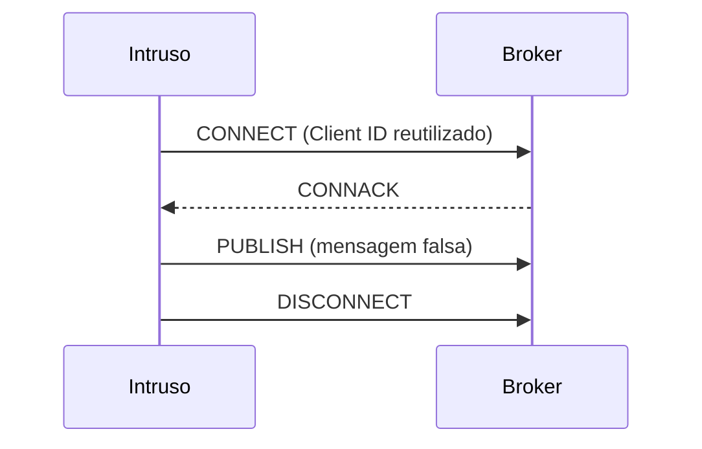

# 03-6. Intrusion: o cliente desconhecido

## Objetivos desta aula

Ao final desta aula você vai entender:

- como funciona uma **sessão MQTT** (conectar, publicar, desconectar) e o que a regra do **Client ID duplicado** muda para a leitura do ataque;
- por que o ataque do Intrusion é um **evento** (uma sessão curtíssima) e não um frame, e como extrair a **assinatura** dessas sessões;
- por que o intruso é **mimético**: reaproveita Client IDs, tópicos e IPs do tráfego legítimo.

E vai ter construído: `packet_names`, `burst_signatures` e `shared_values`, mais o notebook do Intrusion.

**Ganho tangível:** a assinatura em 247 sessões de ataque ("conecta, publica uma mensagem falsa e desconecta") e a medida de quanto das identidades do intruso o tráfego normal também usa.

## Onde estamos

Na [aula 03-5](03-5-mitm-trafego-alterado.md) o ataque estava abaixo do MQTT. No Intrusion ele está **dentro** do MQTT, mas é tão raro (2,35% dos frames, 1.898 de 80.893) e tão parecido com o legítimo que a [issue 03](issues/03-data-audit.md) o trata como caso central: é o `Intrusion.csv` de que as histórias 16 a 21 do [PRD](PRD.md) partem.

### Relembrando

??? question "1. Por que `eth.src` não identifica o atacante no MitM?"

    Sob ARP spoofing o atacante usa o próprio MAC para se passar por outros aparelhos, e o MAC mais ativo no ataque também origina tráfego normal (1.122 frames). Ele aparece nas duas classes.

??? question "2. O que são `layer_shares` e o que mostraram no MitM?"

    A fração de frames de cada classe com camada IP, TCP e MQTT. No ataque só 9,9% tinham IP e 1,2% MQTT, contra 95,5% e 3,3% no normal.

??? question "3. Por que os 47 PUBLISH de ataque do MitM eram indistinguíveis dos normais?"

    Porque os valores alterados (mediana 352) ficam dentro da faixa dos normais (mediana 340, de 42 a 400): nenhuma regra por valor separa as classes.

## Antes de começar

As aulas 03-1 a 03-5 concluídas e a suíte verde:

--8<-- "course/includes/rodar-testes.md"

## Conceitos

### Sessão MQTT e Client ID

Uma **sessão** MQTT começa quando um cliente se conecta e termina quando se desconecta. Na prática, cada sessão é uma sequência de pacotes: o cliente envia CONNECT (com seu **Client ID**, um nome que o broker usa para identificá-lo), o broker responde CONNACK, o cliente assina ou publica, e por fim o cliente envia DISCONNECT. Entre eles, o TCP gera frames próprios (confirmações), que no CSV aparecem como "sem MQTT".

Duas regras do protocolo são cruciais aqui. (1) **Client ID duplicado:** se um cliente se conecta com um Client ID que já está conectado, o broker **desconecta o cliente existente**. Um intruso que reutiliza o Client ID de um sensor legítimo expulsa o sensor e fala em nome dele. (2) **Keep Alive e PINGREQ:** um cliente legítimo, ocioso, envia PINGREQ periódicos para provar que está vivo; um intruso que conecta, publica e sai logo **não** tem PINGREQ.



Fonte: [especificação MQTT 3.1.1](https://docs.oasis-open.org/mqtt/mqtt/v3.1.1/os/mqtt-v3.1.1-os.html) (Client Identifier: "o servidor DEVE desconectar o cliente existente"; Clean Session; Keep Alive).

### O ataque como evento: a assinatura da sessão

Na aula 03-4 uma rajada de ataque tinha 15 mil frames; aqui cada rajada tem em mediana **7 frames** e dura **menos de um segundo**. Cada rajada é **uma sessão do intruso**. Se, em vez de olhar frame a frame, **resumimos cada rajada pela sequência de tipos de pacote**, aparece um padrão repetido, a **assinatura da sessão**. Para comparar sequências, colapsamos repetições consecutivas (`CONNACK > CONNACK` vira `CONNACK`) e contamos quantas rajadas têm cada assinatura.

Por que importa: a métrica por frame trata cada um dos 7 frames como uma amostra independente; mas só a **sequência** diz "isto é uma sessão de intrusão". Isso antecipa a avaliação por **evento** (ADR-011): tempo até o primeiro alerta, falsos alertas por 10.000 frames normais.

### Mimetismo: identidades e conteúdo copiados do legítimo

Um intruso que quer passar despercebido **imita**: usa os Client IDs dos sensores, os tópicos reais e valores plausíveis. Para medir o grau de imitação, comparamos o **conjunto de valores** que o ataque usa com o que o normal usa: valores só do ataque, só do normal e **nos dois**. Quanto maior a interseção, **menos** o valor identifica o ataque. Uma interseção pequena, ao contrário, é uma pista, mas também uma identidade do laboratório (IPs de máquinas do experimento).

## Ponte teoria → projeto

A [issue 03](issues/03-data-audit.md) pede "evidência de risco por IP, MAC, client ID, tópico, payload e ordem" e a [ADR-011](DECISIONS.md#adr-011-objetivo-e-avaliacao) manda avaliar frames **e eventos** porque "o valor operacional depende da detecção de sequências de ataque". Esta aula faz as duas coisas no ambiente em que o ataque é mais raro e mais mimético. Para a sua missão: o portfólio pode dizer, com número, que o Intrusion é um problema de **sessões**, e que as identidades que parecem separá-lo (IP, Client ID) são em boa parte compartilhadas com o tráfego legítimo.

## Mão na massa

### Passo 1 — O perfil do Intrusion

Reutilize o que já escreveu. Rascunho `/tmp/p0306.py` (ele usa `burst_signatures`, do Passo 2; escreva-o antes de executar):

```python title="/tmp/p0306.py" linenums="1"
import pandas as pd

from mqtt_ids.audit import bursts_summary, burst_signatures, class_profile, layer_shares, load_raw

pd.set_option("display.width", 200)
pd.set_option("display.max_colwidth", 100)
df = load_raw("intrusion")
print(bursts_summary(df, "intrusion"))
print()
print(layer_shares(df))
print()
print(class_profile(df).round(6))
print()
print(burst_signatures(df, "intrusion").head(5).to_string())
```

### Passo 2 — Nomes de pacote e assinaturas

Primeiro, uma função que extrai as três linhas de nomeação das aulas 03-1 e 03-3, que agora usamos mais uma vez:

```python title="src/mqtt_ids/audit.py" linenums="240"
def packet_names(df: pd.DataFrame) -> pd.Series:
    """Nome do tipo de pacote de cada frame, com marcas para sem MQTT e reservado."""
    codes = df["mqtt.msgtype"]
    names = codes.map(MSGTYPE_NAMES)
    return names.mask(codes.notna() & names.isna(), RESERVED).fillna(NO_MQTT)  # (1)!
```

1.  A mesma lógica de `msgtype_by_class` e `missing_by_msgtype`: código com nome, código sem nome (reservado) e ausente (sem MQTT).

!!! tip "Refatoração opcional, com rede de segurança"

    `msgtype_by_class` (03-1) e `missing_by_msgtype` (03-3) repetem estas linhas. Depois de escrever `packet_names`, troque as linhas repetidas por `names = packet_names(df)` e rode `uv run --locked pytest`: os testes das aulas 03-1 e 03-3 devem continuar verdes. É para isso que servem: mudar a estrutura sem mudar o comportamento. (Como esta aula não depende da refatoração, o curso não a exige.)

Agora as assinaturas:

```python title="src/mqtt_ids/audit.py" linenums="247"
def burst_signatures(df: pd.DataFrame, positive: str) -> pd.Series:
    """Sequências de pacotes das rajadas de ataque, da mais comum à mais rara."""
    is_attack = df["type"] == positive
    names = packet_names(df)[is_attack]  # (1)!
    sequences = names.groupby(run_ids(df, positive)[is_attack]).agg(_collapse)  # (2)!
    return sequences.value_counts().rename("bursts").rename_axis("signature")  # (3)!


def _collapse(names: pd.Series) -> str:
    kept = [name for i, name in enumerate(names) if i == 0 or name != names.iloc[i - 1]]  # (4)!
    return " > ".join(kept)
```

1.  Os nomes só dos frames de ataque, na ordem de captura.
2.  Agrupa pelo número da rajada (`run_ids`, aula 03-4) e junta os nomes de cada rajada numa sequência com `_collapse`.
3.  `value_counts` conta quantas rajadas têm cada sequência; `rename` e `rename_axis` dão nomes legíveis ao resultado.
4.  Mantém um nome só se for o primeiro da rajada ou diferente do anterior: colapsa repetições consecutivas. O prefixo `_` indica que é um auxiliar interno.

```bash title="$ Execução no terminal (na pasta do projeto)"
uv run --locked python /tmp/p0306.py
```

```text title="Saída esperada"
{'bursts': 247, 'median_frames': 7.0, 'max_frames': 17, 'attack_seconds': 2.2, 'capture_seconds': 5164.4}

              ip    tcp   mqtt
type
intrusion  0.999  0.998  0.451
normal     0.952  0.884  0.050

type                 intrusion        normal
frames             1898.000000  78995.000000
share_with_mqtt       0.451001      0.050155
median_frame_len     60.000000     78.000000
median_time_delta     0.000879      0.000660
unique_topics         4.000000      4.000000

signature
(sem MQTT) > CONNECT > CONNACK > (sem MQTT) > PUBLISH > DISCONNECT > (sem MQTT)    67
(sem MQTT) > PUBLISH > DISCONNECT > (sem MQTT)                                     39
CONNACK > (sem MQTT) > PUBLISH > DISCONNECT > (sem MQTT)                           37
(sem MQTT) > CONNECT > PUBLISH > (sem MQTT) > CONNACK > (sem MQTT)                 18
CONNACK > (sem MQTT) > PUBLISH > DISCONNECT > (sem MQTT) > PUBLISH > (sem MQTT)    17
```

**O que aconteceu e como ler:**

- **Rajadas:** 247, mediana de 7 frames, máximo 17; **2,2 s no total** em 5.164 s de captura (0,04%). Cada rajada dura menos que um segundo.
- **Camadas:** o ataque tem IP e TCP em quase 100% dos frames e MQTT em 45% (no normal, 5%): o ataque é **mais MQTT que o tráfego normal**, o oposto do MitM.
- **Tópicos:** 4 nas duas classes: o mesmo conjunto (`#`, `distance/ultrasonic1`, `light/rele1`, `motor`).
- **Assinaturas:** a sessão típica é `(TCP) > CONNECT > CONNACK > (TCP) > PUBLISH > DISCONNECT > (TCP)`: **conecta, publica uma mensagem e desconecta**. As cinco assinaturas mais comuns cobrem 178 das 247 rajadas (72%). Algumas rajadas começam em `CONNACK` ou `PUBLISH` porque o CONNECT caiu no fim da rajada anterior (a captura corta a sessão no meio).
- Ainda: `CONNECT > ... > DISCONNECT` **sem PINGREQ**: o intruso não fica ocioso.

### Passo 3 — Que parte da sessão é "só do atacante"

Escreva a função que compara os valores de uma coluna:

```python title="src/mqtt_ids/audit.py" linenums="260"
def shared_values(df: pd.DataFrame, column: str, positive: str) -> dict[str, list]:
    """Valores de uma coluna usados só pelo ataque, só pelo normal ou pelos dois."""
    attack = set(df.loc[df["type"] == positive, column].dropna())  # (1)!
    normal = set(df.loc[df["type"] == "normal", column].dropna())
    return {
        "only_attack": sorted(attack - normal),  # (2)!
        "both": sorted(attack & normal),
        "only_normal": sorted(normal - attack),
    }
```

1.  Conjunto (`set`) dos valores **presentes** (sem ausentes) usados pela classe.
2.  Diferença e interseção de conjuntos: o que só o ataque usa, o que os dois usam, o que só o normal usa.

```python title="/tmp/p0306b.py" linenums="1"
from mqtt_ids.audit import load_raw, shared_values

df = load_raw("intrusion")
for column in ("mqtt.clientid", "mqtt.topic", "ip.src", "eth.src"):
    values = shared_values(df, column, "intrusion")
    print(column, {name: len(items) for name, items in values.items()})
clients = shared_values(df, "mqtt.clientid", "intrusion")
print("client IDs só do ataque:", clients["only_attack"])
print("client IDs nos dois:", clients["both"])
print("tópicos nos dois:", shared_values(df, "mqtt.topic", "intrusion")["both"])
```

```bash title="$ Execução no terminal (na pasta do projeto)"
uv run --locked python /tmp/p0306b.py
```

```text title="Saída esperada"
mqtt.clientid {'only_attack': 3, 'both': 5, 'only_normal': 25}
mqtt.topic {'only_attack': 0, 'both': 4, 'only_normal': 0}
ip.src {'only_attack': 0, 'both': 10, 'only_normal': 430}
eth.src {'only_attack': 0, 'both': 5, 'only_normal': 2}
client IDs só do ataque: ['light', 'relay', 'sensorPython']
client IDs nos dois: ['lightSensor', 'sensorLuz', 'sensorMotor', 'sensorUltrasonic', 'shellf11 22']
tópicos nos dois: ['#', 'distance/ultrasonic1', 'light/rele1', 'motor']
```

**O que aconteceu e como ler:**

- **Mimetismo de Client ID:** dos 8 Client IDs do ataque, **5 também são usados no tráfego normal**, entre eles `sensorUltrasonic`, `sensorLuz` e `sensorMotor`: o intruso fala **em nome dos sensores legítimos** (e, pela regra do Client ID duplicado, expulsa o sensor real da conexão). Só 3 (`light`, `relay`, `sensorPython`) são exclusivos.
- **Tópicos:** os 4 tópicos do ataque são os mesmos do normal, incluindo `#`: o curinga também aparece no tráfego legítimo (o artigo descreve a assinatura do `#` como a marca do intruso, mas só **2** frames de ataque a fazem). Tópico não separa nada.
- **IPs e MACs:** **nenhum** IP e **nenhum** MAC é exclusivo do ataque (os 10 IPs e 5 MACs que o ataque usa também aparecem no normal). As centenas de IPs "só do normal" (430) são servidores da internet (HTTPS) que o atacante nunca contata, e por isso **parecem** informativos (a aula 03-7 mede isso direito).
- **Duas leituras:** o identificador do intruso é, ao mesmo tempo, **compartilhado** (não identifica o ataque) e **específico do laboratório** (a máquina que ataca é do experimento).

### Passo 4 — O conteúdo injetado

Reaproveite `numeric_payload_by_class` (aula 03-5):

```python title="/tmp/p0306c.py" linenums="1"
import pandas as pd

from mqtt_ids.audit import load_raw, numeric_payload_by_class

pd.set_option("display.width", 200)
df = load_raw("intrusion")
for topic in ("light/rele1", "distance/ultrasonic1"):
    print("=====", topic)
    print(numeric_payload_by_class(df, topic))
    messages = df[(df["mqtt.topic"] == topic) & (df["type"] == "intrusion")]["mqtt.msg"]
    print("mais comuns no ataque:", messages.value_counts().head(4).to_dict())
```

```bash title="$ Execução no terminal (na pasta do projeto)"
uv run --locked python /tmp/p0306c.py
```

```text title="Saída esperada"
===== light/rele1
           count  mean  std  min  25%  50%  75%  max
type
intrusion  134.0   0.6  0.5  0.0  0.0  1.0  1.0  1.0
normal      65.0   0.6  0.5  0.0  0.0  1.0  1.0  1.0
mais comuns no ataque: {1.0: 78, 0.0: 56}
===== distance/ultrasonic1
            count   mean    std  min    25%    50%    75%    max
type
intrusion   142.0  200.0  228.4  0.0   55.0  100.0  320.0  822.0
normal     1607.0  210.3   53.1  0.0  221.0  222.0  226.0  400.0
mais comuns no ataque: {100.0: 38, 55.0: 29, 0.0: 14, 822.0: 12}
```

**O que aconteceu e como ler:**

- **Relé (`light/rele1`):** o intruso publica `1` e `0` (ligar e desligar a lâmpada), **idêntico** ao normal (mesma média, mesma faixa). Por conteúdo, um comando falso de relé é indistinguível de um legítimo.
- **Sensor de distância (`distance/ultrasonic1`):** aqui o ataque **se distingue**: mediana 100 contra 222 e desvio 228 contra 53, com valores até 822 (o normal vai até 400). São leituras fabricadas, com poucos valores repetidos (100, 55, 0 e 822).

??? question "Pare e pense: se a aula 03-4 mostrou que o tópico separava o DoS perfeitamente, por que aqui ele não separa nada?"

    No DoS o tópico era `mqtt-malaria/...` (ferramenta do atacante); aqui o intruso usa os **tópicos reais** do laboratório. A mesma coluna é um vazamento no DoS e é inútil no Intrusion, e **por isso a análise é por ambiente**.

!!! note "Valores fabricados, não só fora da faixa"

    As leituras mais comuns do intruso no sensor de distância são `100`, `55`, `0` e `822`: poucos valores **repetidos**, em vez da variação contínua de um sensor real (o normal tem mediana 222 com desvio 53). A repetição de valores, mais do que a faixa, é o que denuncia a fabricação.

## Testando

```python title="tests/test_audit_sessions.py" linenums="1"
import pandas as pd

from mqtt_ids.audit import burst_signatures, packet_names, shared_values


def make_frames() -> pd.DataFrame:
    return pd.DataFrame(
        {
            "type": ["normal", "intr", "intr", "intr", "normal", "intr", "intr"],
            "mqtt.msgtype": [12.0, 1.0, 2.0, 2.0, 12.0, 1.0, 2.0],
            "mqtt.clientid": ["ok", "relay", None, None, "relay", "sensor", None],
        }
    )


def test_packet_names_marks_frames_without_mqtt() -> None:
    frames = pd.DataFrame({"mqtt.msgtype": [1.0, None, 0.0]})

    assert packet_names(frames).tolist() == [
        "CONNECT",
        "(sem MQTT)",
        "(tipo fora da tabela)",
    ]


def test_signatures_collapse_repeated_packets_inside_a_burst() -> None:
    signatures = burst_signatures(make_frames(), "intr")

    assert signatures.to_dict() == {"CONNECT > CONNACK": 2}  # (1)!


def test_shared_values_separate_exclusive_and_common_values() -> None:
    values = shared_values(make_frames(), "mqtt.clientid", "intr")

    assert values == {
        "only_attack": ["sensor"],
        "both": ["relay"],
        "only_normal": ["ok"],
    }
```

1.  Duas rajadas de ataque (frames 1–3 e 5–6), ambas `CONNECT, CONNACK, (CONNACK)`: o `CONNACK` repetido é colapsado e as duas têm a mesma assinatura.

```bash title="$ Execução no terminal (na pasta do projeto)"
uv run --locked pytest tests/test_audit_sessions.py -v
```

```text title="Saída esperada"
tests/test_audit_sessions.py::test_packet_names_marks_frames_without_mqtt PASSED [ 33%]
tests/test_audit_sessions.py::test_signatures_collapse_repeated_packets_inside_a_burst PASSED [ 66%]
tests/test_audit_sessions.py::test_shared_values_separate_exclusive_and_common_values PASSED [100%]

============================== 3 passed in 0.16s ==============================
```

**O que aconteceu:** três comportamentos com frames à mão. Atualize o catálogo com `lint tests`.

## O notebook do Intrusion

Preencha `notebooks/02_eda_intrusion.ipynb` (este é o ambiente de que a issue 03 partiu). Mesmo roteiro, sempre com funções da biblioteca:

1. *Markdown*: o ataque (cliente desconhecido, assinatura do `#`, mensagens falsas) e as perguntas.
2. *Código*: `load_raw("intrusion")`, `contract_counts`, `duplicates_by_class`: confirmam **80.893 linhas, 67 colunas, 1.898 intrusões e 30 duplicatas**, os números do critério da issue.
3. *Código*: `msgtype_by_class`, `layer_shares`, `class_profile`.
4. *Código*: `bursts_summary`, `burst_signatures(...).head(10)` e `plot_class_timeline(...)`.
5. *Código*: `shared_values` para `mqtt.clientid`, `mqtt.topic`, `ip.src`, `eth.src`.
6. *Código*: `numeric_payload_by_class` para os dois tópicos.
7. *Markdown*: o que sabemos (sessões de 7 frames, mimetismo) e o que não sabemos (se o intruso usou mesmo Client IDs reutilizados para expulsar os sensores: não é possível provar só com os frames).

## Erros comuns

**1. `KeyError: 'intr'`.** Nos testes o rótulo é o que você escolheu no DataFrame de teste (`intr`); nos dados reais é `intrusion`.

**2. Assinaturas "esquisitas" que começam em `CONNACK`.** Não é bug: a rajada de ataque foi cortada onde a classe mudou; o CONNECT ficou do lado de uma rajada vizinha.

**3. `shared_values` devolve listas gigantes.** Em colunas de alta cardinalidade (IP, tópico no DoS) imprima só o **tamanho** de cada lista, como fizemos no Passo 3.

**4. Concluir que "só 3 Client IDs são do atacante, então Client ID separa".** Separa 3 de 8 identidades; os 5 restantes são compartilhados. E os 3 exclusivos são identidades do laboratório.

## Código completo desta aula

??? example "Trecho acrescentado a src/mqtt_ids/audit.py (a partir da linha 240)"

    ```python
    def packet_names(df: pd.DataFrame) -> pd.Series:
        """Nome do tipo de pacote de cada frame, com marcas para sem MQTT e reservado."""
        codes = df["mqtt.msgtype"]
        names = codes.map(MSGTYPE_NAMES)
        return names.mask(codes.notna() & names.isna(), RESERVED).fillna(NO_MQTT)


    def burst_signatures(df: pd.DataFrame, positive: str) -> pd.Series:
        """Sequências de pacotes das rajadas de ataque, da mais comum à mais rara."""
        is_attack = df["type"] == positive
        names = packet_names(df)[is_attack]
        sequences = names.groupby(run_ids(df, positive)[is_attack]).agg(_collapse)
        return sequences.value_counts().rename("bursts").rename_axis("signature")


    def _collapse(names: pd.Series) -> str:
        kept = [name for i, name in enumerate(names) if i == 0 or name != names.iloc[i - 1]]
        return " > ".join(kept)


    def shared_values(df: pd.DataFrame, column: str, positive: str) -> dict[str, list]:
        """Valores de uma coluna usados só pelo ataque, só pelo normal ou pelos dois."""
        attack = set(df.loc[df["type"] == positive, column].dropna())
        normal = set(df.loc[df["type"] == "normal", column].dropna())
        return {
            "only_attack": sorted(attack - normal),
            "both": sorted(attack & normal),
            "only_normal": sorted(normal - attack),
        }
    ```

??? example "Arquivo completo: tests/test_audit_sessions.py"

    ```python
    import pandas as pd

    from mqtt_ids.audit import burst_signatures, packet_names, shared_values


    def make_frames() -> pd.DataFrame:
        return pd.DataFrame(
            {
                "type": ["normal", "intr", "intr", "intr", "normal", "intr", "intr"],
                "mqtt.msgtype": [12.0, 1.0, 2.0, 2.0, 12.0, 1.0, 2.0],
                "mqtt.clientid": ["ok", "relay", None, None, "relay", "sensor", None],
            }
        )


    def test_packet_names_marks_frames_without_mqtt() -> None:
        frames = pd.DataFrame({"mqtt.msgtype": [1.0, None, 0.0]})

        assert packet_names(frames).tolist() == [
            "CONNECT",
            "(sem MQTT)",
            "(tipo fora da tabela)",
        ]


    def test_signatures_collapse_repeated_packets_inside_a_burst() -> None:
        signatures = burst_signatures(make_frames(), "intr")

        assert signatures.to_dict() == {"CONNECT > CONNACK": 2}


    def test_shared_values_separate_exclusive_and_common_values() -> None:
        values = shared_values(make_frames(), "mqtt.clientid", "intr")

        assert values == {
            "only_attack": ["sensor"],
            "both": ["relay"],
            "only_normal": ["ok"],
        }
    ```

## Exercícios

Os exercícios continuam em `src/mqtt_ids/exercicios.py` e **reaproveitam** `burst_signatures` e `shared_values`.

1. Escreva `share_of_bursts_with(df, positive, packet)`, a fração das rajadas de ataque cuja assinatura **contém** um tipo de pacote (por exemplo, `"CONNECT"`), e `reused_share(df, column, positive)`, a fração dos valores usados pelo ataque que **também** são usados pelo normal. O exercício está pronto quando este teste passar:

    ```python title="tests/test_exercicio_03_6.py"
    import pandas as pd

    from mqtt_ids.exercicios import reused_share, share_of_bursts_with


    def make_frames() -> pd.DataFrame:
        return pd.DataFrame(
            {
                "type": ["normal", "intr", "intr", "normal", "intr", "normal", "intr"],
                "mqtt.msgtype": [12.0, 1.0, 2.0, 12.0, 3.0, 12.0, 1.0],
                "mqtt.clientid": ["ok", "relay", None, "relay", None, "ok", "sensor"],
            }
        )


    def test_share_of_bursts_with_counts_bursts_that_contain_a_packet() -> None:
        assert share_of_bursts_with(make_frames(), "intr", "CONNECT") == 2 / 3
        assert share_of_bursts_with(make_frames(), "intr", "PUBLISH") == 1 / 3


    def test_reused_share_is_the_fraction_of_attack_values_also_used_by_normal() -> None:
        assert reused_share(make_frames(), "mqtt.clientid", "intr") == 0.5
    ```

    ```bash title="$ Execução no terminal (na pasta do projeto)"
    uv run --locked pytest tests/test_exercicio_03_6.py
    ```

    Antes da solução:

    ```text title="Saída esperada (antes da solução)"
    E   ImportError: cannot import name 'reused_share' from 'mqtt_ids.exercicios' (...)
    ERROR tests/test_exercicio_03_6.py
    ```

??? tip "Solução"

    ```python title="src/mqtt_ids/exercicios.py (acrescente ao arquivo)"
    from mqtt_ids.audit import burst_signatures, shared_values  # junto dos imports de audit


    def share_of_bursts_with(df: pd.DataFrame, positive: str, packet: str) -> float:
        signatures = burst_signatures(df, positive)
        contains = signatures.index.str.contains(packet)
        return float(signatures[contains].sum() / signatures.sum())


    def reused_share(df: pd.DataFrame, column: str, positive: str) -> float:
        values = shared_values(df, column, positive)
        attack_values = len(values["only_attack"]) + len(values["both"])
        return len(values["both"]) / attack_values
    ```

    Depois da solução: `2 passed`. Como `burst_signatures` conta rajadas por assinatura, somar as contagens das assinaturas que contêm o pacote e dividir pelo total dá a fração de **rajadas**. No `Intrusion.csv` real: `CONNECT` em **99,6%** das rajadas, `PUBLISH` em **98,8%**, `DISCONNECT` em **81,0%** e `SUBSCRIBE` em apenas **0,8%**; `reused_share` para `mqtt.clientid` dá **0,625** (5 dos 8 Client IDs do ataque).

## Quiz de fixação

??? question "1. Com suas palavras: por que o Intrusion deve ser avaliado também por evento e não só por frame?"

    Porque cada ataque é uma sessão de cerca de 7 frames em menos de um segundo: o que caracteriza a intrusão é a sequência (conecta, publica, desconecta). Contar cada frame como amostra independente superestima o tamanho do ataque e esconde métricas operacionais como o tempo até o primeiro alerta (ADR-011).

??? question "2. O que a regra do Client ID duplicado ajuda a explicar no Intrusion?"

    Que reutilizar o Client ID de um sensor legítimo (5 dos 8 do ataque aparecem também no normal) faz o broker desconectar o sensor real; isso é coerente com os 200 DISCONNECT do ataque, mas os frames sozinhos não provam a causa (continua sendo hipótese).

**3. O que significa `shared_values(df, "ip.src", "intrusion")["only_attack"] == []`?**

- a) Nenhum IP é exclusivo do ataque: todos os que ele usa também aparecem no tráfego normal
- b) O ataque não usa nenhum IP de origem
- c) O normal usa menos IPs que o ataque

??? question "Resposta da 3"

    **a)**. O atacante usa 10 IPs de origem e todos aparecem no normal (a máquina do atacante também gera tráfego legítimo). O b) está errado (há 10); o c) é o contrário: o normal tem 430 IPs a mais.

??? question "4. Revisão da aula 03-5: por que o payload do relé não separa as classes no Intrusion e o do sensor de distância separa em parte?"

    O relé só recebe `0` e `1`, iguais nas duas classes; o sensor de distância tem uma faixa realista (mediana 222, máximo 400) e o intruso publica valores fora dela (mediana 100, máximo 822).

## Commit

```bash title="$ Execução no terminal (na pasta do projeto)"
git add src/mqtt_ids/audit.py tests/test_audit_sessions.py notebooks/02_eda_intrusion.ipynb
git commit -m "feat(audit): assinaturas de sessão e valores compartilhados no Intrusion"
```

## Resumo

- No Intrusion o ataque é uma **sessão**: 247 rajadas de ~7 frames, `CONNECT > CONNACK > PUBLISH > DISCONNECT`, em 2,2 s de 5.164 s.
- O intruso é **mimético**: 5 dos 8 Client IDs, todos os tópicos, todos os IPs e MACs também aparecem no normal.
- O conteúdo é indistinguível para o relé e separável só em parte para o sensor de distância (valores fora da faixa).

## Fonte principal

[Especificação MQTT 3.1.1](https://docs.oasis-open.org/mqtt/mqtt/v3.1.1/os/mqtt-v3.1.1-os.html): leia a seção do CONNECT (Client Identifier, Clean Session, Keep Alive).

## Para saber mais

- [Artigo MQTT_UAD](https://doi.org/10.1016/j.dib.2025.112167), [mosquitto_sub](https://mosquitto.org/man/mosquitto_sub-1.html)
- [Series.value_counts](https://pandas.pydata.org/docs/reference/api/pandas.Series.value_counts.html)

!!! question "Ficou com dúvida?"

    O agente é o seu professor: pergunte o que não ficou claro, colando a mensagem de erro exata e o que você tentou. Para conversar com pessoas, veja as comunidades em [Recursos](recursos.md#comunidades).

**Próxima aula:** [03-7. Vazamento por identidade, conteúdo e ordem](03-7-vazamento-identidade-conteudo-ordem.md).
