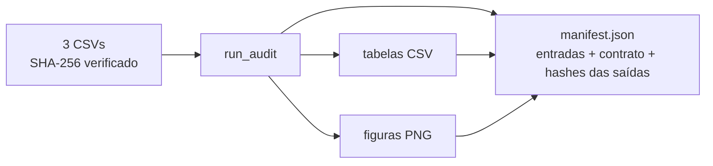
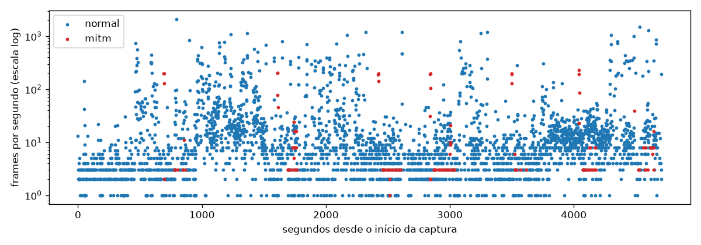
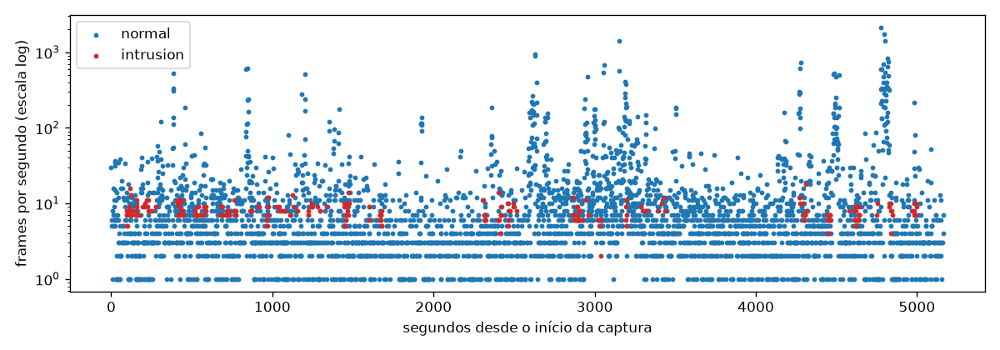

# 03-8. O estágio `audit` e o manifesto com hashes

## Objetivos desta aula

Ao final desta aula você vai entender:

- como transformar o que você explorou em notebooks num **estágio do runner**, reproduzível por um único comando;
- como o manifesto **liga cada tabela e figura ao hash da entrada**, e por que isso é a prova de proveniência de um resultado;
- como testar um estágio inteiro com dados sintéticos e provar que o raw não foi alterado.

E vai ter construído: `src/mqtt_ids/audit_stage.py`, o estágio `audit` no runner e na CLI, `configs/audit.yaml` e os testes do estágio.

**Ganho tangível:** `uv run --locked mqtt-ids --scenario configs/audit.yaml --stage audit` gera 12 tabelas e 3 figuras e um manifesto com o SHA-256 de cada entrada e de cada saída.

## Onde estamos

Nas aulas 03-1 a 03-7 você escreveu as funções de auditoria e as usou em rascunhos. A [issue 03](issues/03-data-audit.md) pede mais: "adicionar um **estágio de auditoria** que leia a entrada verificada, produza tabelas/figuras (...) e um notebook narrativo que consuma as mesmas funções", com "manifesto que liga tabelas e figuras ao hash da entrada". Esta aula fecha o ciclo técnico da issue: o runner (aula 01-3) ganha o terceiro estágio, depois do `diagnostics` e do `acquire` (aula 02-2).

### Relembrando

??? question "1. Por que o `frame.number` dá F1 alto na divisão aleatória e zero na temporal no DoS?"

    Porque o mesmo frame aparece em várias linhas idênticas: numa divisão aleatória as cópias caem em treino e teste e o número as liga; na temporal esses números nunca reaparecem no futuro.

??? question "2. Em que ordem o runner executa as etapas, e o que o `finally` garante?"

    Na ordem dos estágios selecionados; o `finally` grava o `manifest.json` sempre, com status `completed` ou `failed` e o erro quando houver.

??? question "3. O que o `acquire` faz diferente de ler direto de `data/raw`?"

    Baixa para uma pasta temporária, valida nomes e SHA-256 e só então promove, de forma atômica; e reaproveita a cópia apenas se o manifesto de proveniência bate com os bytes.

## Antes de começar

As aulas 03-1 a 03-7 concluídas e a suíte verde:

--8<-- "course/includes/rodar-testes.md"

Esta aula **altera** `runner.py` e `cli.py` (da issue 01): as mudanças são pequenas e os testes das aulas 01-3 e 02-2 continuam valendo.

## Conceitos

### Estágio: da exploração à execução reproduzível

Num notebook, cada célula roda quando você manda e o resultado depende do estado da sessão. Um **estágio** é uma função que recebe entradas explícitas e produz saídas explícitas, chamada pelo runner com um cenário. Isso importa por três razões: (1) **reprodutibilidade** (um comando, o mesmo resultado); (2) **auditoria** (o manifesto registra o que foi feito); (3) **separação**: a lógica fica em `src/` e o notebook apenas **conta a história** a partir dos artefatos.

Para o `audit`, a função é `run_audit(raw_dir, results_dir)`: lê os três CSVs com `load_raw` (que verifica o hash, aula 03-2), calcula os resultados das aulas anteriores e os grava em `results/`.

### Artefatos ligados à entrada

Uma tabela solta no disco não diz de **qual dado** ela veio. O manifesto resolve isso registrando três coisas: o **hash de cada entrada** (os três CSVs), o **contrato de contagens** de cada ambiente e o **hash de cada saída** (tabelas e figuras). Quem recebe a pasta consegue conferir: "esta tabela tem este hash, calculada sobre estas entradas com estes hashes". Se a entrada mudar (outra versão do dataset), `load_raw` recusa antes de gerar qualquer coisa.



### Testar um estágio com dados sintéticos

O estágio inteiro é testado com **três CSVs de 20 linhas** que o próprio teste cria, com as colunas que as funções usam. A fixture troca `RAW_HASHES` pelos hashes desses arquivos (como na aula 03-2). Assim o teste roda em um segundo, sem dados reais, e cobre os critérios da issue: manifesto liga saídas às entradas; raw intacto; o estágio falha sem a seção `dataset`.

## Ponte teoria → projeto

A [issue 03](issues/03-data-audit.md) lista como critérios: o notebook "executa do início ao fim a partir dos artefatos do estágio", "nenhuma execução altera conteúdo, hash ou mtime do raw" e "o manifesto liga tabelas e figuras ao hash da entrada". A [ADR-016](DECISIONS.md#adr-016-configuracao-registries-e-manifests) define "um manifesto em arquivos para cada execução" e a [ADR-018](DECISIONS.md#adr-018-bootstrap-automatico-e-ambiente-unico-para-scripts-e-notebooks) manda executar tudo via `uv run --locked`. Para a sua missão: cada tabela do portfólio pode apontar para um `manifest.json` que comprova a versão dos dados.

## Mão na massa

### Passo 1 — O estágio

Crie `src/mqtt_ids/audit_stage.py`:

```python title="src/mqtt_ids/audit_stage.py" linenums="1"
"""Estágio audit: tabelas e figuras ligadas ao hash da entrada."""

from __future__ import annotations

from pathlib import Path
from typing import Any

from mqtt_ids import audit
from mqtt_ids.audit import (
    DATASETS,
    class_runs,
    column_profile,
    contract_counts,
    identity_leak_table,
    load_raw,
    msgtype_by_class,
)
from mqtt_ids.audit_figures import plot_class_timeline
from mqtt_ids.kaggle_assets import sha256

LEAK_COLUMNS = [  # (1)!
    "ip.src",
    "eth.src",
    "mqtt.clientid",
    "mqtt.topic",
    "tcp.dstport",
    "frame.len",
    "frame.number",
]
```

1.  As colunas da tabela de vazamento (aula 03-7): três identidades, o tópico, a porta, o tamanho e o número do frame.

```python title="src/mqtt_ids/audit_stage.py" linenums="32"
def run_audit(raw_dir: Path, results_dir: Path) -> dict[str, Any]:
    """Gera tabelas e figuras dos três ambientes e devolve o que foi produzido."""
    tables_dir = results_dir / "tables"
    figures_dir = results_dir / "figures"
    tables_dir.mkdir(parents=True, exist_ok=True)
    inputs: dict[str, str] = {}
    outputs: dict[str, str] = {}
    contract: dict[str, Any] = {}
    for key, (filename, positive) in DATASETS.items():
        df = load_raw(key, raw_dir)  # (1)!
        inputs[filename] = audit.RAW_HASHES[filename]  # (2)!
        contract[key] = contract_counts(df, positive)
        tables = {  # (3)!
            f"{key}_columns.csv": column_profile(df),
            f"{key}_msgtype.csv": msgtype_by_class(df),
            f"{key}_runs.csv": class_runs(df, positive),
            f"{key}_leakage.csv": identity_leak_table(df, positive, LEAK_COLUMNS),
        }
        for name, table in tables.items():
            path = tables_dir / name
            table.to_csv(path)  # (4)!
            outputs[f"tables/{name}"] = sha256(path)  # (5)!
        figure = plot_class_timeline(df, positive, figures_dir / f"{key}_timeline.png")
        outputs[f"figures/{figure.name}"] = sha256(figure)
    return {"inputs": inputs, "contract": contract, "outputs": outputs}
```

1.  A carga **verifica o hash** antes de ler (aula 03-2): se o arquivo não for a versão fixada, o estágio falha aqui.
2.  Registramos o hash da entrada. Como `load_raw` acabou de provar que o arquivo tem esse hash, o valor esperado é o valor real. A referência é `audit.RAW_HASHES` (e não uma importação direta) para que os testes possam trocar o dicionário.
3.  Quatro tabelas por ambiente, todas funções que você já escreveu: perfil de colunas (03-3), tipos de pacote (03-1), rajadas (03-4) e vazamento (03-7).
4.  `to_csv` grava o índice por padrão: ele traz os **nomes** (colunas do CSV de origem, tipos de pacote). É o que queremos.
5.  O hash de cada saída vai para o manifesto, com o caminho **relativo** à pasta de resultados.

### Passo 2 — Ligar o estágio ao runner e à CLI

Em `src/mqtt_ids/runner.py`, quatro mudanças (linhas destacadas):

```python title="src/mqtt_ids/runner.py" linenums="14" hl_lines="1 5"
from mqtt_ids.audit_stage import run_audit
from mqtt_ids.config import Scenario
from mqtt_ids.kaggle_assets import DatasetMetadata, acquire_dataset

SUPPORTED_STAGES = ("diagnostics", "acquire", "audit")


def run_experiment(
    scenario: Scenario,
    stages: Iterable[str],
    output_dir: Path,
    resume: bool = False,
    results_dir: Path = Path("results"),  # (1)!
) -> Path:
```

1.  Parâmetro novo, com valor padrão: as chamadas antigas (testes das aulas 01 e 02) continuam funcionando sem mudança.

```python title="src/mqtt_ids/runner.py" linenums="67" hl_lines="1-6"
            elif stage == "audit":
                if scenario.dataset is None:
                    raise ValueError("O estágio audit exige a seção 'dataset'.")  # (1)!
                manifest["audit"] = run_audit(
                    scenario.dataset.data_dir / "raw", results_dir  # (2)!
                )
        manifest["status"] = "completed"
```

1.  O mesmo padrão do `acquire`: sem a seção `dataset` não se sabe onde estão os dados; a falha vai para o manifesto.
2.  Os CSVs ficam em `<data_dir>/raw`; o resultado do estágio entra em `manifest["audit"]`.

Em `src/mqtt_ids/cli.py`, uma opção nova e a passagem do argumento:

```python title="src/mqtt_ids/cli.py" linenums="18" hl_lines="2 11"
    parser.add_argument("--output-dir", type=Path, default=Path("artifacts/runs"))
    parser.add_argument("--results-dir", type=Path, default=Path("results"))  # (1)!
    arguments = parser.parse_args()
    try:
        scenario = load_scenario(arguments.scenario)
        manifest = run_experiment(
            scenario,
            arguments.stage or ["diagnostics"],
            arguments.output_dir,
            arguments.resume,
            arguments.results_dir,
        )
```

1.  Onde gravar tabelas e figuras. `results/tables/` e `results/figures/` já estão no `.gitignore` do projeto (dados derivados e saídas não vão para o Git).

E um cenário, `configs/audit.yaml`:

```yaml title="configs/audit.yaml" linenums="1"
run:
  name: audit
  seed: 20261001
dataset:
  handle: OWNER/SLUG/versions/N  # (1)!
  data_dir: data
  doi: 10.6084/m9.figshare.24420958
  license: CC-BY-4.0
  authors:
    - Héctor Alaiz-Moretón
    - Jose Antonio Aveleira-Mata
    - Saúl Díez Fernández
    - Ángel Luis Muñoz Castañeda
    - Isaías García-Rodríguez
    - Carmen Benavides
    - José Alberto Benítez-Andrades
```

1.  O estágio `audit` **não usa** o handle (só o `acquire` o usa); a seção `dataset` está aqui porque o cenário precisa dizer onde estão os dados (`data_dir`) e de quem são (atribuição). Deixe o modelo como está.

### Passo 3 — Executar o estágio

```bash title="$ Execução no terminal (na pasta do projeto)"
uv run --locked mqtt-ids --scenario configs/audit.yaml --stage audit --output-dir /tmp/audit_out/runs --results-dir /tmp/audit_out/results
```

```text title="Saída esperada"
/tmp/audit_out/runs/ec15561db5750943/manifest.json
```

**O que aconteceu:** o runner imprimiu o caminho do manifesto, como sempre. A pasta tem o nome da **identidade** (aula 01-3), `ec15561db5750943`, que depende só do cenário e dos estágios (o seu valor é o mesmo se o conteúdo de `configs/audit.yaml` for o desta aula). A execução levou poucos segundos. A ajuda do comando agora lista o estágio novo:

```bash title="$ Execução no terminal (na pasta do projeto)"
uv run --locked mqtt-ids --help
```

```text title="Saída esperada"
usage: mqtt-ids [-h] --scenario SCENARIO [--stage {diagnostics,acquire,audit}]
                [--resume] [--output-dir OUTPUT_DIR]
                [--results-dir RESULTS_DIR]
...
```

### Passo 4 — Ler o resultado

```bash title="$ Execução no terminal (na pasta do projeto)"
find /tmp/audit_out/results -type f | sort | sed 's#/tmp/audit_out/results/##'
head -4 /tmp/audit_out/results/tables/dos_leakage.csv
head -3 /tmp/audit_out/results/tables/intrusion_runs.csv
```

```text title="Saída esperada"
figures/dos_timeline.png
figures/intrusion_timeline.png
figures/mitm_timeline.png
tables/dos_columns.csv
tables/dos_leakage.csv
tables/dos_msgtype.csv
tables/dos_runs.csv
tables/intrusion_columns.csv
tables/intrusion_leakage.csv
tables/intrusion_msgtype.csv
tables/intrusion_runs.csv
tables/mitm_columns.csv
tables/mitm_leakage.csv
tables/mitm_msgtype.csv
tables/mitm_runs.csv
,temporal,random
ip.src,0.855,0.89
eth.src,0.853,0.887
mqtt.clientid,0.0,0.0
,label,frames,start_s,end_s,duration_s
0,normal,600,0.0,94.8,94.8
1,intrusion,7,94.8,94.8,0.0
```

**O que aconteceu:** 15 arquivos: 4 tabelas e 1 figura por ambiente. As tabelas de vazamento e de rajadas são **as mesmas** das aulas 03-7 e 03-4, agora em CSV. Duas figuras novas, para comparar com o DoS (aula 03-4):





No MitM e no Intrusion os pontos vermelhos ficam **dentro** da nuvem azul: a **taxa não distingue** o ataque, ao contrário do DoS. A figura confirma visualmente o que as aulas 03-5 e 03-6 mostraram em números.

Agora o manifesto: o que ele guarda sobre a auditoria.

```bash title="$ Execução no terminal (na pasta do projeto)"
cat /tmp/audit_out/runs/*/manifest.json | python3 -c "
import json, sys
manifest = json.load(sys.stdin)
audit = manifest['audit']
print({chave: manifest[chave] for chave in ('identity', 'stages', 'status')})
print('entradas:', {nome: digest[:12] + '...' for nome, digest in audit['inputs'].items()})
print('contrato do DoS:', audit['contract']['dos'])
print('saídas:', len(audit['outputs']))
"
```

```text title="Saída esperada"
{'identity': 'ec15561db5750943', 'stages': ['audit'], 'status': 'completed'}
entradas: {'DoS.csv': 'e935c819f8bc...', 'Intrusion.csv': '730f65a2bd38...', 'MitM.csv': 'bfee47413bcf...'}
contrato do DoS: {'classes': {'DoS': 45514, 'normal': 49111}, 'columns': 67, 'duplicates': 32298, 'labels_ok': True, 'repeated_frame_numbers': 32298, 'rows': 94625}
saídas: 15
```

**O que aconteceu:** o manifesto traz **as três entradas com o hash** (os mesmos de `RAW_HASHES`), o **contrato de contagens** de cada ambiente (aqui, o do DoS, com as 32.298 duplicatas) e **o hash das 15 saídas**. Quem receber `results/` e `manifest.json` consegue conferir cada arquivo (é o exercício desta aula).

### Passo 5 — Determinismo, retomada e falha

```bash title="$ Execução no terminal (na pasta do projeto)"
uv run --locked mqtt-ids --scenario configs/audit.yaml --stage audit --output-dir /tmp/audit_out/runs --results-dir /tmp/audit_out/results --resume
uv run --locked mqtt-ids --scenario configs/diagnostics.yaml --stage audit --output-dir /tmp/audit_out/runs --results-dir /tmp/audit_out/results
```

```text title="Saída esperada"
/tmp/audit_out/runs/ec15561db5750943/manifest.json
usage: mqtt-ids [-h] --scenario SCENARIO [--stage {diagnostics,acquire,audit}]
                [--resume] [--output-dir OUTPUT_DIR]
                [--results-dir RESULTS_DIR]
mqtt-ids: error: O estágio audit exige a seção 'dataset'.
```

**O que aconteceu:** com `--resume` o runner reconheceu o manifesto `completed` e **não executou de novo** (o caminho é o mesmo). Com o cenário `diagnostics.yaml`, que não tem a seção `dataset`, o estágio falha com a mensagem esperada, e o manifesto dessa execução fica com `status: failed`. Rodando o estágio **duas vezes** em pastas diferentes, os hashes de **todas** as tabelas e figuras foram idênticos no replay: o resultado é **determinístico** (as figuras podem variar entre versões do Matplotlib, então não compare hashes de PNG entre máquinas diferentes).

!!! warning "Limite da retomada"

    `--resume` só olha o **manifesto**: se você apagar `results/` e rodar com `--resume`, nada será regerado. O exercício desta aula (`missing_outputs`) é a ferramenta para detectar isso: compara os hashes do manifesto com os arquivos que estão no disco.

## O notebook que conta a história

Agora os três notebooks (`01_eda_dos`, `02_eda_intrusion`, `03_eda_mtmi`) podem ter uma célula inicial que **lê os artefatos** em vez de recalcular tudo:

1. *Código*: `import pandas as pd; from pathlib import Path; tables = Path("../results/tables")`.
2. *Código*: `pd.read_csv(tables / "dos_leakage.csv", index_col=0)` e exiba (a tabela da aula 03-7).
3. *Código*: `pd.read_csv(tables / "dos_runs.csv", index_col=0)` e as figuras com `IPython.display.Image`.
4. *Markdown*: a **interpretação**, escrita por você, ao lado de cada tabela.

Regra: o notebook **não** reimplementa nada; se precisar de um número novo, a função entra em `src/mqtt_ids/audit.py`, o estágio grava a tabela e o notebook a lê. Para conferir que ele "executa do início ao fim a partir dos artefatos", use *Restart & Run All* depois de rodar o estágio.

## Testando

```python title="tests/test_audit_stage.py" linenums="1"
import hashlib
import json
from pathlib import Path

import pandas as pd
import pytest

from mqtt_ids import audit
from mqtt_ids.audit import DATASETS
from mqtt_ids.audit_stage import run_audit
from mqtt_ids.config import DatasetConfig, Scenario
from mqtt_ids.kaggle_assets import sha256
from mqtt_ids.runner import run_experiment


def make_csv(positive: str) -> str:
    n = 20
    frames = pd.DataFrame(
        {
            "type": ["normal"] * 8 + [positive] * 6 + ["normal"] * 6,
            "frame.number": range(1, n + 1),
            "frame.time_relative": [i * 0.5 for i in range(n)],
            "mqtt.msgtype": [None, 3.0] * (n // 2),
            "mqtt.topic": ["t", None] * (n // 2),
            "mqtt.clientid": [None] * n,
            "ip.src": ["10.0.0.1", "10.0.0.2"] * (n // 2),
            "eth.src": ["aa"] * n,
            "tcp.dstport": [1883.0] * n,
            "tcp.srcport": [50000.0] * n,
            "frame.len": [60 + i for i in range(n)],
        }
    )
    return frames.to_csv(index=False)  # (1)!
```

1.  Gera um CSV de 20 linhas **em texto**, com as colunas que as funções de auditoria usam: 8 frames normais, 6 de ataque e 6 normais (duas rajadas de classe, uma de ataque no meio).

```python title="tests/test_audit_stage.py" linenums="31"
@pytest.fixture
def data_dir(tmp_path: Path, monkeypatch: pytest.MonkeyPatch) -> Path:
    raw = tmp_path / "data" / "raw"
    raw.mkdir(parents=True)
    hashes = {}
    for filename, positive in DATASETS.values():
        content = make_csv(positive)
        (raw / filename).write_text(content, encoding="utf-8")
        hashes[filename] = hashlib.sha256(content.encode("utf-8")).hexdigest()
    monkeypatch.setattr(audit, "RAW_HASHES", hashes)  # (1)!
    return tmp_path / "data"


def test_audit_links_every_output_to_the_input_hashes(
    data_dir: Path, tmp_path: Path
) -> None:
    result = run_audit(data_dir / "raw", tmp_path / "results")

    assert set(result["inputs"]) == {"DoS.csv", "MitM.csv", "Intrusion.csv"}
    assert len(result["outputs"]) == 15  # (2)!
    for relative, digest in result["outputs"].items():
        assert sha256(tmp_path / "results" / relative) == digest  # (3)!
```

1.  Os três arquivos sintéticos passam a ser "a versão verificada" (mesma técnica da aula 03-2).
2.  4 tabelas e 1 figura por ambiente, em 3 ambientes.
3.  O manifesto precisa dizer a verdade: o hash de cada saída é o hash do arquivo que está em disco.

```python title="tests/test_audit_stage.py" linenums="56"
def test_audit_never_changes_the_raw_files(data_dir: Path, tmp_path: Path) -> None:
    files = sorted((data_dir / "raw").iterdir())
    before = [(f.read_bytes(), f.stat().st_mtime_ns) for f in files]  # (1)!

    run_audit(data_dir / "raw", tmp_path / "results")

    assert [(f.read_bytes(), f.stat().st_mtime_ns) for f in files] == before


def test_runner_records_the_audit_in_the_manifest(
    data_dir: Path, tmp_path: Path
) -> None:
    scenario = Scenario(
        name="audit",
        seed=7,
        dataset=DatasetConfig(
            handle="owner/data/versions/1",
            data_dir=data_dir,
            doi="10.6084/m9.figshare.24420958",
            license="CC-BY-4.0",
            authors=("Example Author",),
        ),
    )

    manifest_path = run_experiment(
        scenario, ["audit"], tmp_path / "runs", results_dir=tmp_path / "results"
    )

    manifest = json.loads(manifest_path.read_text(encoding="utf-8"))
    assert manifest["status"] == "completed"
    assert manifest["audit"]["contract"]["dos"]["rows"] == 20  # (2)!


def test_audit_without_a_dataset_section_fails_with_a_failed_manifest(
    tmp_path: Path,
) -> None:
    with pytest.raises(ValueError, match="exige a seção 'dataset'"):
        run_experiment(Scenario(name="audit", seed=7), ["audit"], tmp_path / "runs")

    manifest = json.loads(next((tmp_path / "runs").glob("*/manifest.json")).read_text())
    assert manifest["status"] == "failed"  # (3)!
```

1.  Guarda conteúdo e horário de modificação de cada raw antes do estágio: o critério "nenhuma execução altera conteúdo, hash ou mtime do raw".
2.  O contrato do DoS sintético tem 20 linhas: o manifesto reflete os dados do teste.
3.  Mesmo sem a seção `dataset`, o `finally` do runner gravou o manifesto, com o erro registrado (aula 01-3).

```bash title="$ Execução no terminal (na pasta do projeto)"
uv run --locked pytest tests/test_audit_stage.py -v
```

```text title="Saída esperada"
tests/test_audit_stage.py::test_audit_links_every_output_to_the_input_hashes PASSED [ 25%]
tests/test_audit_stage.py::test_audit_never_changes_the_raw_files PASSED [ 50%]
tests/test_audit_stage.py::test_runner_records_the_audit_in_the_manifest PASSED [ 75%]
tests/test_audit_stage.py::test_audit_without_a_dataset_section_fails_with_a_failed_manifest PASSED [100%]
```

**O que aconteceu:** quatro comportamentos do estágio, sem dados reais. Rode agora a suíte inteira (`uv run --locked pytest`): os testes das aulas 01 e 02 continuam verdes, o que prova que as mudanças em `runner.py` e `cli.py` não quebraram nada. Depois, `lint tests` para atualizar o [Catálogo de testes](testing/scenarios.md).

## Erros comuns

**1. `AuditError: SHA-256 divergente para ...`.** Os CSVs de `data/raw` não são a versão fixada. Refaça a aquisição (aula 02-2).

**2. `FileNotFoundError: ... data/raw/DoS.csv`.** O `data_dir` do cenário não aponta para a pasta que contém `raw/`. O estágio lê `<data_dir>/raw`.

**3. `ValueError: O estágio audit exige a seção 'dataset'.`** Você usou um cenário sem `dataset` (como o `diagnostics.yaml`). Use `configs/audit.yaml`.

**4. As figuras não aparecem no notebook.** Elas só existem depois de rodar o estágio; o notebook as **lê**, não as gera. Rode o comando primeiro.

**5. `ModuleNotFoundError: No module named 'matplotlib'`.** Você não está no ambiente do projeto: use `uv run --locked ...`.

## Código completo desta aula

??? example "Arquivo completo: src/mqtt_ids/audit_stage.py"

    ```python
    """Estágio audit: tabelas e figuras ligadas ao hash da entrada."""

    from __future__ import annotations

    from pathlib import Path
    from typing import Any

    from mqtt_ids import audit
    from mqtt_ids.audit import (
        DATASETS,
        class_runs,
        column_profile,
        contract_counts,
        identity_leak_table,
        load_raw,
        msgtype_by_class,
    )
    from mqtt_ids.audit_figures import plot_class_timeline
    from mqtt_ids.kaggle_assets import sha256

    LEAK_COLUMNS = [
        "ip.src",
        "eth.src",
        "mqtt.clientid",
        "mqtt.topic",
        "tcp.dstport",
        "frame.len",
        "frame.number",
    ]


    def run_audit(raw_dir: Path, results_dir: Path) -> dict[str, Any]:
        """Gera tabelas e figuras dos três ambientes e devolve o que foi produzido."""
        tables_dir = results_dir / "tables"
        figures_dir = results_dir / "figures"
        tables_dir.mkdir(parents=True, exist_ok=True)
        inputs: dict[str, str] = {}
        outputs: dict[str, str] = {}
        contract: dict[str, Any] = {}
        for key, (filename, positive) in DATASETS.items():
            df = load_raw(key, raw_dir)
            inputs[filename] = audit.RAW_HASHES[filename]
            contract[key] = contract_counts(df, positive)
            tables = {
                f"{key}_columns.csv": column_profile(df),
                f"{key}_msgtype.csv": msgtype_by_class(df),
                f"{key}_runs.csv": class_runs(df, positive),
                f"{key}_leakage.csv": identity_leak_table(df, positive, LEAK_COLUMNS),
            }
            for name, table in tables.items():
                path = tables_dir / name
                table.to_csv(path)
                outputs[f"tables/{name}"] = sha256(path)
            figure = plot_class_timeline(df, positive, figures_dir / f"{key}_timeline.png")
            outputs[f"figures/{figure.name}"] = sha256(figure)
        return {"inputs": inputs, "contract": contract, "outputs": outputs}
    ```

??? example "Arquivo completo: src/mqtt_ids/cli.py"

    ```python
    """Interface de linha de comando do runner."""

    from __future__ import annotations

    import argparse
    from pathlib import Path

    from mqtt_ids.config import ScenarioError, load_scenario
    from mqtt_ids.runner import SUPPORTED_STAGES, run_experiment


    def main() -> None:
        """Processa argumentos e imprime o caminho do manifesto produzido."""
        parser = argparse.ArgumentParser(description="Executa um cenário MQTT IDS.")
        parser.add_argument("--scenario", required=True, type=Path)
        parser.add_argument("--stage", action="append", choices=SUPPORTED_STAGES)
        parser.add_argument("--resume", action="store_true")
        parser.add_argument("--output-dir", type=Path, default=Path("artifacts/runs"))
        parser.add_argument("--results-dir", type=Path, default=Path("results"))
        arguments = parser.parse_args()
        try:
            scenario = load_scenario(arguments.scenario)
            manifest = run_experiment(
                scenario,
                arguments.stage or ["diagnostics"],
                arguments.output_dir,
                arguments.resume,
                arguments.results_dir,
            )
        except (ScenarioError, ValueError) as error:
            parser.error(str(error))
        print(manifest)


    if __name__ == "__main__":
        main()
    ```

## Exercícios

Os exercícios continuam em `src/mqtt_ids/exercicios.py`. Eles fazem o que um revisor faria com o seu `results/`.

1. Escreva `missing_outputs(outputs, results_dir)`, que devolve, em ordem alfabética, os caminhos do mapa `outputs` do manifesto cujo arquivo **não existe** ou cujo hash **não confere**, e `changed_outputs(old, new)`, que compara dois mapas `outputs` (de duas execuções) e devolve os caminhos cujo hash **mudou ou é novo**. O exercício está pronto quando este teste passar:

    ```python title="tests/test_exercicio_03_8.py"
    from pathlib import Path

    from mqtt_ids.exercicios import changed_outputs, missing_outputs
    from mqtt_ids.kaggle_assets import sha256


    def test_missing_outputs_reports_absent_and_altered_files(tmp_path: Path) -> None:
        (tmp_path / "tables").mkdir()
        good = tmp_path / "tables" / "good.csv"
        good.write_text("a\n", encoding="utf-8")
        altered = tmp_path / "tables" / "altered.csv"
        altered.write_text("b\n", encoding="utf-8")
        outputs = {
            "tables/good.csv": sha256(good),
            "tables/altered.csv": sha256(altered),
            "tables/gone.csv": "0" * 64,
        }
        altered.write_text("changed\n", encoding="utf-8")

        assert missing_outputs(outputs, tmp_path) == [
            "tables/altered.csv",
            "tables/gone.csv",
        ]


    def test_changed_outputs_compares_two_manifests() -> None:
        old = {"tables/a.csv": "1", "tables/b.csv": "2"}
        new = {"tables/a.csv": "1", "tables/b.csv": "3", "tables/c.csv": "4"}

        assert changed_outputs(old, new) == ["tables/b.csv", "tables/c.csv"]
    ```

    ```bash title="$ Execução no terminal (na pasta do projeto)"
    uv run --locked pytest tests/test_exercicio_03_8.py
    ```

    Antes da solução:

    ```text title="Saída esperada (antes da solução)"
    E   ImportError: cannot import name 'changed_outputs' from 'mqtt_ids.exercicios' (...)
    ERROR tests/test_exercicio_03_8.py
    ```

??? tip "Solução"

    ```python title="src/mqtt_ids/exercicios.py (acrescente ao arquivo)"
    def missing_outputs(outputs: dict[str, str], results_dir: Path) -> list[str]:
        problems = []
        for relative, expected_hash in sorted(outputs.items()):
            path = results_dir / relative
            if not path.is_file() or sha256(path) != expected_hash:
                problems.append(relative)
        return problems


    def changed_outputs(old: dict[str, str], new: dict[str, str]) -> list[str]:
        return sorted(name for name, digest in new.items() if old.get(name) != digest)
    ```

    Depois da solução: `2 passed`. `missing_outputs` é a mesma lógica de `tampered_files` da aula 02-1 (arquivo ausente ou hash diferente), e `old.get(name)` devolve `None` para um arquivo novo, que também conta como "mudou".

## Quiz de fixação

??? question "1. Com suas palavras: por que o manifesto guarda o hash da entrada **e** o hash de cada saída?"

    O hash da entrada prova de que versão dos dados o resultado vem; o hash da saída prova que o arquivo em disco é o que o estágio produziu. Juntos, deixam um revisor conferir que a tabela é do dado citado e que ninguém a alterou depois.

??? question "2. Por que as chamadas antigas de `run_experiment` (testes das aulas 01 e 02) continuam funcionando depois da mudança?"

    Porque `results_dir` é um parâmetro novo **com valor padrão** (`Path("results")`): quem não o informa continua chamando como antes.

**3. O que acontece se você apagar `results/` e rodar de novo com `--resume`?**

- a) Nada é regerado, porque o manifesto `completed` faz o runner retomar
- b) O estágio roda de novo e recria as tabelas e figuras
- c) O runner falha com erro por faltarem os arquivos

??? question "Resposta da 3"

    **a)**. O `--resume` só confere o manifesto da execução; ele não olha `results/`. Para saber se os arquivos ainda existem e conferem, use `missing_outputs`; para regerar, rode sem `--resume`. O b) e o c) pressupõem que o runner verifica as saídas, o que ele não faz.

??? question "4. Revisão da aula 03-2: por que `run_audit` chama `load_raw` em vez de `pd.read_csv` direto?"

    Porque `load_raw` confere o SHA-256 antes de ler: um arquivo que não seja a versão fixada faz o estágio falhar antes de gerar qualquer resultado.

## Commit

```bash title="$ Execução no terminal (na pasta do projeto)"
git add src/mqtt_ids/audit_stage.py src/mqtt_ids/runner.py src/mqtt_ids/cli.py configs/audit.yaml tests/test_audit_stage.py notebooks/
git commit -m "feat(audit): estágio audit com manifesto ligando saídas ao hash da entrada"
```

Depois de conferir os critérios da [issue 03](issues/03-data-audit.md) com tudo verde, marque-os no arquivo da issue (a marcação é sua).

## Resumo

- Um estágio é uma função com entradas e saídas explícitas, chamada pelo runner; os notebooks apenas leem os artefatos.
- O manifesto liga cada tabela e figura ao hash dos CSVs de entrada e traz o contrato de contagens; `load_raw` garante a versão.
- O estágio é testado com CSVs sintéticos de 20 linhas e prova que o raw não muda; `--resume` não verifica as saídas.

## Fonte principal

[DataFrame.to_csv (pandas)](https://pandas.pydata.org/docs/reference/api/pandas.DataFrame.to_csv.html): leia `index` e `path_or_buf`.

## Para saber mais

- [Matplotlib: backends](https://matplotlib.org/stable/users/explain/figure/backends.html), [pytest: fixtures](https://docs.pytest.org/en/stable/how-to/fixtures.html)

!!! question "Ficou com dúvida?"

    O agente é o seu professor: pergunte o que não ficou claro, colando a mensagem de erro exata e o que você tentou. Para conversar com pessoas, veja as comunidades em [Recursos](recursos.md#comunidades).

**Próxima aula:** [03-9. Da evidência à política de features e à modelagem](03-9-politica-de-features-e-modelagem.md).
